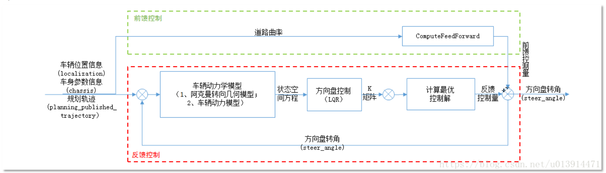

https://blog.csdn.net/u013914471/article/details/82775091

**问题一：Apollo的纵向控制的参考点到底怎么找？**

答：纵向控制的框架如下

先说结论，Apollo中**纵向控制的跟踪点**（reference_point或preview_point）是**根据绝对时间找的（也就是通过自车当前的绝对时间戳，找轨迹中距离该时间戳时间最短的轨迹点）**。**横向控制**的跟踪点也**是根据时间找的**（target_point）**（也就是通过自车当前的绝对时间戳，找轨迹中距离该时间戳时间最短的轨迹点）**，但是可以通过配置FLAGS_query_time_nearest_point_only   这个参数使target_point为**距离**自车最近的点。

纵向控制中有三个重要的点：

**mathed_point：**参考线上距离自车xy最近的点。通过找到最近点->找到最近点的前点和后点->黄金分割+线性插值得到最近点。该点主要用于获得自车在frenet下的坐标，从而计算出PID控制器计算误差时所需的s_matched和s_dot_match。

**reference_point：**如果FLAGS_enable_speed_station_preview为0，也就是不考虑预瞄，那么reference_point为跟踪点。

**preview_point：**如果FLAGS_enable_speed_station_preview为1，也就是考虑预瞄，那么preview_point为跟踪点。

**
**
**问题二：Apollo的横向控制的参考点到底怎么找？**

答：

横向控制中有三个重要的点：

**target_point：**相当于纵向控制中的reference_point或preview_point，该点为跟踪点，也是**通过绝对时间找到的****（也就是通过自车当前的绝对时间戳，找轨迹中距离该时间戳时间最短的轨迹点）**。（给了选项，**也可以按照最近距离**来找，默认是根据时间）通过该点和车辆自身的xy坐标，可以求得LQR的四个状态量（横向误差，横向误差变化率，航向误差，航向误差变化率）。    

**preview_point：**通过一定的预瞄时间，找到最近的轨迹点

**matched_point：**离轨迹点最近的参考点。

 

preview_point和matched_point主要是为了求预瞄后的横向误差，有很多地方会用到这个误差，比如之后求反馈的时候。