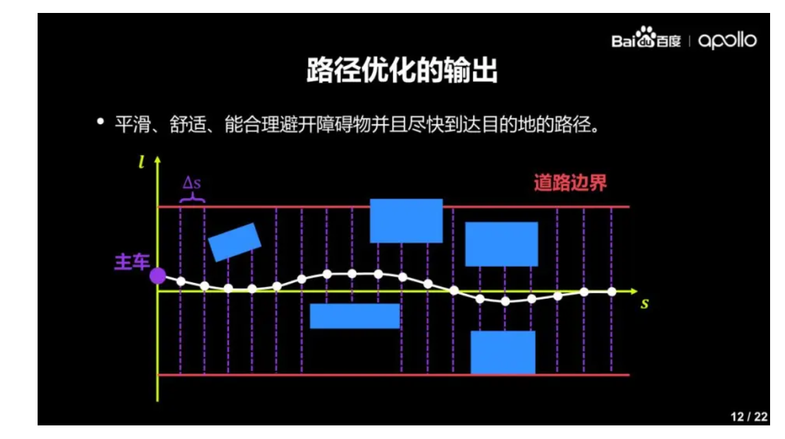
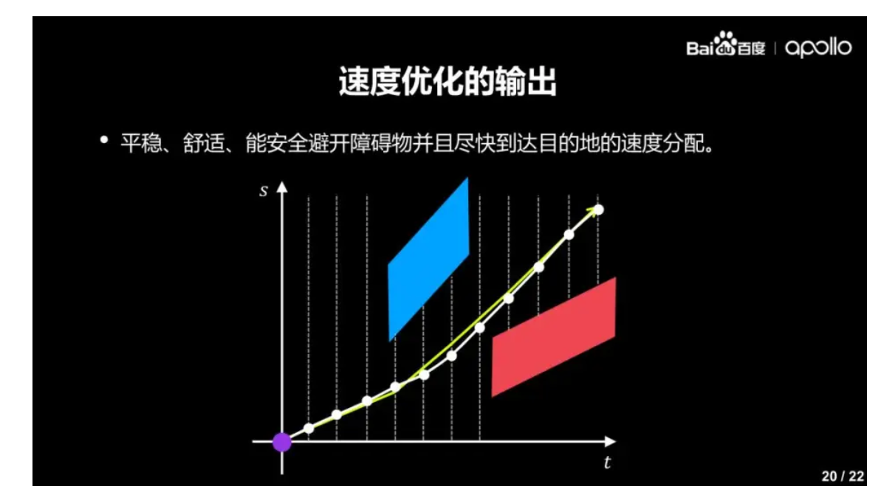

问题一：
  有了路径决策之后，还要对路径进行优化。路径优化分为四个步骤：

        1）将连续性问题离散化。==以 ∆s 为间隔进行采样，得到 n 个点。∆s 不能太大也不能太小，如果特别小在工程上会影响求解速度，所以 ∆s 通常设置为 0.5 厘米。==

        2）明确要满足的约束条件。约束条件包括三个：==主车必须在道路边界内，同时不能与障碍物发生碰撞==；根据当前状态，主==车的横向速度/加速度/加加速度有特定的运动学限制；==必须满==足基本的物理原理==。

        3）明确要努力达到的目标。第一目标是确保安全礼貌地驾驶，不能四处乱窜，用数学语言的表达相当于使横向位移的绝对值最小；第二目标是确保舒适的体感，尽可能降低横向速度/加速度/加加速度。

        4）将优化问题转化为二次规划问题进行求解。转化为二次规划问题之后，整个复杂问题简单化，运用一些现成比较好的求解二次规划算法，规划出比较合理的运动路径。

