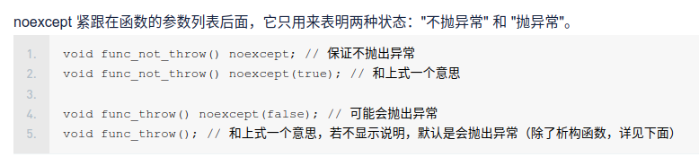
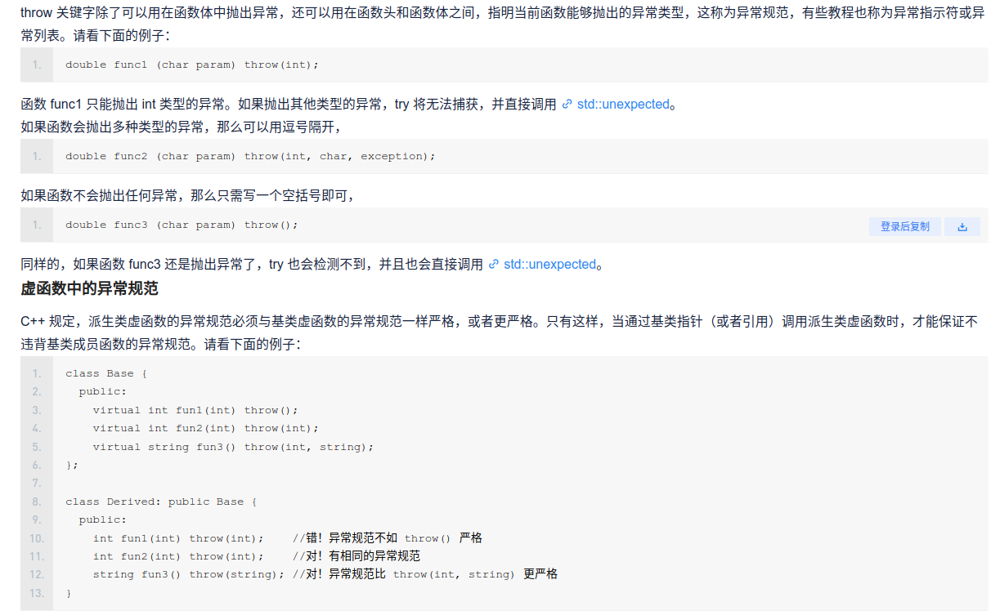
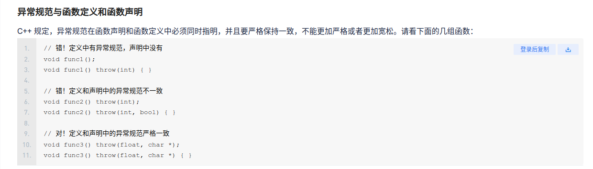
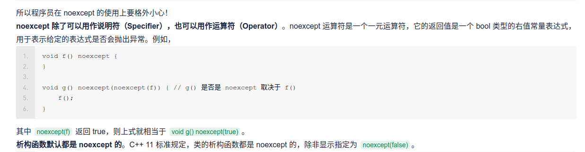
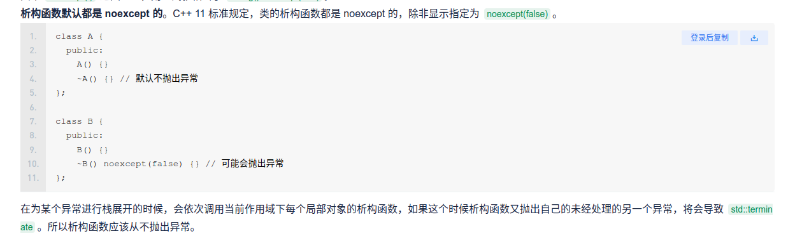

noexcept

# noexcept
## 1 noexcept作用

noexcept主要告诉编译器该函数不会抛出异常，可以帮助编译器优化。如果不加noexcept表示默认会抛出异常。

使用方法：

## 2noexcept的由来

在C++11之前是没有noexcept的，只有throw。throw 关键字除了可以用在**函数体中抛出异常**，还可以用在**函数头和函数体之间，指明当前函数能够抛出的异常类型，这称为异常规范**，有些教程也称为异常指示符或异常列表。请看下面的例子：




但是在c++11是中，throw被抛弃掉了

异常规范的初衷是好的，它希望让程序员看到函数的定义或声明后，立马就知道该函数会抛出什么类型的异常，这样程序员就可以使用 try-catch 来捕获了。如果没有异常规范，程序员必须阅读函数源码才能知道函数会抛出什么异常。

不过这有时候也不容易做到。**例如，func_outer() 函数可能不会引发异常，但它调用了另外一个函数 func_inner()，这个函数可能会引发异常**。再如，编写的一个函数调用了老式的一个库函数，此时不会引发异常，但是老式库更新以后这个函数却引发了异常。

其实，不仅仅如此，
1. 异常规范的检查是在运行期而不是编译期，因此程序员不能保证所有异常都得到了 catch 处理。

2. 由于第一点的存在，编译器需要生成额外的代码，在一定程度上妨碍了优化。

3. 模板函数中无法使用。

所以 C++11 摒弃了 throw 异常规范，而引入了新的异常说明符 noexcept。

## 3 C++11中的noexcept

加在函数明和函数体之间，表示一定不会出现异常，帮助编译器优化。
此外noexcept是一个一元运算符，可以返回bool值。这样之前throw的无法捕捉函数内其他函数是否有异常的缺点就被解决了。





## 4 使用建议


# volatile

volatile与const是相反的词

volatile 关键字是一种类型修饰符，用它声明的类型变量表示可以被某些编译器未知的因素更改，比如：操作系统、硬件或者其它线程等。**遇到这个关键字声明的变量，编译器对访问该变量的代码就不再进行优化**，从而可以提供对特殊地址的稳定访问。声明时语法：**int volatile vInt;** 当要求使用 volatile 声明的变量的值的时候，**系统总是重新从它所在的内存读取数据**，即使它前面的指令刚刚从该处读取过数据。而且读取的数据立刻被保存。例如：
```c++
volatile int i=10;
int a = i;
...
// 其他代码，并未明确告诉编译器，对 i 进行过操作
int b = i;
```

volatile 指出 i 是随时可能发生变化的，每次使用它的时候必须从 i的地址中读取，因而编译器生成的汇编代码会重新从i的地址读取数据放在 b 中。而优化做法是，由于编译器发现两次从 i读数据的代码之间的代码没有对 i 进行过操作，它会自动把上次读的数据放在 b 中。而不是重新从 i 里面读。
这样以来，如果 i是一个寄存器变量或者表示一个端口数据就容易出错，所以说 volatile 可以保证对特殊地址的稳定访问。