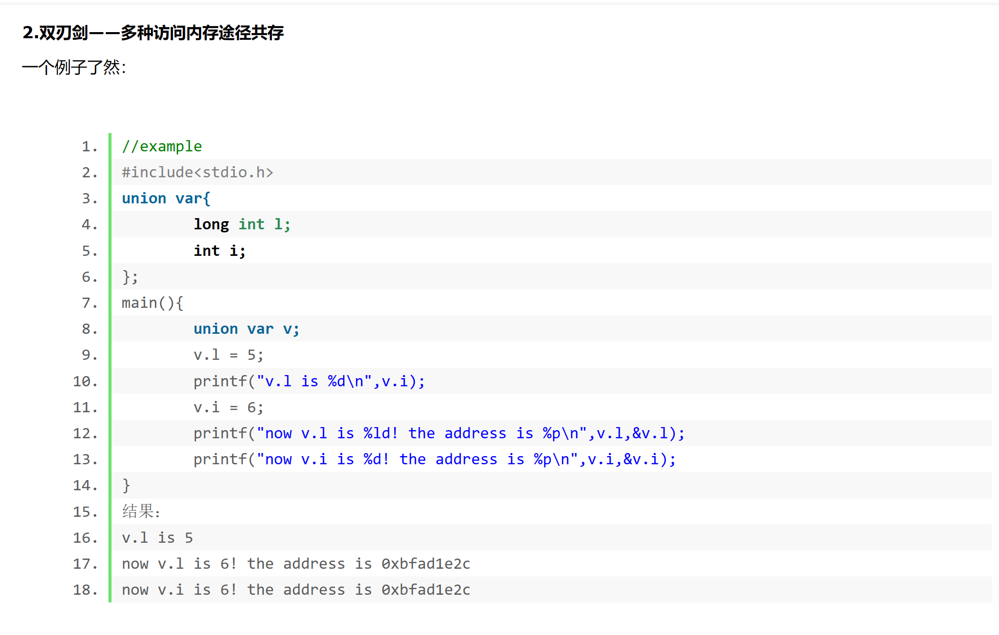

  [结构体](https://so.csdn.net/so/search?q=%E7%BB%93%E6%9E%84%E4%BD%93&spm=1001.2101.3001.7020)struct：把不同类型的数据组合成一个整体，自定义类型。

  共同体[union](https://so.csdn.net/so/search?q=union&spm=1001.2101.3001.7020)： 使几个不同类型的变量共同占用一段内存。

结构体(struct)中所有变量是“共存”的——优点是“有容乃大”，全面；缺点是struct内存空间的分配是粗放的，不管用不用，全分配。

而联合体(union)中是各变量是“互斥”的——缺点就是不够“包容”；但优点是内存使用更为精细灵活，也节省了内存空间。Union的特点就是同一时间，只能由一个成员占用内存。union的内存是照着里边占地儿最大的那个变量分的。

Union适用于各数据类型各变量占用空间差不多并且对各变量同时使用要求不高的场合。
一个数组（或者更大的数组int a[100]），和一个或者几个小变量写在一个union里，实在没什么必要，节省的空间太有限了，还增加了一些风险（最少有前边提到的逻辑上的风险）。所以，从内存占用分析，这种情况不如直接struct。

去别的具体实例：
[(2条消息) 结构体struct和联合体union最全讲解_struct union_liguangxian2018的博客-CSDN博客](https://blog.csdn.net/liguangxianbin/article/details/80510669?app_version=5.15.5&csdn_share_tail=%7B%22type%22%3A%22blog%22%2C%22rType%22%3A%22article%22%2C%22rId%22%3A%2280510669%22%2C%22source%22%3A%22qq_44640266%22%7D&utm_source=app)
