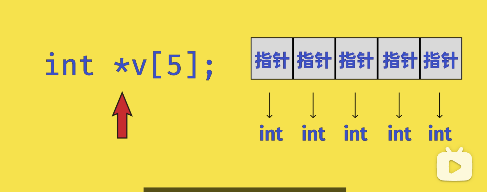
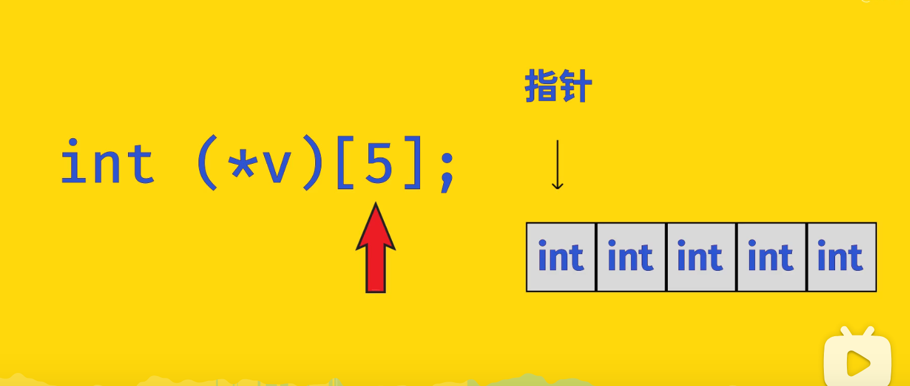
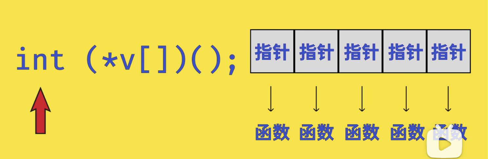

C++中类型声明应该遵循以下原则：**先找到变量名，先往右找，再往左找，遇到括号依次循环，遇到const可以先跳过**。

举例：

v是一个数组，数组里存放的是指针，每个指针指向int

v是一个指针，指向一个数组，数组里存的是int（数组指针）

v是一个数组，数组里存放的是指针，每个指针指向int返回型的函数

v是一个指针，指向一个数组，数组里存的是指针，指向int返回型的函数

