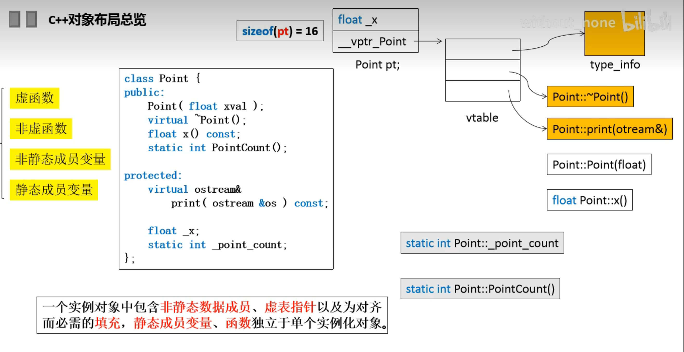
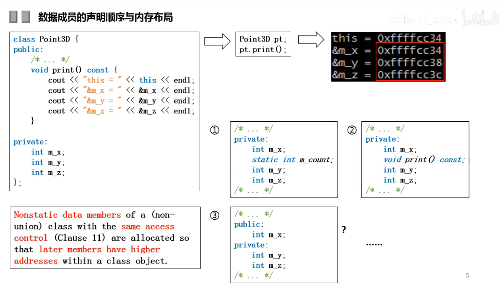
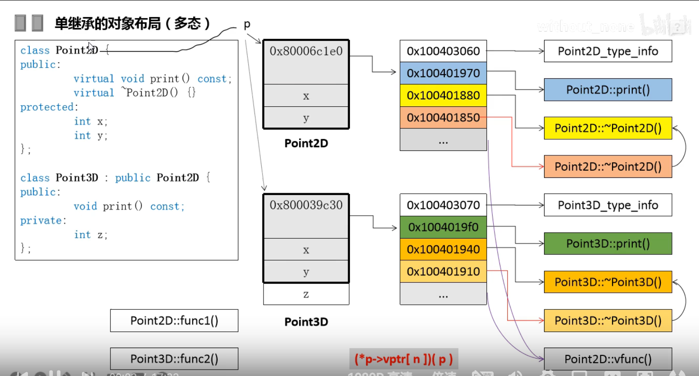
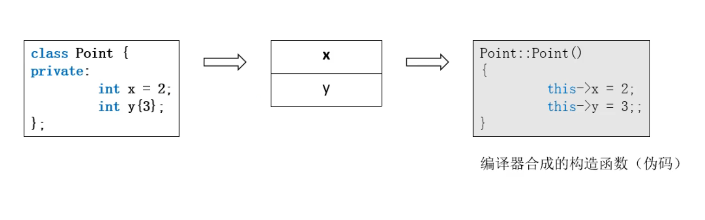
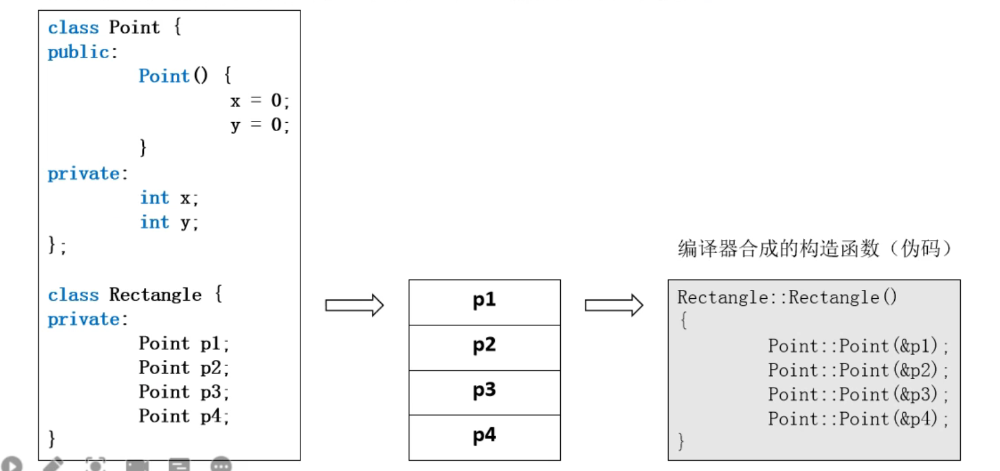

对象模型
# 1 对象布局总览

# 2 继承下的对象布局（非多态）

**继承时，基类在低地址，子类在高地址。**

## 2.1 单继承

## 2.2 多继承

# 3 继承下的对象布局（多态）

- c++规定，当一个成员函数被声明为虚函数后，其派生类中的同名函数都自动成为虚函数。所以虚函数在子类中重写时可以不用加virtual关键字，但习惯上每一层声明函数时都加virtual,使程序更加清晰。
- 虚函数声明和定义分离时，声明加virtual关键字，定义不加。

## 3.1 单继承

- 有两个析构函数，但是我们其实只定义了一个析构函数（剩下的那个是编译器合成的，如下图中的红色和橙色的析构）

- 当基类的指针指向子类（Point2D * pt= Point3D();），实际上通过虚函数表调用函数时，调用的是子类的函数。这就是多态。

- 假设Point2D有一个虚函数vfunc()，但是Point3D没有重写，Point3D也会把vfunc()继承下来，因此通过子类指针调用vfunc时会调用到父类的vfun。

- Point3D的虚析构函数（不声明时会自动生成）会自动掉用Point2D的虚析构函数。

# 4 构造函数语义学

## 4.1 合成默认构造函数的四种情况

编译器会合成默认构造函数的4种情况（总结来说只要类内有需要初始化的成分，比如虚函数表、非静态成员默认初始化、主动初始化成员，那么就会合成默认构造函数）：

只要下列四种情况都不满足，就不会合成默认构造函数。

1. 类中有虚函数

2. 类中有等号或者大括号初始化

3. 基类有自定义（或者编译器合成的有意义）的构造函数。**编译器合成的有意义构造函数指1. 2. 情况**

4. 非静态数据成员有自定义（或者编译器合成的有意义）的构造函数。**编译器合成的有意义构造函数指1. 2. 情况**
    基本数据成员，比如int、double、float，没有默认构造函数。

## 4.2 基类和数据成员的初始化时机

1. 对于基类，用户自定义的构造函数，编译器会做一定的补充，比如自动调用父类的默认构造函数。

2. 初始化列表更加高效，直接会调用string的构造函数，而不用调用string的默认构造函数再赋值。

3. 初始化列表的补充，初始化列表的顺序不重要，还是按照声明的顺序初始化（**由低地址向高地址构造**）。

## 4.3 拷贝构造

下列四种情况使类没有位逐次拷贝的特性，会合成拷贝构造。
- data member有拷贝构造
- 基类有拷贝构造
- 类有虚函数
- 继承自虚类

# 5 析构函数语义学

如果没有自定义析构函数，如果**内部的成员变量或者是基类有析构函数**，那么会自动合成析构函数。
下列中①、②、③、④都不会合成析构函数。但是④是需要程序员定义析构函数的，不然会内存泄漏。

对于继承，先调用子类的析构函数，再调用父类的析构函数（会自动合成到子类的析构函数中）

析构顺序与声明顺序相反（**由高地址向低地址析构**）：

**构造由低地址向高地址构造，析构由高地址向低地址析构。**
继承时，基类在低地址，子类在高地址。
原因：依赖关系

