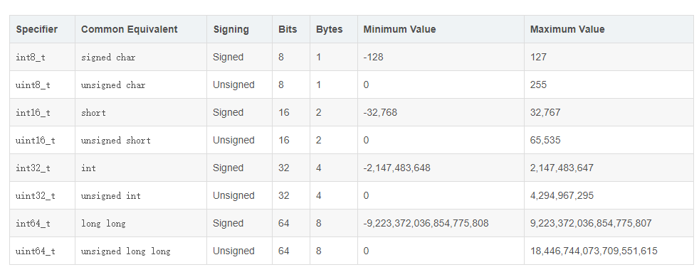

note：一般来以*\_t结尾，可以理解为type/typedef的缩写，表示它是通过typedef定义的，而不是其它数据类型。uint8_t，uint16_t，uint32_t等都不是什么新的数据类型，它们只是使用typedef给类型起的别名，新瓶装老酒的把戏。
又比如float64是double的别名

## 1 内置类型
七种基本的数据类型bool、char、int、flaot、double、void、wchar_t（typedef short int wchar_t;）
一些基本类型可以使用一个或多个类型修饰符进行修饰（int和char默认都是signed）：
- signed
- unsigned
- short
- long

## char

|类型| 位  | 范围  |
|---|---|---|
|char|1 个字节|-128 到 127 或者 0 到 255|
|unsigned char|1 个字节|0 到 255|
|signed char|1 个字节|-128 到 127|

## int

|类型| 位  | 范围  |
|---|---|---|
|int|4 个字节|-2147483648 到 2147483647|
|unsigned int|4 个字节|0 到 4294967295|
|signed int|4 个字节|-2147483648 到 2147483647|
|short int|2 个字节|-32768 到 32767|
|unsigned short int|2 个字节|0 到 65,535|
|signed short int|2 个字节|-32768 到 32767|
|long int|8 个字节|-9,223,372,036,854,775,808 到 9,223,372,036,854,775,807|
|signed long int|8 个字节|-9,223,372,036,854,775,808 到 9,223,372,036,854,775,807|
|unsigned long int|8 个字节|0 到 18,446,744,073,709,551,615|

## float

|   |   |   |
|---|---|---|
|float|4 个字节|精度型占4个字节（32位）内存空间，+/- 3.4e +/- 38 (~7 个数字)|

## double

|   |   |   |
|---|---|---|
|double|8 个字节|双精度型占8 个字节（64位）内存空间，+/- 1.7e +/- 308 (~15 个数字)|
|long double|16 个字节|长双精度型 16 个字节（128位）内存空间，可提供18-19位有效数字。|

