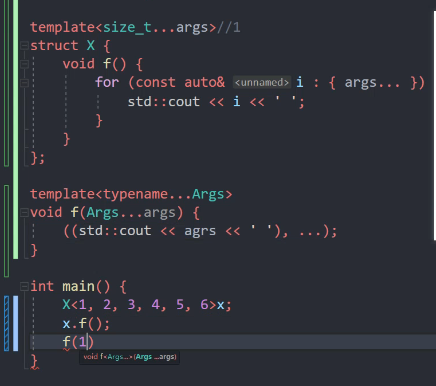

形参包
## 1 C++形参包
模板形参包是接受零个或更多个模板实参（非类型、类型或模板）的模板形参。函数形参包是接受零个或更多个函数实参的函数形参。

至少有一个形参包的模板被称作_变参模板_。

### 1.1 非类型模板形参包（形参包里是具体的数字）



### 1.2 模板形参包与函数形参包（形参包里是类型与形参包里是实参）

```cpp
template <class... Args>
void f(Args... args)//Args解包，变为int a和int b，args为a b 的集合
{    
    cout << sizeof...(args) << endl; //打印变参的个数
}

f();        //0 同f<>()
f(1, 2);    //2 同f<int,int>(1, 2)，此时Args为包含int和int的参数包，args为包含1,2(形参1，形参2)的参数包
f(1, 2.5, "");    //3 同f<int, float, const char*>(1, 2.5, "")此时Args为包含int, float, const char*的参数包，args为包含1，2.5，3（形参1、形参2、形参3）的参数包
```

```cpp
template<typename... Args> void f(Args... args) { 
    constexpr auto s1 = sizeof...(Args); // 模板参数包 
    constexpr auto s2 = sizeof...(args); // 函数参数包 
    static_assert(s1  s2);
}
```

形参包展开
```cpp
template<typename... Args> void f(Args... args) { 
    std::tuple<Args...> tp = // 展开模板参数包 
    std::make_tuple(args...); // 展开函数参数包 
}

`f(1, "2", 3.0)` 展开后的结果 [https://cppinsights.io/s/b78454ba](https://cppinsights.io/s/b78454ba)
template<> 
void f<int, const char *, double>(int __args0, const char * __args1, double __args2) { 
    std::tuple<int, const char *, double> tp = std::make_tuple(__args0, __args1, __args2); 
    //Args 为int、const char*、double的集合
    //args 为__args0, __args1, __args2的集合
}
```

### 1.3 形参包的遍历

#### 1.3.1 递归函数：
```cpp
#include <iostream>
using namespace std;
//递归终止函数
void print()
{
   cout << "empty" << endl;
}
//展开函数
template <class T, class ...Args>
void print(T head, Args... rest)
{
   cout << "parameter " << head << endl;
   print(rest...);
}

int main(void)
{
   print(1, 2.5, "");//此时，Args为float和const char*，rest为2.5和“”，head为1
   return 0;
}
```
上例会输出每一个参数，直到为空时输出empty。展开参数包的函数有两个，一个是递归函数，另外一个是递归终止函数，参数包Args...在展开的过程中递归调用自己，每调用一次参数包中的参数就会少一个，直到所有的参数都展开为止，当没有参数时，则调用非模板函数print终止递归过程。
递归调用的过程是这样的:
print(1,2,3,4);
print(2,3,4);
print(3,4);
print(4);
print();


#### 1.3.2如果类型一样可以用初始化列表去承载展开的形参包
```cpp
#include <iostream>
#include <memory>
#include <vector>

template <class... T>
void f(T... args) {
  auto m = {args...};//m 为std::initializer_list<int>
  for (auto i : m) {
    std::cout << i << " ";
  }
}
int main(int argc, char* argv[]) {
  f(1, 2); // 1 , 2
  return 0;
}
```

#### 1.3.3 折叠表达式（C++17）
递归函数展开参数包是一种标准做法，也比较好理解，但也有一个缺点,就是必须要一个重载的递归终止函数，即必须要有一个同名的终止函数来终止递归，这样可能会感觉稍有不便。有没有一种更简单的方式呢？其实还有一种方法可以不通过递归方式来展开参数包，那就是折叠表达式：

折叠表达式是C++17新引进的语法特性。使用折叠表达式可以简化对C++11中引入的参数包的处理，从而在某些情况下避免使用递归。
```cpp
template <class... T>
void f(T... args) {
  //折叠表达式，一元右折叠
  ((std::cout << args << " "), ...);
   // 折叠表达式，左折叠
  (..., (std::cout << args << " "));
}

int main(int argc, char* argv[]) {
  f(1, 2, 3.5, "hello"); // 1 , 2 , 3.5. hello
  return 0;
}
//由于逗号表达式是从左往右计算，所以不管是右折叠还是左折叠，都是输出1 , 2 , 3.5. hello
```

语法形式中的op代表运算符，pack代表参数包，init代表初始值。

- 一元右折叠(unary right fold)
( pack op ... )
一元右折叠(E op ...)展开之后变为 E1 op (... op (EN-1 op EN))

- 一元左折叠(unary left fold)
( ... op pack )
一元左折叠(... op E)展开之后变为 ((E1 op E2) op ...) op EN

- 二元右折叠(binary right fold)
( pack op ... op init )
二元右折叠(E op ... op I)展开之后变为 E1 op (... op (EN−1 op (EN op I)))

- 二元左折叠(binary left fold)
( init op ... op pack )
二元左折叠(I op ... op E)展开之后变为 (((I op E1) op E2) op ...) op EN

### 1.4 形参包的模式

可以在形参包外边套上一些符号来给形参包套上一些类型。
为每个类型加上了const &
```cpp
template<typename... Args> 
void print(const Args&... args) {
    ((std::cout << args << std::endl), ...); // 逗号表达式、折叠表达式 
}
```