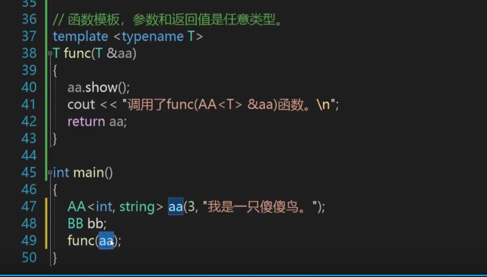

1. **C++中如果存在同名函数的普通函数，模板具体化函数，模板函数。那么调用的优先级是普通函数>模板具体化函数>模板函数。**

1. **模板具体化函数和普通函数一样，是有实体的，可以头文件声明，源文件定义。而模板函数没有实体，所以不能分文件编写，只能在头文件中分别声明和定义。**

1. **decltype（func（））括号内如果是函数，并不会调用函数，只会推导出函数的返回值类型。而auto = func（），会调用函数体。注意：函数后置返回类型在C++14之后就没什么意义了，不建议使用**

1. **函数模板可以隐式的推导，也就是说在函数模板创建的时候可以不用<>指定数据类型。但是类模板不行，类模板必须用<>指定数据类型。**

1. **类模板中的成员函数在类外实现的方式（类外也需要加template<typename T>声明）**

1. **类模板可以指定默认模板类型，在定义时就可以缺省有默认类型的模板参数。**

比如上述代码在定义AA类时，就可以AA <int>，这时会默认转成AA<int,string>。当然也可选择不使用默认的类型，比如AA<string,char>

1. **类模板的完全具体化和部分具体化，在类外实现成员函数时需要注意和类声明保持一致。调用的规则是具体化程度高的类>具体化程度低的类>没有具体化的类。**

1. **模板类继承普通类没什么好说的，模板类在声明时记得<>，其他的都和普通继承一样。但是普通类继承模板类时，可以继承模板类的实例化版本，也就是必须指定继承的父类（模板类）的模板参数<>，此时和普通继承区别不大。也可以直接继承模板类，此时需要在构造函数中，调用父类的构造函数时加上<T1,T2>，见下图2.**

上述代码在声明AA时，只需要声明AA a；即可，不需要用<>。

上述代码在声明AA时，需要用<>，比如AA<int，string> a。

1. **模板类继承模板类，需要在子类中增加模板类的参数，也就是子类的模板类参数包括子类自己的模板类参数+父类的模板类参数，如下述代码中T是子类的模板类参数，T1和T2是父类的模板类参数。**

1. **花活：可以继承模板参数，也就是模板参数当作父类。这样子类的父类可以不指定，而是可变的。**

1. **模板类用于函数的参数和返回值。如果调用函数时，函数模板和普通函数都能匹配上，优先使用函数模板。**

其实上边的第二个函数并不规范，很弱智，可以直接下称下边这样，效果是一样的。下边的方法可以支持任意类型，而上边的方法支持AA这一种模板类，再来个BB就不支持了。也就是适用范围更小。

1. **最好的友元模板函数写法**

1. **在模板类中创建模板类和模板函数(类之间的嵌套)**

1. **C++支持模板的模板**

class和typename都行

具体定义

最精髓的地方：T1是一个模板，用T2来创建T1的具体化类型。
