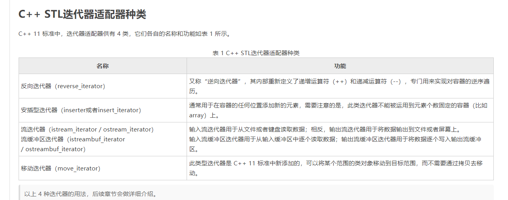
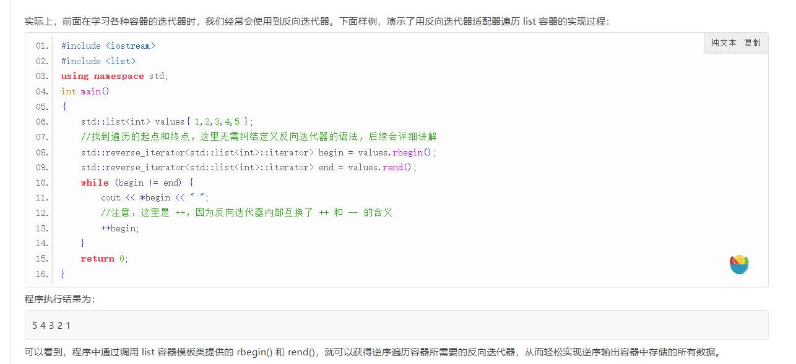
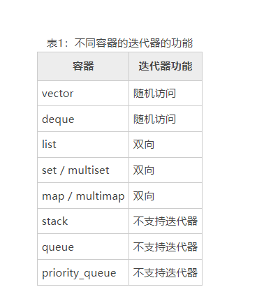

 容器通过空间配置器取得数据存储空间；算法利用迭代器向容器存取数据；仿函数协助算法完成不同的策略；适配器可以用来修改容器、迭代器或仿函数的接口；
 
## 1 容器Container

### 1.1顺序式容器
STL容器包含两种：序列式容器主要有vector、list、deque，forward_list和array
**顺序：访问、排序方便，插入删除不便（如vector容器就是这种存储结构**
**链式：插入删除方便，存取不便（如 list 存储结构）**
**混合 :访问方便，在两端插入和删除方便，在中间不便（如 deque）。**
1、list 容器的性质
list容器表示不连续的内存区域，允许向前或向后逐个遍历元素。在任何位置都可高效地insert或erase一个元素。插入或删除list容器中的一个元素不需要移动任何其他元素。

list容器不支持随机访问，访问某个元素要求遍历所涉及的其他元素

2、vector 容器的性质
对于vector容器，因为vector容器是按顺序存储的，所以除了容器尾部外，其他任何位置上的插入（删除）操作都要求移动被插入（或删除）元素右边所有的元素。例如，假设有一个拥有50个元素的vector容器，我们希望删除其中的第23号元素，则23号元素后面的所有元素都必须向前移动一个位置。否则，vector容器上将会留下一个空位（hole）,而vector容器的元素就不再是连续存放的了。

3、deque 容器的性质—-两端容易，中间难
deque容器拥有更加复杂的数据结构。**从deque队列的两端插入和删除元素都非常快。在容器中间插入或删除付出很大代价**。deque容器具有list和vector的一些性质：

与vector一样，在deque容器的中间insert或erase效率比较低

**不同于vector容器，deque容器提供高效地在其首部实现insert和erase操作，就像在容器尾部一样。**

与 vector容器一样，不同于list的是，deque容器支持对所有元素的随机访问；

### 1.2 关联式容器
关联式容器主要有：set、map、multiset、multimap、unordered_set、unordered_map、unordered_multiset、unordered_multiamp
容器主要是用来存放数据的，从实现的角度来看容器是一种class template（类模板）。

## 2 适配器Adapter
适配器， 在STL中扮演着**转换器**的角色，本质上是一种设计模式，用于**将一种接口转换成另一种接口**，从而是原本不兼容的接口能够很好地一起运作。
根据目标接口的类型，适配器可分为以下几类：

　　（1） 改变容器的接口，称为**容器适配器；**  
　　（2）改变迭代器的接口，称为**迭代器适配器**；  
　　（3）改变仿函数的接口，称为**仿函数适配器**。
　
### 2.1 容器适配器

容器的适配器有stack、queue、priority_queue，是在容器deque的基础进行了一些特定的约束，因而本质上并不属于容器，而是容器的适配器。
1. stack\<T>：是一个封装了 deque\<T> 容器的适配器类模板，默认实现的是一个后入先出（Last-In-First-Out，LIFO）的压入栈。stack\<T> 模板定义在头文件 stack 中。
2. queue\<T>：是一个封装了 deque\<T> 容器的适配器类模板，默认实现的是一个先入先出（First-In-First-Out，FIFO）的队列。可以为它指定一个符合确定条件的基础容器。queue\<T> 模板定义在头文件 queue 中。

**queue和deque的区别：** queue可以访问两端但是只能修改队头而deque可以访问两端并且可以在队首和队尾删除和插入元素

	deque是双端队列（可以在队头队尾进行入队出队操作），有push_back、push_front、pop_back、pop_front
	queue是单端队列，只能队尾插入，队首弹出，只有push和pop


3. priority_queue\<T>：是一个封装了 vector\<T> 容器的适配器类模板，默认实现的是一个会对元素排序，从而保证最大元素总在队列最前面的队列。priority_queue\<T> 模板定义在头文件 queue 中。




### 2.2函数对象适配器

1. 绑定器(binder)：给二元函数对象绑定一个常量，转化成一元函数对象。包括`bind1st`和`bind2nd`。
2. 取反器(negator)：将谓词函数对象结果取反。包括`not1`和`not2`

### 2.3迭代器适配器
C++ STL 标准库中迭代器大致分为 5 种类型，分别是输入迭代器、输出迭代器、前向迭代器、双向迭代器以及随机访问迭代器。值得一提的是，这 5 种迭代器是 STL 标准库提供的最基础的迭代器，很多场景中遍历容器的需求，它们并不适合。
所谓迭代器适配器，其本质也是一个模板类，比较特殊的是，该模板类是借助以上 5 种基础迭代器实现的。换句话说，迭代器适配器模板类的内部实现，是通过对以上 5 种基础迭代器拥有的成员方法进行整合、修改，甚至为了实现某些功能还会添加一些新的成员方法。由此，将基础迭代器“改头换面”，就变成了本节要讲的迭代器适配器。
本质上讲，迭代器适配器仍属于迭代器，可以理解为是基础迭代器的“翻新版”或者“升级版”。同时，“xxx 迭代器适配器”通常直接称为“xxx 迭代器”。



非适配器版本


适配器版本
## 3 算法Algorithm
一般分为三类，查找、排序和数值操作。
查找常用的有`std::find`、`std::find_if`、`std::find_first_of`等。
排序主要用`std::sort`及其家族的一系列算法。
数值操作主要用`std::accumulate`求和。

## 4迭代器Iterator
STL中迭代器主要用来把容器和算法结合起来，扮演容器与算法之间的胶合剂，是所谓的“泛型指针”。从实现的角度看迭代器是一种将operator*、operator->、operator++、operator--等指针操作重载的class template（类模板）。所有的STL容器都有自己的迭代器，**只有容器本身才知道如何遍历自身的元素**。
按功能强弱，迭代器可以分为输入、输出、正向、双向、随机访问五种

1) **正向迭代器**。假设 p 是一个正向迭代器，则 p 支持以下操作：++p，p++，*p。此外，两个正向迭代器可以互相赋值，还可以用``和`!=`运算符进行比较。  
  
2) **双向迭代器**。双向迭代器具有正向迭代器的全部功能。除此之外，若 p 是一个双向迭代器，则`--p`和`p--`都是有定义的。`--p`使得 p 朝和`++p`相反的方向移动。  双向迭代器不支持< >比较
  
3) **随机访问迭代器**。随机访问迭代器具有双向迭代器的全部功能。若 p 是一个随机访问迭代器，i 是一个整型变量或常量，则 p 还支持以下操作：
此外，两个随机访问迭代器 p1、p2 还可以用 <、>、<=、>= 运算符进行比较。`p1<p2`的含义是：p1 经过若干次（至少一次）`++`操作后，就会等于 p2。其他比较方式的含义与此类似。

- p+=i：使得 p 往后移动 i 个元素。
- p-=i：使得 p 往前移动 i 个元素。
- p+i：返回 p 后面第 i 个元素的迭代器。
- p-i：返回 p 前面第 i 个元素的迭代器。
- p[i]：返回 p 后面第 i 个元素的引用。




## 5 仿函数functor
仿函数是一种行为类似函数，但是实际是重载了operator()的class或class template（类模板），一般函数指针可视为狭义的仿函数。
```c++
#include<iostream>
#include<algorithm>
using namespace std;
 
class A{
public:
      int operator()(int x, int y){
          return x+y;
	  }
};
 
int main(){ 
	A *a = new A();
	cout<<(*a)(3,4)<<endl;
	
    getchar();
    return 0;
}
/*
输出
7 
*/
```

## 6 分配器Allocator
STL的空间配置器主要用来给容器进行空间的配置与管理，从实现的角度来说空间配置器是实现了一个动态分配空间、空间管理、空间释放的class template（类模板）。一般容器都会自带默认分配器，很少会自己实现分配器。