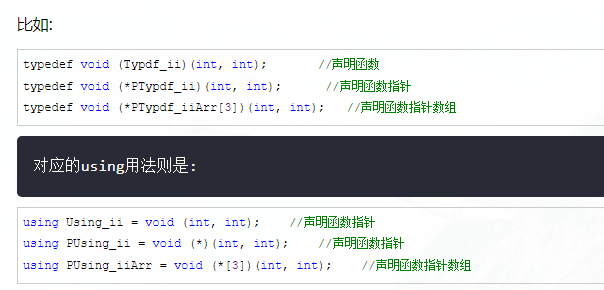

**c++标准对于typedef的解释**：任何声明变量的语句前面加上typedef，原来是变量的都会变成一种类型，不管这个生命中的标识符号出现在中间还是靠后。**也就是说，把typedef去掉，就是一个变量的声明。**

指针数组和数组指针：
- 首先，对于语句“int\*p1[5]”，因为“[]”的优先级要比“\*”要高，所以 p1 先与“[]”结合，构成一个数组的定义，数组名为 p1，而“int*”修饰的是数组的内容，即数组的每个元素。也就是说，该数组包含 5 个指向 int 类型数据的指针，如图 1 所示，因此，它是一个**指针数组**。

- 其次，对于语句“int(\*p2)[5]”，“()”的优先级比“[]”高，“\*”号和 p2 构成一个指针的定义，指针变量名为 p2，而 int 修饰的是数组的内容，即数组的每个元素。也就是说，p2 是一个指针，它指向一个包含 5 个 int 类型数据的数组，如图 2 所示。很显然，它是一个**数组指针**

# 数组
typedef <元素类型关键字> <数组类型名>[<常量表达式>];

```cpp
typedef int num[5]; //定义数组类型  
using num = int[5];

typedef char *num1[5]; //定义指针数组，本身是数组，数组里边存了5个char类型的指针
using num1 = char *[5];

typedef int(*num2)[5];  //定义数组指针，本身是指针，指向一个int[5]的数组
using num2 = int(*)[5];
```


```cpp
typedef int arrs[5];
using arrs=int[5];

typedef arrs * p_arr5;
using p_arr5 = arrs *;

typedef p_arr5 arrp10[10];
using arrp10=p_arr5[10];

arrs togs;       // togs是具有5个元素的int数组
p_arr5 p2;      // p2是一个指针，指向具有元素的数组
arrp10  ap;    // ap是具有十个元素的指针数组，每个指针指向具有5个元素的int数组

```

```cpp
//##### .定义指向包含10个int变量的数组的指针类型
typedef int (* pints)[10];
int main()
{
    int arr[10] = {1,2,3,4};
    pints pis = &arr;
    for(int i=0; i<10; ++i)
        cout << (*pis)[i] << " ";
}
输出：  
1 2 3 4 0 0 0 0 0 0
```

```cpp
##### 定义包含10个int指针的数组类型
typedef int * pInts[10];
int main()
{
    int arr[10] = {1,2,3,4};
    pInts pIs;
    for(int i=0; i<10; ++i)
        pIs[i] = &(arr[i]);
    for(int i=0; i<10; ++i)
        cout << *(pIs[i]) << " ";
}
输出：  
5 6 7 8 0 0 0 0 0 0
```

# 函数指针

```cpp
typedef void*(*Fun)(int,int);
using P = void*(*)(int a);//等价上一条
```

这里将返回类型为void \*，入参为int的函数类型命名为Fun，


# 普通用法
```cpp
typedef int my_int;
typedef int* my_int_point;
```

# using代替typedef

