果使用上面的方式打印指针指向的内容，那么打印出来的只是指针地址而已。那怎么打印出指针指向的内容呢？
## 基本命令

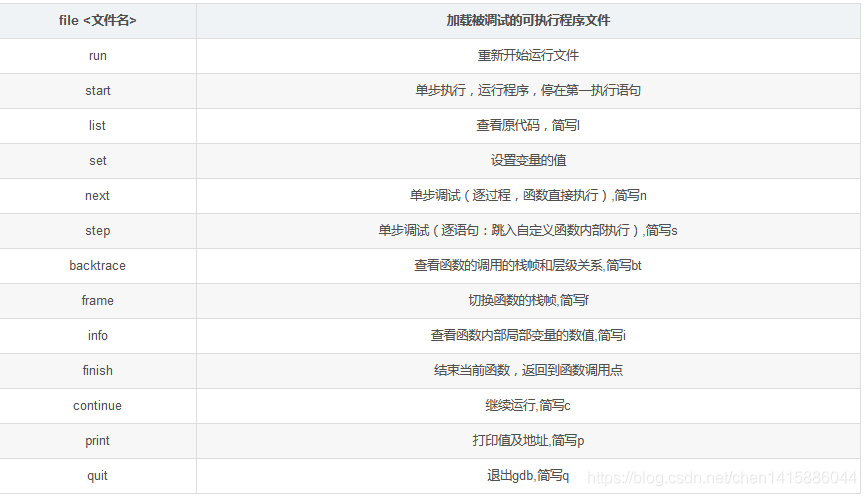

## 调试前的判断

要调试C/C++的程序，首先在编译时，要使用gdb调试程序，在使用gcc编译源代码时必须加上“-g”参数。保留调试信息，否则不能使用GDB进行调试。

有一种情况，有一个编译好的二进制文件，你不确定是不是带有-g参数，带有GDB调试，这个时候你可以使用如下的命令验证：gdb + 二进制文件名

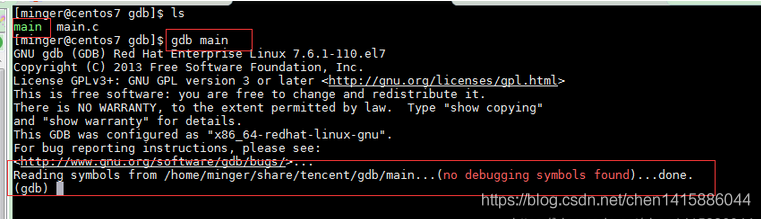

如果没有调试信息，则会出现：
Reading symbols from /home/minger/share/tencent/gdb/main…(no debugging symbols found)…done.

如果带有调试功能，下面会提示：

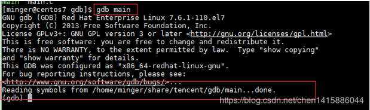

说明可以进行GDB调试。

也可以是使用readelf命令查看：readelf -S main|grep debug
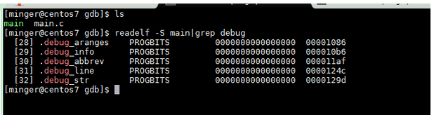
如果有debug说明有调试功能，如果没有debug。说明没有带有调试功能，则不能被调试。

开始进入正题，GDB启动调试。


## 启动调试

编译时增加 -g参数。
gcc -g main.c -o main

```cpp
#include <stdio.h>
void Print(int i){
	printf("hello,程序猿编码 %d\n", i);
}
int main(int argc, char const *argv[]){
	int i = 0;
	for (i = 1; i < 3; i++){
		Print(i);
	}
	return 0;
}
```

- 键入gdb，进入调试，“(gdb)”为GDB内部命令引导符，等待用户输入GDB命令。
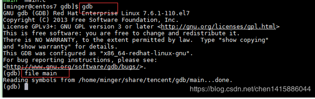

- 使用“file”命令载入被调试程序 main（这里的 main 即前面gcc 编译输出的可执行文件）：如果最后一行提示Reading symbols from /home/minger/share/tencent/gdb/main…done. 表示已经加载成功。

- 使用“r”命令执行（Run）被调试文件，因为尚未设置任何断点，将直接执行到程序结束（如果main有参数，就在r 后跟上参数）：
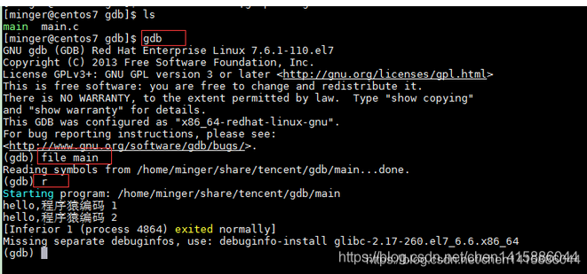

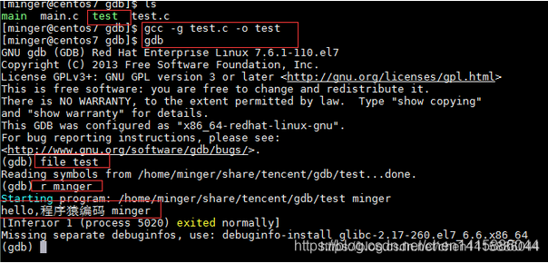


### 利用core排查段错误

#### 方法一
加入已经生成了core文件。用gdb调试该core，命令为 gdb core.test.3591 ,显示如下
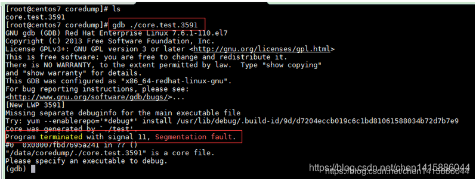
program terminated with signal 11 告诉我们信号中断了我们的程序，发生了段错误。这个时候可以敲命令 backtrace(bt) 查看函数的调用的栈帧和层级关系。
#### 方法二
也可以 gdb可执行文件，软后用core-file命令+bt

gdb 可执行程序
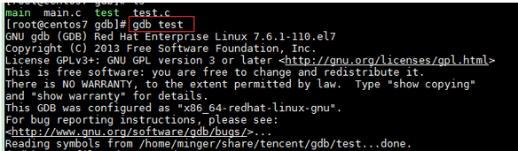
进入gdb环境后，core-file core的名字
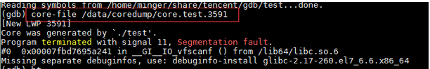
敲bt命令，这是gdb查看back trace的命令，查看函数的调用的栈帧和层级关系。
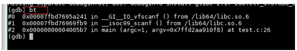
可以看到最近的栈中存储的是调用了IO操作，可以看到main函数的26行出错。

到此为止，就是core文件配置生成和调试方法。

## 断点设置与查看源码

- break 文件名:行号（该行不执行）
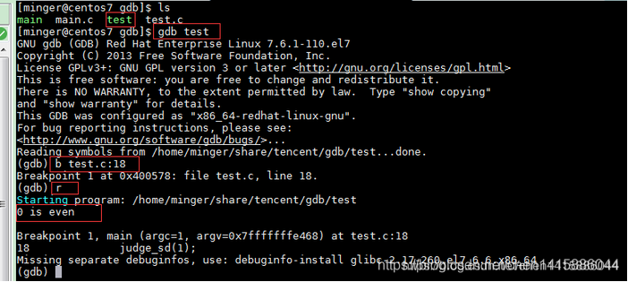

- break 函数名
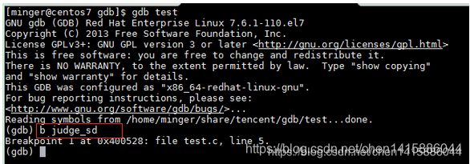

- 条件断点：break test.c:6 if num>0

- 查看断点：info breakpoints

- 删除断点：delete breakpoint

- 查看源码：断点设置完后，当程序运行到断点处就会暂停。暂停的时候，我们可以查看断点附近的代码。查看代码的子命令是list，缩写形式为l。
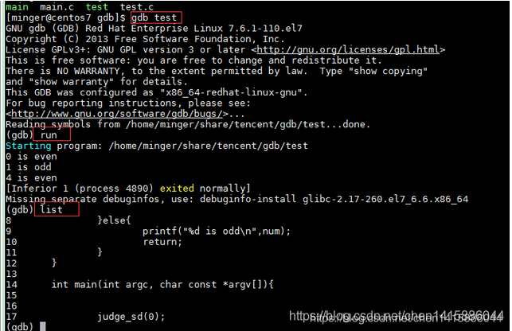

## 单步调试与查看变量

断点附近的代码你了解后，这时候你就可以使用单步执行一条一条语句的去执行。可以随时查看执行后的结果。接下来你可能会想知道程序运行的一些情况，就需要查看变量的值。下面介绍单步调试与设置变量。

- step单步进入（可简写为s），它可以单步跟踪到函数内部。
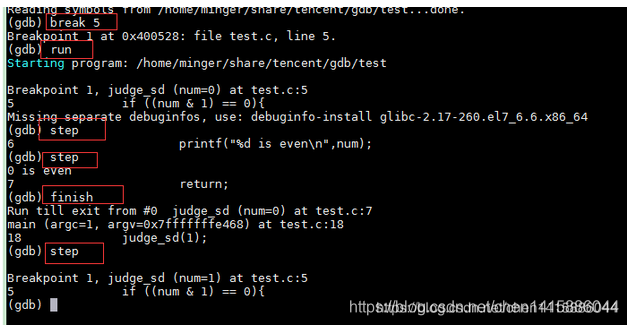
从上面的过程可以看到，在5行设置断点，运行程序，可见，step命令进入到了被调用函数中judge_sd。使用step命令也会在这个方法中一行一行的单步执行。但是如果没有该函数源码，需要跳过该函数执行，可使用finish命令，继续后面的执行。

- next单步执行（可简写为n）用于在程序断住后，继续执行下一条语句（不进入函数内部）。
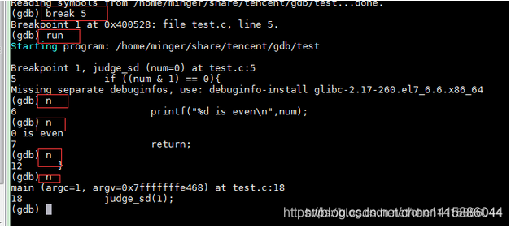
next命令（可简写为n）用于在程序断住后，继续执行下一条语句。上面的信息在5行处打断点，然后运行到6行，然后输入 运行n 2，则会单步执行两行。可见，使用next命令只会在本方法中单步执行。

- continue命令（可简写为c）或者fg，它会继续执行程序，直到再次遇到断点处。
我们可能打了多处断点，或者断点打在循环内，这个时候，想跳过这个断点，甚至跳过多次断点继续执行该怎么做呢？可以使用continue命令。它的作用就是从暂停处继续执行。命令的简写形式为c


### 查看变量

- print（简写p） 变量名
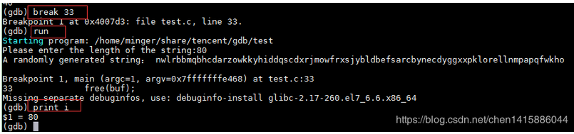

打印出的变量i的值为80。

当然，多个函数或者多个文件会有同一个变量名，这个时候可以在前面加上文件名或者函数名来区分：
p 'testfile.c'::i
p 'sum'::i

- 查看指针：
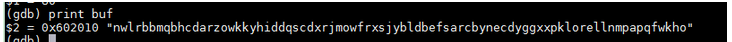
如果使用上面的方式打印指针指向的内容，那么打印出来的只是指针地址而已。那怎么打印出指针指向的内容呢？

- 查看指针的内容
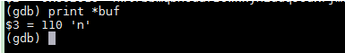
仅仅使用只能打印第一个值，如果要打印多个值，后面跟上\@并加上要打印的长度。  
或者\@后面跟上变量值：如下：
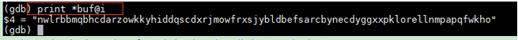

### 设置变量

使用print命令查看了变量的值，如果感觉这个值不符合预期，想修改下这个值，再看下执行效果。这种情况下，我们该怎么办呢？通常情况下，我们会修改代码，再重新执行代码。使用**gdb的set**命令，一切将变得更简单。