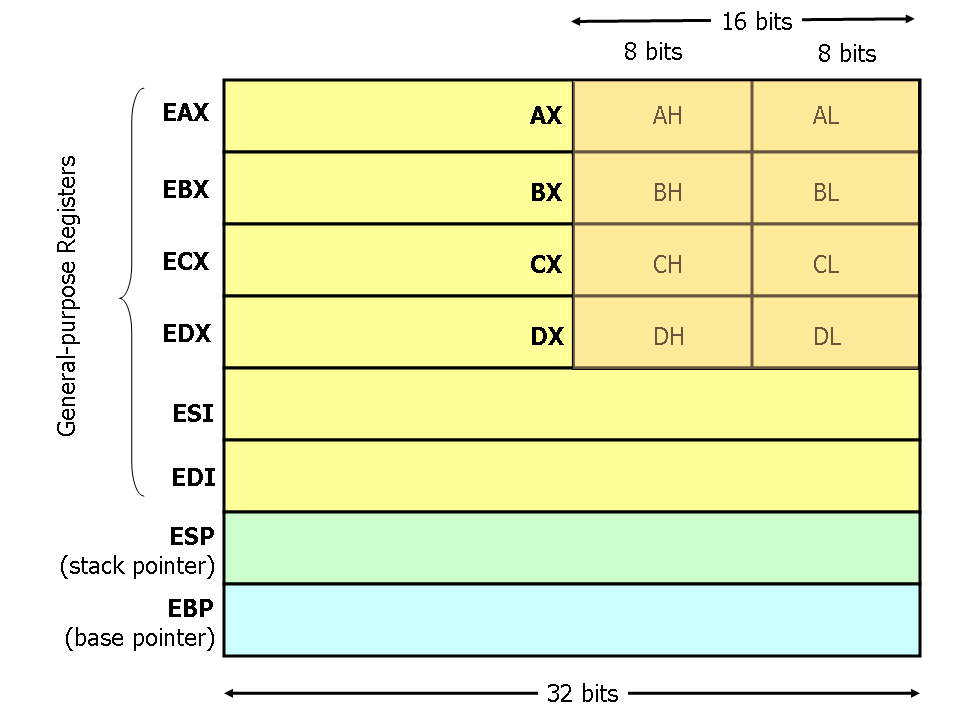
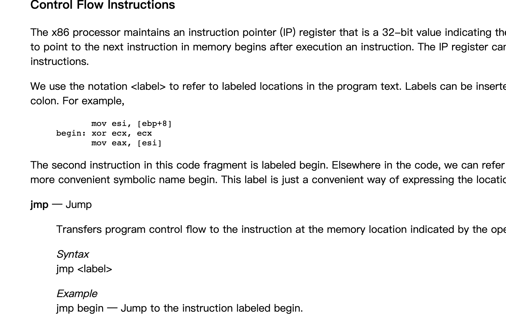
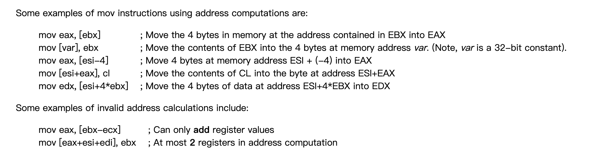
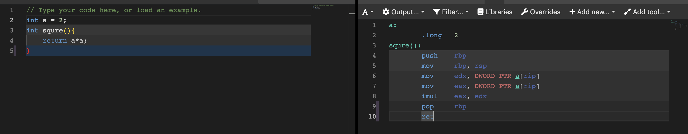
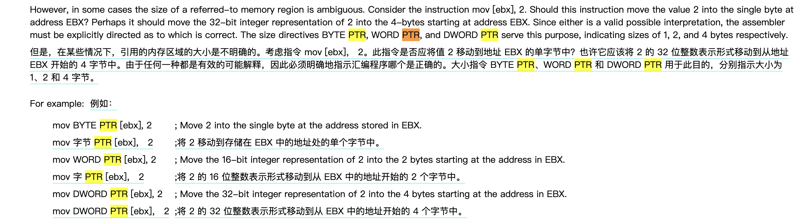
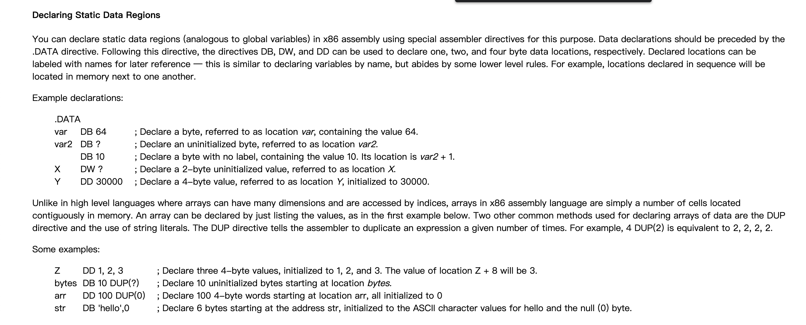
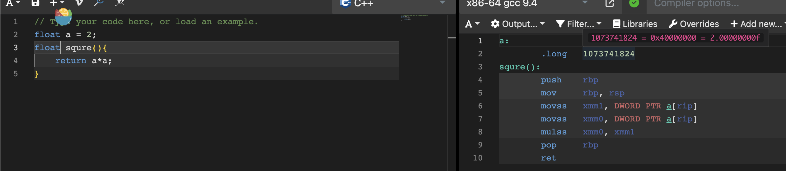

仅针对x86架构
## 32位x86寄存器：


## 64位x86寄存器：
	把32位的e全部换成r，比如rax、rbx。
	其中rax专门用来用做return的值。
	rsp为栈顶指针：8个字节，64位
	rbp为栈底指针：8个字节，64位

## 快速入门
这篇博客，快速入门
https://www.cs.virginia.edu/~evans/cs216/guides/x86.html

调用函数用call  标签
代码跳转用 junmp 标签

汇编中任何一个地方都可以用<标签:>标记：
比如 my_tag:


\[addr\]:表示addr地址指向的内容
比如\[rax\]:表示rax寄存器中存的是一个地址，\[rax\]表示该地址指向的值。

## 常用的指令：
- mov、push、pop、lea、add、sub、inc\\dec、imul、idiv、and、or、xor、not、neg、shl（左移位）、shr（右移位）、je（等于跳转）、jne（不等跳转）、jg（大于）、jge（大于等于）、jl（小于）、jle（小于等于）、cmp（比较，通常和跳转连用）、call、ret



## 一些惯用的代码：

- 变量名+\[rip\]表示变量的值，rip为程序指针，指示当前程序运行的位置。上图a\[rip\]代表2
- 函数的开头和结尾：
```
push rbp
mov rbp,rsp

do some thing

pop rbp
ret
``` 
- 函数名做好标签：如上图中squre()就是标签
- 一般函数返回值的结果都存在eax中。
- byte ptr、word ptr、dword ptr

- 静态区的声明：DB（一个字节）、DW（两个字节）、DD（四个字节）


## 浮点数的表示

float在内存中中32位二进制数表示
