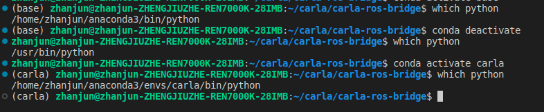
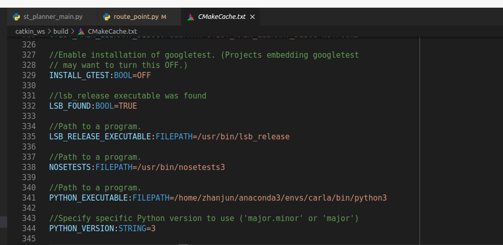
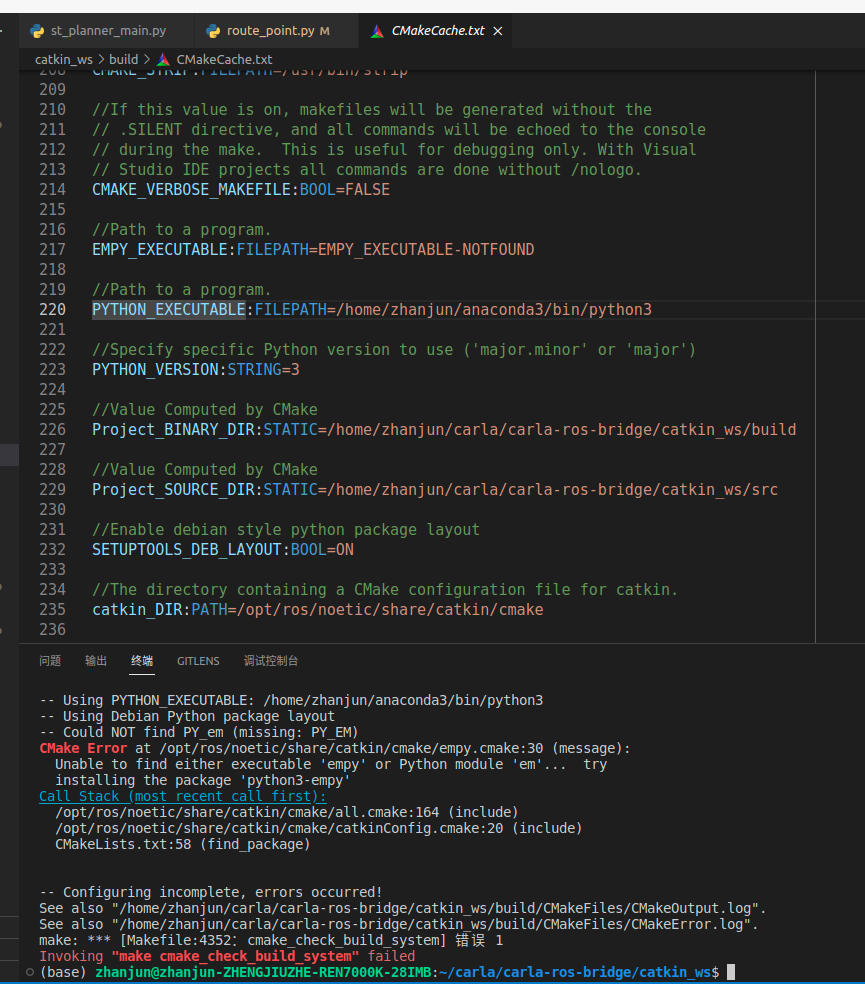
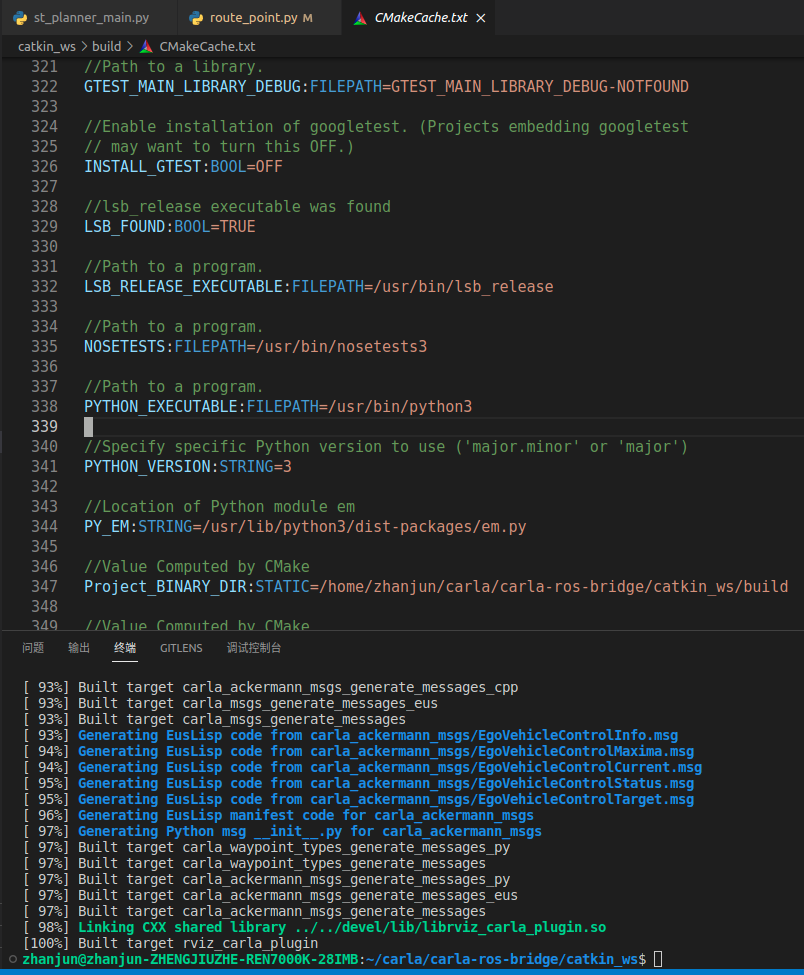
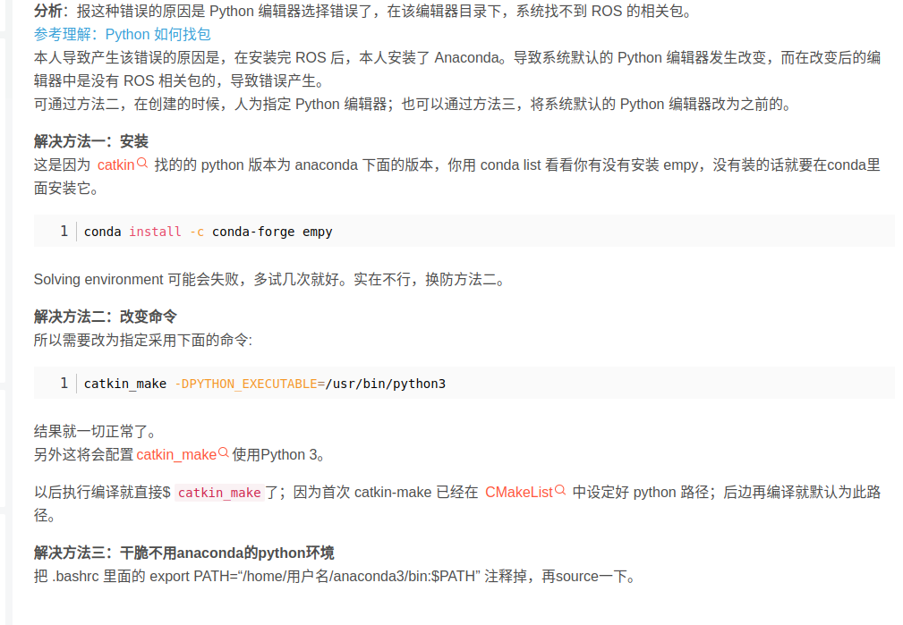

1. 在ROS中，如果没有conda环境，一般调用的是usr/bin/python

2. 如果想在ROS中使用conda，一般要先下载ROS再下载conda，然后在~/.bashrc中conda deactivate。在下载conda之后，终端中which python的位置会随着conda的虚拟环境而发生改变，如下图所示

3. ros编译的时候可以指定python解释器的路径catkin_make DPYTHON_EXECUTABLE=/home/zhanjun/anaconda3/envs/carla/bin/python3

（一般终端中如果激活了conda环境，catkin会自动识别，然后用当前虚拟环境的解释器,如下图所示）

base环境下，PYTHON_EXECUTABLE是base的python

没有conda环境下，PYTHON_EXECUTABLE是ubuntu自己的python

python文件中的脚本#~ /usr/bin/env python会被覆盖

4. conda中要使用ros如果报找不到python3-empy的错误（一般ubuntu自带的/usr/bin/python3没有这个问题，这个问题一般是conda虚拟环境少包），执行下边的安装conda install -c conda-forge empy（或者 pip install empy，但是只能选择一个，不能重复安装）。

对于一个空的conda环境，最好python版本指定为3.7，然后还需要pip install rospkg，pip install catkin-tools

如果报错找不到catkin_make ,pip install catkin_make

