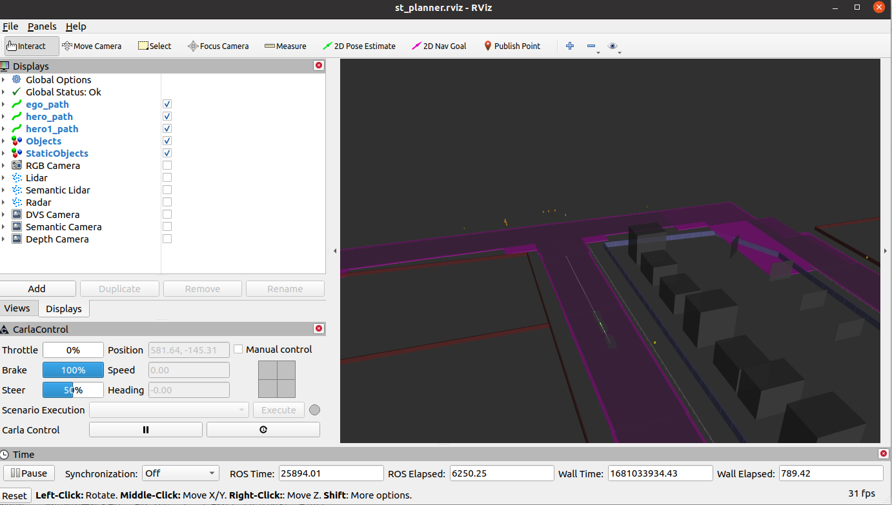

在rviz中可以看到ros中相关的时间概念一共有四个：
ROS Time：ROS中的仿真时间，如果计算量小，会走的非常快，它是当前时间到ROSmaster启动的仿真时间差。他的时间与rviz开启与否无关。
ROS Elapsed：rviz开启的时间到当前时间的ROS世界的时间差
Wall Time：系统时间
Wall Elapsed：rviz开启的时间到当前时间的系统时间差

总结：Wall Elapsed和ROS Elapsed和rviz开启的时间有关，ROS Time和Wall Time一个是仿真时间，一个是系统时间

