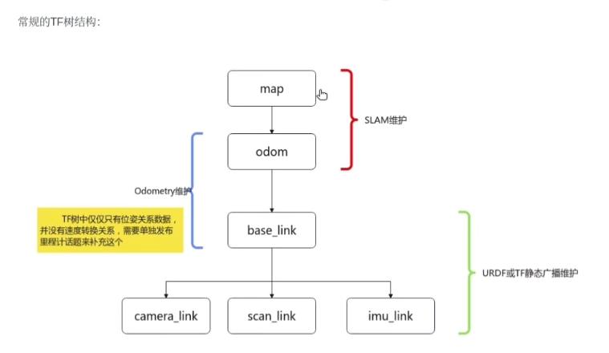
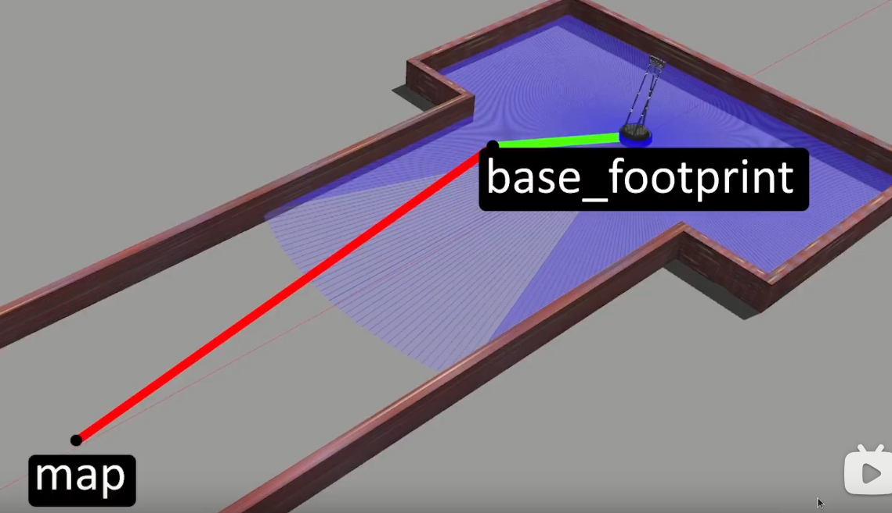
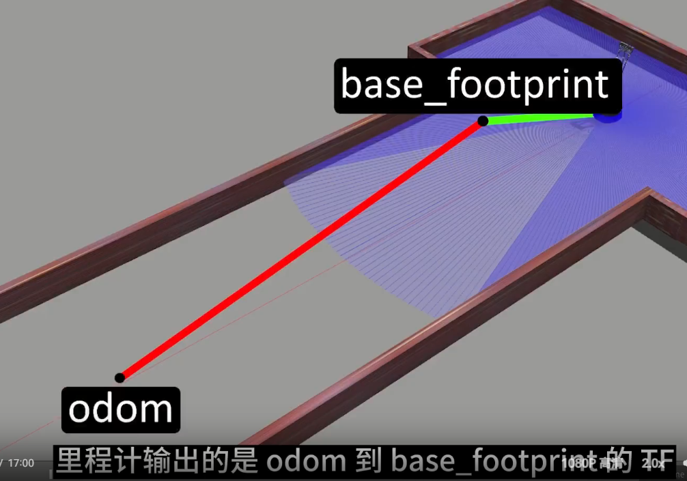
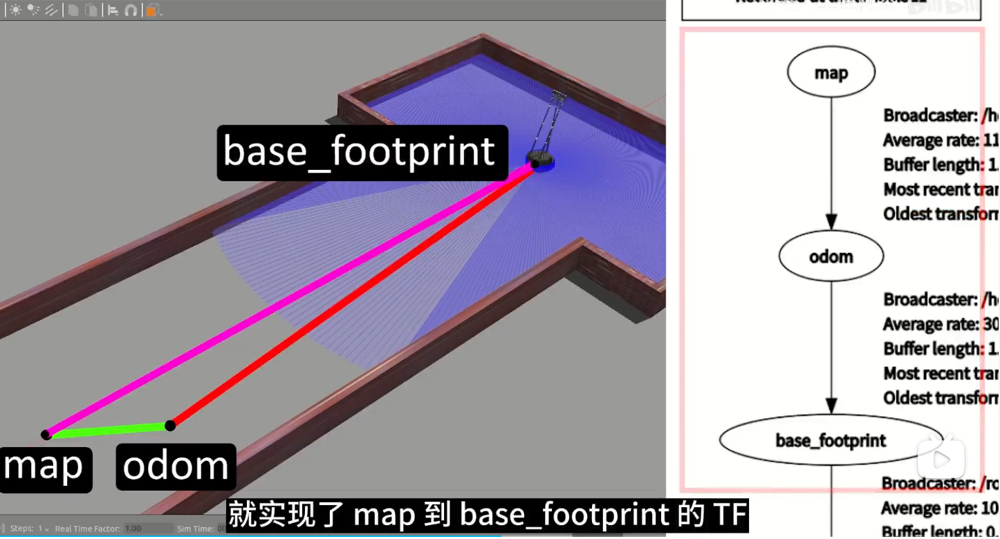
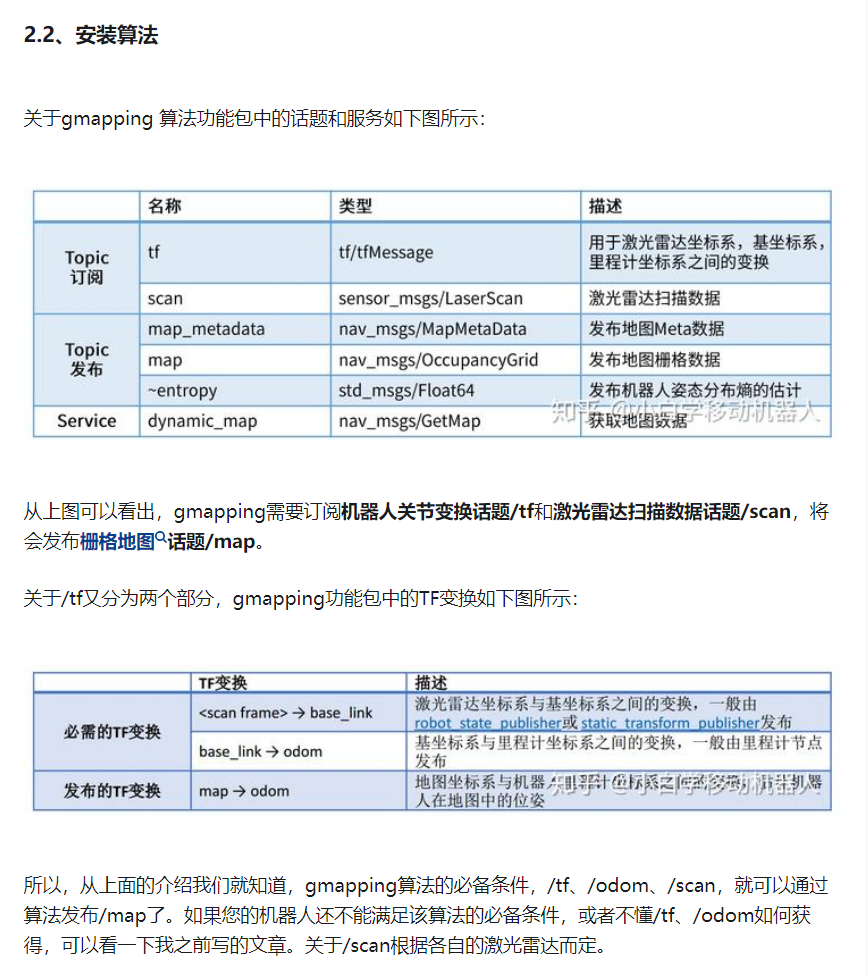
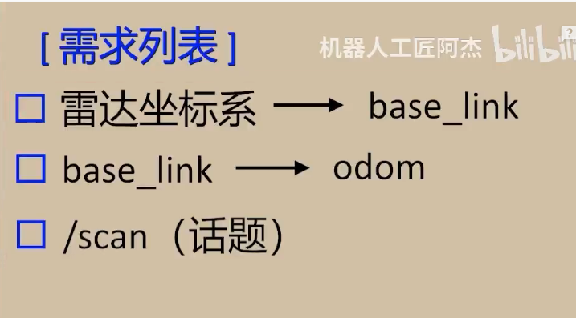
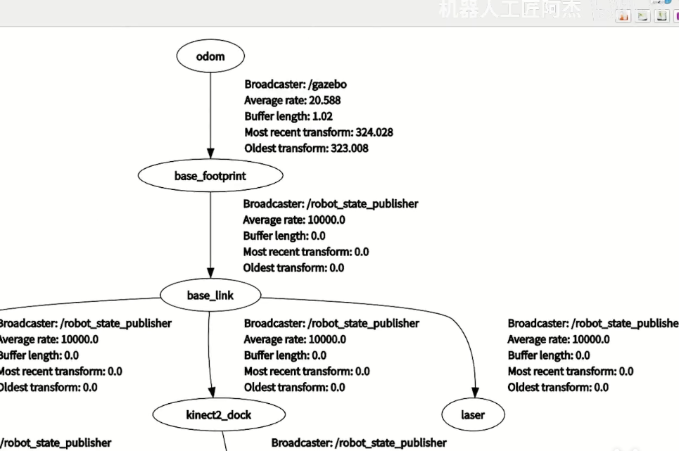
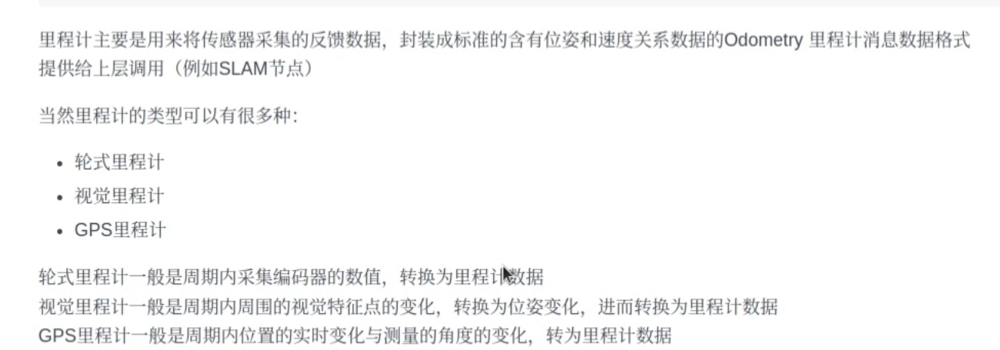
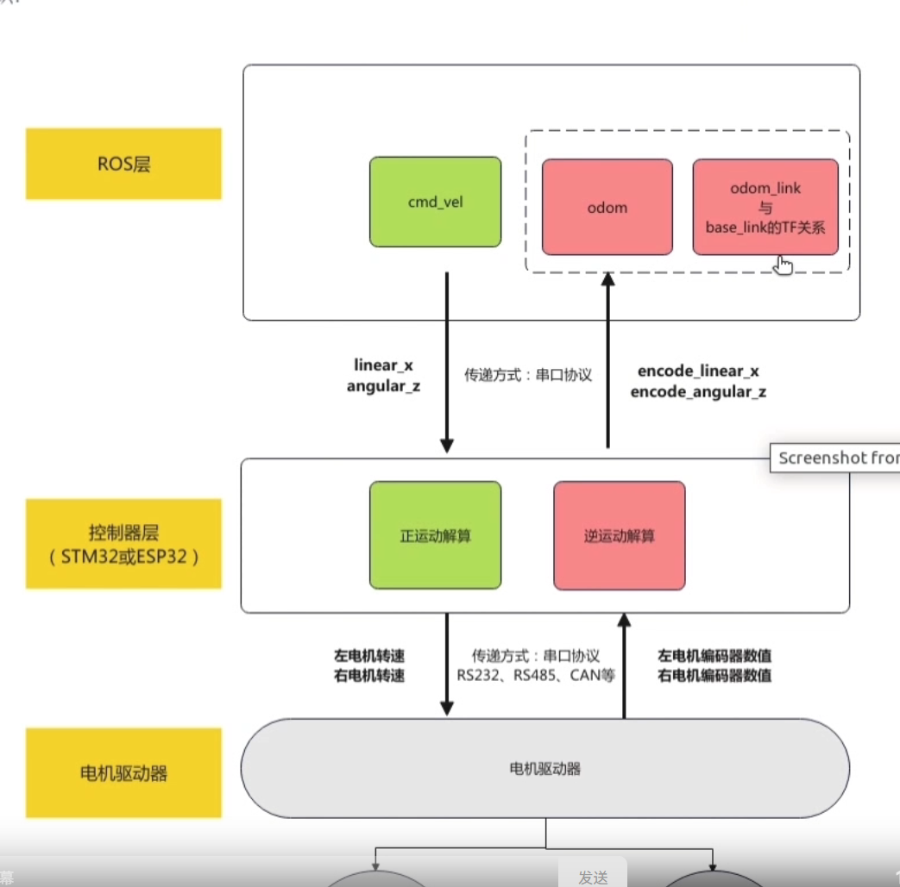
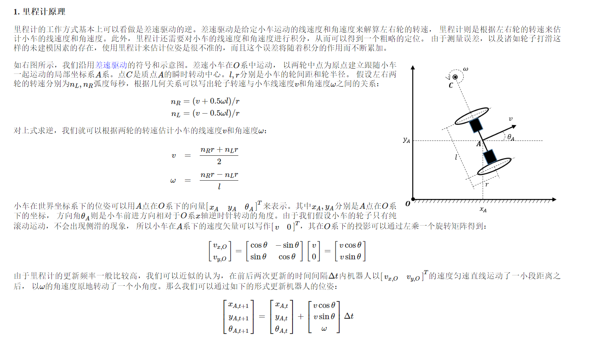

https://www.bilibili.com/video/BV1LV411T7Pm/?spm_id_from=333.788&vd_source=d31a858cc26ae1ffa19e14058b339f40

软件包：
https://github.com/6-robot/wpr_simulation

## 1基本概念
激光雷达slam的定位是通过输出map到base_footprint的tf来实现的。



里程计输出的是odom到base_footprint的tf，原理上odom坐标系应该是和map坐标系重合的，是一个定值。但是由于odom和base_footprint如果都固定无法表示累计误差，一般是把odom作为动的坐标。map到odom就表示odom的累计误差。




Map: 全局坐标系。  
odom: 原点位于初始位置的坐标系， 坐标轴与map坐标系平行。  
Base_foot_print: 原点位于机器人上的坐标系， 坐标轴与map坐标系平行。  
bask_link: 原点位于机器人上的坐标系， 坐标轴会随着机器人旋转而旋转。  
因此， 从map 到odom, 表示建图的位置， 从odom 到base_footprint表示机器人的平移变换， 从base_footprint 到base_link 表示机器人的旋转变换。  
**gmapping 算法会在从map 到odom 中插入一定的值来矫正odom的误差， 里程计应该输出的是从odom到base_link（包括旋转和平移）的tf**


## 2 tf关系





## 3 gmapping的输入输出





## 4里程计类型

轮式里程计、视觉里程计、GPS里程计。

里程计的工作方式基本上可以看做是差速驱动的逆。差速驱动是给定小车运动的线速度和角速度来解算左右轮的转速， **里程计则是根据左右轮的转速来估计小车的线速度和角速度。此外，里程计还需要对小车的线速度和角速度进行积分，从而可以得到一个粗略的定位**。 由于测量误差，以及诸如轮子打滑这样的未建模因素的存在，使用里程计来估计位姿是很不准的，而且这个误差将随着积分的作用而不断累加。

一般的小车里里程计可以用每一时刻的线速度和角速度的反馈值来构建里程计的消息格式（一般需要自己写一个里程计节点来发送odom到base_link的tf变换和发布odom消息）。 






## 5手写里程计代码
如果车上没有线程的里程计，我们可以通过小车实时反馈的线速度和角速度结合采样时间手写一个里程计。需要实现tf的发布和odom消息的发布两部分。

```c++

// 速度/位置结构体
typedef struct __Vel_Pos_Data_
{
    float X;
    float Y;
    float Z;
} Vel_Pos_Data;

Vel_Pos_Data Robot_Pos; // 机器人的位置
Vel_Pos_Data Robot_Vel; // 机器人的速度
float sampling_time;           // 采样时间
double _time_now, _time_last;

/**************************************
Function: 发布里程计相关信息
***************************************/
void Publish_Odom()
{
    _time_now = nodeHandle->get_clock()->now().seconds();
    sampling_time = _time_now - _time_last;
    Robot_Pos.X += (Robot_Vel.X * cos(Robot_Pos.Z) - Robot_Vel.Y * sin(Robot_Pos.Z)) * sampling_time; // 计算x方向的位移
    Robot_Pos.Y += (Robot_Vel.X * sin(Robot_Pos.Z) + Robot_Vel.Y * cos(Robot_Pos.Z)) * sampling_time; // 计算y方向的位移，
    Robot_Pos.Z += Robot_Vel.Z * sampling_time * 0.75;                                            // 0.75是用来纠正偏差，需要通过里程计校准步骤来获取该值

    tf2::Quaternion quaternion;
    quaternion.setRPY(0.0, 0.0, Robot_Pos.Z);
    geometry_msgs::msg::Quaternion odom_quat = tf2::toMsg(quaternion);

    auto odom = std::make_unique<nav_msgs::msg::Odometry>();
    odom->header.stamp = nodeHandle->get_clock()->now(); // 当前时间
    odom->header.frame_id = "wheel_odom";
    odom->pose.pose.position.x = Robot_Pos.X; // 位置
    odom->pose.pose.position.y = Robot_Pos.Y;
    odom->pose.pose.position.z = 0;
    odom->pose.pose.orientation = odom_quat;
    // 设置速度
    odom->child_frame_id = "base_link";
    odom->twist.twist.linear.x = Robot_Vel.X;  // X方向前进速度
    odom->twist.twist.linear.y = Robot_Vel.Y;  // y方向前进速度
    odom->twist.twist.angular.z = Robot_Vel.Z; // 角速度

    // first, we'll publish the transform over tf
    geometry_msgs::msg::TransformStamped odom_trans;
    odom_trans.header.stamp = odom->header.stamp;
    odom_trans.header.frame_id = "wheel_odom";
    odom_trans.child_frame_id = "base_link";
    odom_trans.transform.translation.x = Robot_Pos.X;
    odom_trans.transform.translation.y = Robot_Pos.Y;
    odom_trans.transform.translation.z = 0;
    odom_trans.transform.rotation = odom_quat;
    odom_publisher->publish(std::move(odom)); // 发布这个话题 消息类型是nav_msgs::msg::Odometry


    odom_broadcaster->sendTransform(odom_trans);
    // send the transform

    _time_last = _time_now; // 记录时间
}
```