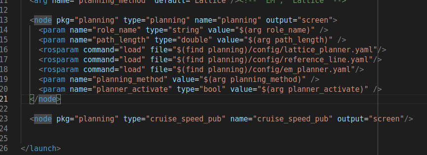
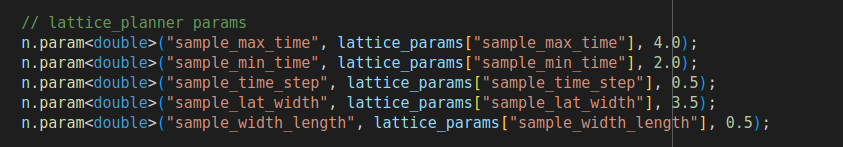

launch文件
# 1. rosparam 加载yaml定义的参数



# 2.param标签来设置参数
- 如果rosparam标签和param标签在node标签下，那么参数是私有命名空间：node_name/parma_name

- 如果rosparam标签和param标签在node标签外，那么参数是全局命名空间：/parma_name

# 3 node标签

`<node>`标签用于指定 ROS 节点，是最常见的标签，需要注意的是: roslaunch 命令不能保证按照 node 的声明顺序来启动节点(节点的启动是多进程的)

#### 1.属性

- pkg="包名"
    
    节点所属的包
    
- type="nodeType"
    
    节点类型(与之相同名称的可执行文件)
    
- name="nodeName"
    
    节点名称(在 ROS 网络拓扑中节点的名称)
    
- args="xxx xxx xxx" (可选)
    
    将参数传递给节点
    
- machine="机器名"
    
    在指定机器上启动节点
    
- respawn="true | false" (可选)
    
    如果节点退出，是否自动重启
    
- respawn_delay=" N" (可选)
    
    如果 respawn 为 true, 那么延迟 N 秒后启动节点
    
- required="true | false" (可选)
    
    该节点是否必须，如果为 true,那么如果该节点退出，将杀死整个 roslaunch
    
- ns="xxx" (可选)
    
    在指定命名空间 xxx 中启动节点
    
- clear_params="true | false" (可选)
    
    在启动前，删除节点的私有空间的所有参数
    
- output="log | screen" (可选)
    
    日志发送目标，可以设置为 log 日志文件，或 screen 屏幕,默认是 log
    

#### 2.子级标签

- env 环境变量设置
    
- remap 重映射话题名称（ from="xxx"原始话题名称 to="yyy"目标名称）
    

#### 2.子级标签

- 无
    
- rosparam 参数设置（yaml文件，私有命名空间）
    
- param 参数设置（非yaml文件，全局命名空间）

# 4 include标签

`include`标签用于将另一个 xml 格式的 launch 文件导入到当前文件

#### 1.属性

- file="$(find 包名)/xxx/xxx.launch"
    
    要包含的文件路径
    
- ns="xxx" (可选)
    
    在指定命名空间导入文件
    

#### 2.子级标签

- env 环境变量设置
    
- arg 将参数传递给被包含的文件

# 5 group标签

`<group>`标签可以对节点分组，具有 ns 属性，可以让节点归属某个命名空间

#### 1.属性

- ns="名称空间" (可选)
    
- clear_params="true | false" (可选)
    
    启动前，是否删除组名称空间的所有参数(慎用....此功能危险)
    

#### 2.子级标签

- 除了launch 标签外的其他标签

# 6 arg标签
 
#### 1.属性

- name="参数名称"
    
- default="默认值" (可选)
    
- value="数值" (可选)
    
    不可以与 default 并存
    
- doc="描述"
    
    参数说明
    

#### 2.子级标签

- 无

#### 3.示例

- launch文件传参语法实现,hello.lcaunch
    
    ```xml
    <launch>
        <arg name="xxx" />
        <param name="param" value="$(arg xxx)" />
    </launch>
    ```
    
- 命令行调用launch传参
```bash
roslaunch hello.launch xxx:=值
```

# 2. 通过nodehandle来读取参数


  
param()函数从参数服务器取参数值给变量param_val。如果无法获取，则将默认值赋给变量。
这个函数的功能和getParam()函数类似，区别是param()函数还提供了一个默认值。


