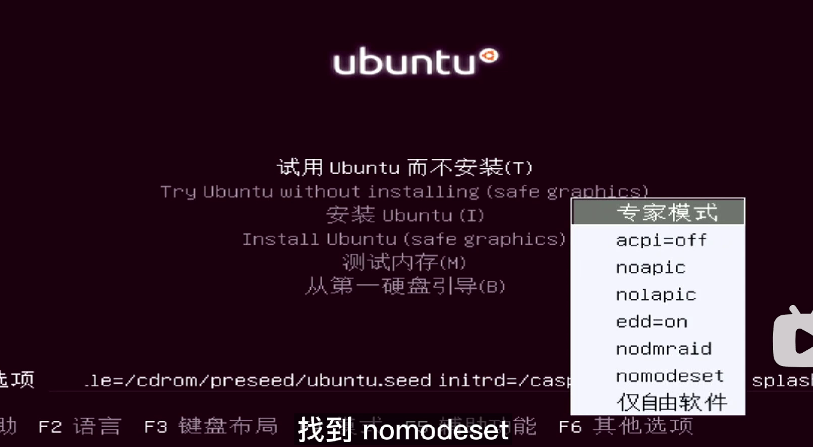
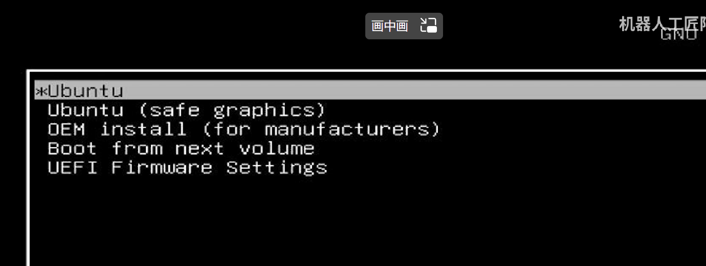
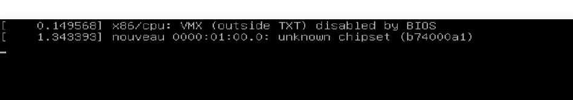
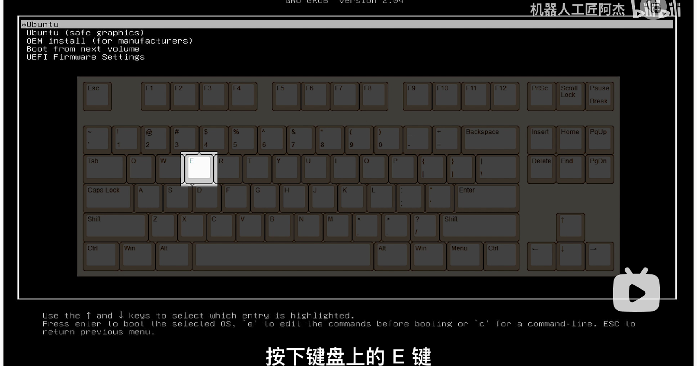
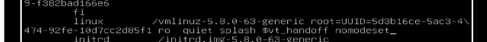
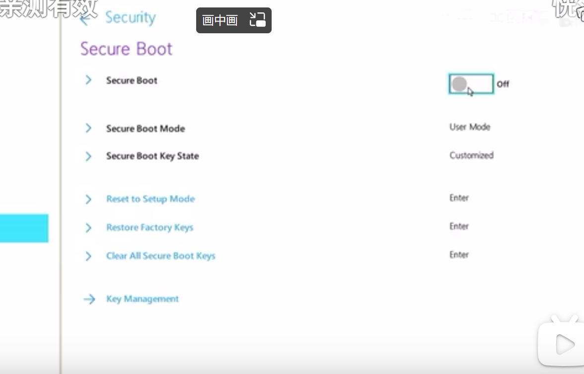

linux在安装系统开机时经常会遇到黑屏的情况，主要是因为linux开源显卡驱动，以下是解决方案：
1.首先确定进入系统的引导是efi引导还是legacy引导
	
2.如果是legacy引导
	
重启后不断按e，进入编辑模式
选择语言，然后选择安装ubuntu，按f6，找到nomodeset，关闭就可以了

3.如果uefi引导

重启，然后按e，添加nomodeset，然后按f10保存。

4.如果启动后黑屏
同样在启动界面按e，找到linux的那一项。添加nomodeset，然后按f10保存。

具体可以看这个视频
https://www.bilibili.com/video/BV1wY411p7mU?p=2&vd_source=d31a858cc26ae1ffa19e14058b339f40

## linux安装显卡驱动有两大途径：

### 1. 从ubuntu软件中心进行选择

### 2.自己在nvidia官方网站下载安装

	1.首先关闭bios的security boot，不然安装显卡驱动会出现签名认证。
	2.在该网站下下载下卡驱动，选择适合自己版本的显卡驱动
	https://www.nvidia.cn/Download/index.aspx?lang=cn
	3.下载显卡驱动，然后 sudo bash  xxxx.run
	

