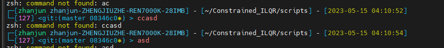

只推荐rkj-repos

在这个主题中，会有一个命令状态码的概念
https://blog.csdn.net/wlovh1989/article/details/51113488

0                   命令成功结束
1                    通用未知错误
2                    误用shell命令
126               命令不可执行
127               没找到命令
128               无效退出参数
128+x          Linux 信号x的严重错误
130            Linux 信号2 的严重错误，即命令通过SIGINT（Ctrl＋Ｃ）终止
255               退出状态码越界

比如127代表没有找到命令
