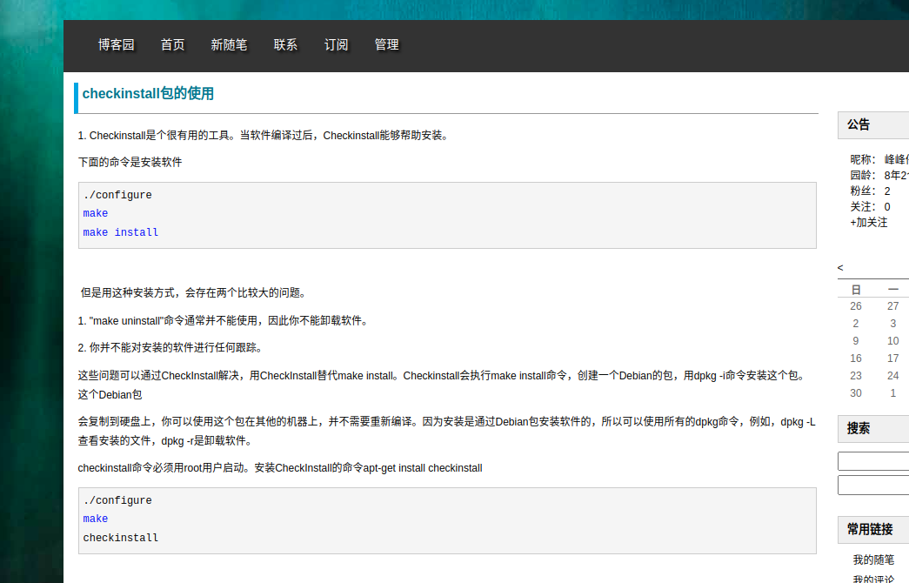
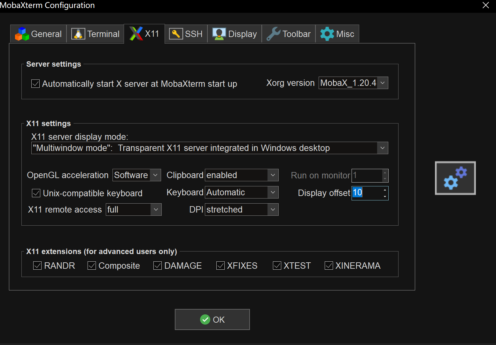
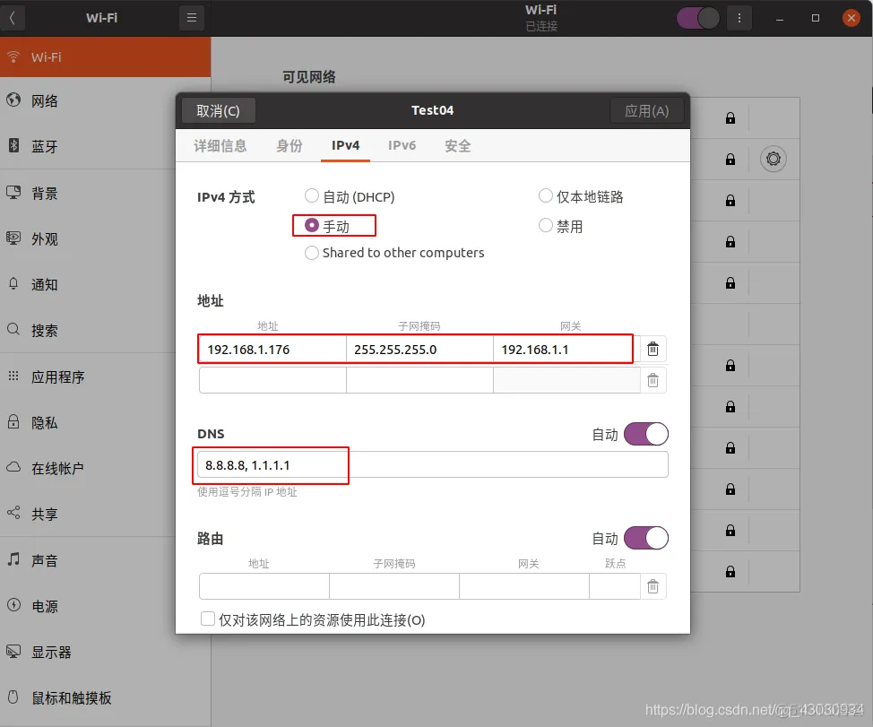
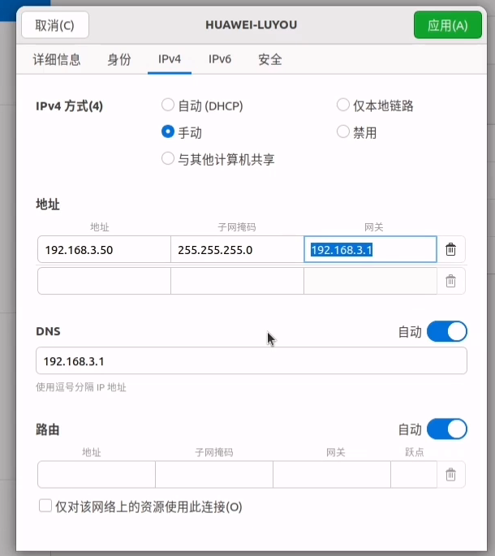
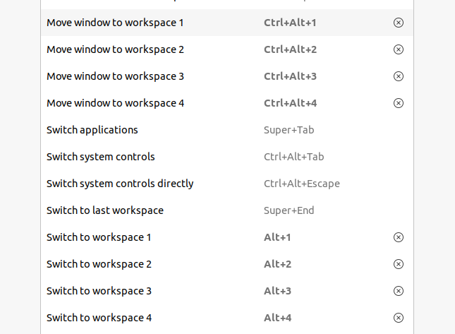
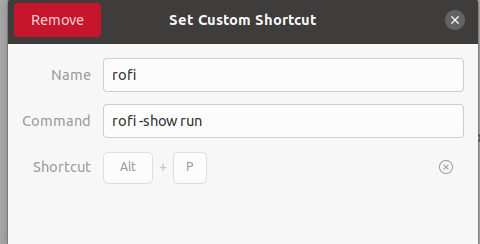

## 0 设置su密码

	1.输入sudo passwd命令，然后会提示输入当前用户的密码。 
	2.按enter键，终端会提示输入新的密码并确认，此时的密码就是新的root密码。 
	3.修改完毕以后，在执行su root命令，此时输入新的root密码即可

配置显卡驱动


## 1 安装必要软件：

**1.neofetch**：终端系统信息汇总
**2.btop**：代替top，可以查看温度
**3.tweak**：用来锁定大写键盘，玩装完后中文名可能叫 优化
**4.新立得synaptic**     sudo apt install synaptic：用来可视化apt安装包的gui界面
**5.snap**：ubuntu下另一个包管理工具，如果apt install找不到可以用snap install
**6.无道词典**
**7.checkinstall**：用来把make install的东西转成apt管理

**8.安装GParted工具（扩容，分区）**
sudo apt install gparted
[分区](https://blog.csdn.net/qq_41035283/article/details/120274586)
[扩容]()

**9.安装wps，安装缺失字体**

```bash
git clone https://github.com/IamDH4/ttf-wps-fonts.git && cd ttf-wps-fonts
sudo sh install.sh
```

**10安装rofi启动器并配置快捷指令**
**11 安装flameshot并配置快捷指令**
**12 安装桌面扩展**

1. `sudo apt install gnome-tweak-tool`
2. `sudo apt install chrome-gnome-shell`
3. `sudo apt install gnome-shell-extensions`
4. 搜索extension,打开扩展- [GNOME Shell Extensions Website](https://extensions.gnome.org/)

13 自带的一些软件
	1. pdf 阅读器：evince（建议换成okular）
	2. 文件管理器：nautilus （建议换成ranger）
	3. 视频播放器：建议换成vlc
	4. 


## 2 配置ssh以及x

**8.安装ssh并配置开机启动：**
sudo  apt-get  install openssh-server
sudo /etc/init.d/ssh start
sudo systemctl enable ssh

注意，ssh默认的端口是22，可以更改端口，更改后先stop，
然后start就可以了。改配置在/etc/ssh/sshd_config下，如下所示。
1. xjj@xjj-desktop:~$ vi /etc/ssh/sshd_config
2. # Package generated configuration file
3. # See the sshd(8) manpage **for** details
4. # What ports, IPs and protocols we listen **for**
5. Port 22

**如X11无法通过ssh转发：**

先删除~/.Xauthority ，然后
cd /etc/ssh/sshd_config

修改如下
```
X11Forwarding yes
X11DisplayOffset 10
X11UseLocalhost yes
```

然后
systemctl restart sshd

在winodws的mobaxterm上设置x11server。offset改为10

**9.安装配置cpolar内网穿透**：使用外网可以ssh到服务器（不然只能在同一局域网下ssh）

[内网穿透](https://blog.csdn.net/LisaCpolar/article/details/128149452)

curl  -L https://www.cpolar.com/static/downloads/install-release-cpolar.sh |  sudo  bash

## 3 开启/关闭 gnome动画
**10.关闭动画**
gsettings set org.gnome.desktop.interface enable-animations false
重新开启动画
gsettings set org.gnome.desktop.interface enable-animations true

## 4 解决中文字体显示不正常

### 4.1 修改字体为英文
修改字体：
修改/etc/default/locale文件
sudo vim /etc/default/locale

改为：
LANG="en_US.UTF-8"  
LANGUAGE="en_US:en"

中文改为：
LANG="zh_CN.UTF-8"  
LANGUAGE="zh_CN:zh"

### 4.2解决英文字体下中文显示不正常

当系统使用的是英文环境时，Ubuntu默认采用的字体Noto Sans CJK优先显示日文汉字，这一问题可以通过修改配置文件/**etc**/**fonts**/**conf.avail**/**64-language-selector-prefer.conf**文字顺序来修复.
```bash
su
cd /etc/fonts/conf.avail/
vi 64-language-selector-prefer.conf

JP －日文  
KR － 韩文  
SC － 简体中文  
TC － 繁体中文  
修改上面的文件，将顺序改成SC TC JP KR，如下：


1 <?xml version="1.0"?>                                                       
2 <!DOCTYPE fontconfig SYSTEM "fonts.dtd">
3 <fontconfig>
4     <alias>
5         <family>sans-serif</family>
6         <prefer>
7             <family>Noto Sans CJK SC</family>
8             <family>Noto Sans CJK TC</family>
9             <family>Noto Sans CJK JP</family>
10             <family>Noto Sans CJK KR</family>
11             <family>Noto Sans CJK HK</family>
12             <family>Lohit Devanagari</family>
13         </prefer>
14     </alias>
15     <alias>
16         <family>serif</family>
17         <prefer>
18             <family>Noto Serif CJK SC</family>
19             <family>Noto Serif CJK TC</family>
20             <family>Noto Serif CJK JP</family>
21             <family>Noto Serif CJK KR</family>
22             <family>Lohit Devanagari</family>
23         </prefer>
24     </alias>
 25     <alias>
 26         <family>monospace</family>
 27         <prefer>
 28             <family>Noto Sans Mono CJK SC</family>
 29             <family>Noto Sans Mono CJK TC</family>
 30             <family>Noto Sans Mono CJK JP</family>
 31             <family>Noto Sans Mono CJK KR</family>
 32             <family>Noto Sans Mono CJK HK</family>
 33         </prefer>
 34     </alias>
 35 </fontconfig>   

```

## 5 配置swap空间
```bash
# 将现有swap移动到主内存，可能需要几分钟
sudo swapoff -a

# 创建新的swap文件，bs×count=最后生成的swap大小，这里设置32G
sudo dd if=/dev/zero of=/swapfile bs=1G count=32

# 设置权限
sudo chmod 0600 /swapfile

# 设置swap
sudo mkswap /swapfile

# 打开swap
sudo swapon /swapfile

# 检查设置是否有效
btop

# 设置永久有效
sudo gedit /etc/fstab
# 在末尾行加上 
# /swapfile swap swap sw 0 0
```
刷新swap分区

```bash
sudo swapoff -a
sudo swapon-a
```

## 6 配置输入法

使用ibus框架
### 6.1 安装中文语言包

安装中文语言包是为了让Input Sources里面出现Chinese这一项。


选择“Manage Installed Languages”，“Install/Remove Languages”，“Chinese(Simplified)”，“Apply”。

### 6.2 安装ibus输入法

然后可以安装ibus中文输入法了。

安装ibus框架。

```bash
sudo apt-get install ibus ibus-clutter ibus-gtk ibus-gtk3 ibus-qt4
```

切换到ibus框架。

```bash
im-config -s ibus
```

安装拼音引擎。

```bash
sudo apt-get install ibus-pinyin
```

### 6.3 添加ibus中文输入法

把ibus输入法添加到输入法栏。

现在Input Source里面就有Chinese了，点进去。


选择Chinese(Intelligent Pinyin)。


右上角选择Chinese(Intelligent Pinyin)，中英文切换方式就是shift，Preferences里面可以选择7个选择项。

然后就可以愉快使用ibus中文输入法啦。


## 7安装zsh

### 7.1：检查

```text
cat /etc/shells   
```


### 7.2、安装zsh

```text
sudo apt install zsh #安装zsh

chsh -s /bin/zsh #将zsh设置成默认shell（不设置的话启动zsh只有直接zsh命令即可）
```

### 7.3、安装oh-my-zsh


```
# 1. 通过 curl
sh -c "$(curl -fsSL https://raw.githubusercontent.com/ohmyzsh/ohmyzsh/master/tools/install.sh)"

# 2. 通过 wget
sh -c "$(wget -O- https://raw.githubusercontent.com/ohmyzsh/ohmyzsh/master/tools/install.sh)"

# 3. 通过 git
cd ~
git clone https://github.com/ohmyzsh/ohmyzsh ohmyzsh
cd ~/ohmyzsh/tools
sh install.sh
```

### 7.4、安装插件

因为我也是刚玩，也就下载了几个官方推荐的插件比如：

```bash
cd ~/.oh-my-zsh/custom/plugins
#zsh-autosuggestions 命令行命令键入时的历史命令建议
git clone https://github.com/zsh-users/zsh-autosuggestions zsh-autosuggestions
#zsh-syntax-highlighting 命令行语法高亮插件
git clone https://github.com/zsh-users/zsh-syntax-highlighting zsh-syntax-highlighting
```

### 7.5、配置文件~/.zshrc:

没什么好讲的，这是我自己的配置文件，直接复制替换原来的.zshrc即可。

```bash
ZSH_THEME="rkj-repos" #我目前使用的模式
# 配置要使用的插件
plugins=(
        git
        extract
        zsh-autosuggestions
        zsh-syntax-highlighting
)
```

## 8. 配置vscode

```json
{
    "security.workspace.trust.untrustedFiles": "open",
    "code-runner.runInTerminal": true,
    "workbench.editorAssociations": {
        "*.ipynb": "jupyter-notebook"
    },
    "notebook.cellToolbarLocation": {
        "default": "right",
        "jupyter-notebook": "left"
    },
    "debug.onTaskErrors": "debugAnyway",
    "cmake.configureOnOpen": false,
    "markdown-preview-enhanced.previewTheme": "atom-light.css",
    "explorer.confirmDelete": false,
    "workbench.iconTheme": "vscode-icons",
    "git.enableSmartCommit": true,
    "remote.SSH.remotePlatform": {
        "thicvhs": "linux",
        "hans": "linux",
        "hangqi": "linux",
        "Debug": "linux",
        "tiaobanA100": "linux",
        "qihang": "linux",
        "tiaoban3090/4090": "linux",
        "DebugA100": "linux",
        "Debug4090": "linux",
        "Debug4090MCT": "linux",
        "mutiGPU": "linux"
    },
    "git.ignoreLegacyWarning": true,
    "terminal.integrated.inheritEnv": false,
    "vsicons.dontShowNewVersionMessage": true,
    "update.mode": "manual",
    "notebook.lineNumbers": "on",
    "EnglishChineseDictionary.enableHover": true,
    "[cpp]": {
        "editor.defaultFormatter": "ms-vscode.cpptools"
    },
    "editor.inlineSuggest.enabled": true,
    "github.copilot.enable": {
        "*": true,
        "plaintext": false,
        "markdown": false,
        "scminput": false,
        "yaml": true
    },
    "C_Cpp.clang_format_fallbackStyle": "Google",
    "clang-format.fallbackStyle": "Google",
    "git.confirmSync": false,
    "clang-format.executable": "/usr/bin/clang-format",
    "clang-format.language.cpp.fallbackStyle": "Google",
    "clang-format.language.cpp.style": "Google",
    "editor.minimap.enabled": false,
    "editor.fontSize": 15,
    "cmake.generator": "Unix Makefiles",
    "vim.handleKeys": {
        "<C-a>": false,
        "<C-f>": false,
        "<C-x>": false,
        "<C-c>": false,
        "<C-z>": false,
        "<C-v>": false,
        "<C-[>": false,
        "<C-]>": false,
        "<C-s>": false,
        "<C-b>": false,
        "<C-/>": false,
        "<C-w>": false,
        "<C-shift+f>": false
    },
    "vim.insertModeKeyBindings": [
        {
            "before": [
                "<c-h>"
            ],
            "after": [
                "<left>"
            ]
        },
        {
            "before": [
                "<c-l>"
            ],
            "after": [
                "<right>"
            ]
        },
        {
            "before": [
                "<c-j>"
            ],
            "after": [
                "<down>"
            ]
        },
        {
            "before": [
                "<c-k>"
            ],
            "after": [
                "<up>"
            ]
        },
        {
            "before": [
                "<c-u>"
            ],
            "after": [
                "<esc>",
                "b",
                "i"
            ]
        },
        {
            "before": [
                "<c-d>"
            ],
            "after": [
                "<esc>",
                "e",
                "a"
            ]
        }
    ],
    "[python]": {
        "editor.formatOnType": true,
        "editor.defaultFormatter": "ms-python.black-formatter"
    },
    "editor.fontLigatures": false,
    "terminal.integrated.fontFamily": "monospace",
    "editor.rulers": [
        80
    ],
    "C_Cpp.clang_format_style": "Google",
    "C_Cpp.default.cppStandard": "gnu++17",
    "python.languageServer": "Default",
    "python.formatting.provider": "black",
    "python.analysis.extraPaths": [
        "/home/thicv/carla/carla-ros/src/ros_compatibility/src",
        "/home/thicv/carla/carla-ros/src/carla_common/src",
        "/home/thicv/Downloads/test/waymo-open-dataset/src",
        "/home/thicv/Downloads/test/waymo-open-dataset/src/py_protos"
    ],
    "cmake.automaticReconfigure": false,
    "cmake.autoSelectActiveFolder": false,
    "cmake.configureOnEdit": false,
    "C_Cpp.inlayHints.parameterNames.enabled": true,
    "grunt.autoDetect": "on",
    "gulp.autoDetect": "on",
    "jake.autoDetect": "on",
    "cmake.buildTask": true,
    "extensions.ignoreRecommendations": true,
    "github.copilot.advanced": {},
    "workbench.startupEditor": "none",
    "terminal.integrated.commandsToSkipShell": [
        "language-julia.interrupt"
    ],
    "julia.symbolCacheDownload": true,
    "julia.enableTelemetry": true,
    "julia.executablePath": "/home/thicv/miniconda3/envs/julia_test/bin/julia",
    "latex-workshop.bibtex-format.tab": "tab",
    "latex-workshop.latex.autoBuild.run": "never",
    "latex-workshop.latex.autoBuild.cleanAndRetry.enabled": false,
    "latex-workshop.latex.autoClean.run": "onBuilt",
    "latex-workshop.latex.recipe.default": "lastUsed",
    "latex-workshop.view.pdf.internal.synctex.keybinding": "double-click",
    "latex-workshop.latex.tools": [
        {
            "name": "xelatex",
            "command": "xelatex",
            "args": [
                "-synctex=1",
                "-interaction=nonstopmode",
                "-file-line-error",
                "-pdf",
                "%DOCFILE%"
            ]
        },
        {
            "name": "bibtex",
            "command": "biber",
            "args": [
                "%DOCFILE%"
            ]
        },
        {
            "name": "pdflatex",
            "command": "pdflatex",
            "args": [
                "-synctex=1",
                "-interaction=nonstopmode",
                "-file-line-error",
                "%DOC%"
            ]
        }
    ],
    "latex-workshop.latex.recipes": [
        {
            "name": "pdftex 简单编译",
            "tools": [
                "pdflatex"
            ]
        },
        {
            "name": "XeLaTeX 简单编译",
            "tools": [
                "xelatex"
            ]
        },
        {
            "name": "xe->bib->xe->xe 复杂编译",
            "tools": [
                "xelatex",
                "bibtex",
                "xelatex",
                "xelatex"
            ]
        },
        {
            "name": "pdflatex -> bibtex -> pdflatex*2",
            "tools": [
                "pdflatex",
                "bibtex",
                "pdflatex",
                "pdflatex"
            ]
        }
    ],
    "latex-workshop.latex.clean.fileTypes": [
        "*.aux",
        "*.bbl",
        "*.blg",
        "*.idx",
        "*.ind",
        "*.lof",
        "*.lot",
        "*.out",
        "*.toc",
        "*.acn",
        "*.acr",
        "*.alg",
        "*.glg",
        "*.glo",
        "*.gls",
        "*.ist",
        "*.fls",
        "*.log",
        "*.fdb_latexmk",
        "*.bcf",
        "*.run.xml"
    ],
    "editor.inlayHints.enabled": "offUnlessPressed",
    "cmake.showOptionsMovedNotification": false,
    "python.autoComplete.extraPaths": [
        "/home/thicv/Downloads/test/waymo-open-dataset/src/"
    ],
    "terminal.integrated.profiles.linux": {
        "bash": {
            "path": "bash",
            "icon": "terminal-bash"
        },
        "zsh": {
            "path": "zsh"
        },
        "fish": {
            "path": "fish"
        },
        "tmux": {
            "path": "tmux",
            "icon": "terminal-tmux"
        },
        "pwsh": {
            "path": "pwsh",
            "icon": "terminal-powershell"
        }
    },
    "editor.accessibilitySupport": "off",
    "terminal.integrated.enableMultiLinePasteWarning": false,
    "workbench.editor.wrapTabs": true,
    "terminal.integrated.scrollback": 20000,
    "terminal.integrated.persistentSessionScrollback": 1000,
    "python.analysis.cacheLSPData": true,
    "gitlens.hovers.currentLine.over": "line",
    "python.analysis.packageIndexDepths": [
        {
            "name": "sklearn",
            "depth": 2
        },
        {
            "name": "matplotlib",
            "depth": 2
        },
        {
            "name": "scipy",
            "depth": 2
        },
        {
            "name": "django",
            "depth": 2
        },
        {
            "name": "flask",
            "depth": 2
        },
        {
            "name": "fastapi",
            "depth": 2
        }
    ],
    "github.copilot.chat.experimental.temporalContext.enabled": true,
    "cursor.cpp.disabledLanguages": [
        "plaintext",
        "markdown",
        "scminput"
    ],
    "workbench.colorTheme": "Default Dark+",
    "workbench.editor.editorActionsLocation": "titleBar",
    "workbench.activityBar.orientation": "vertical",
    "editor.tokenColorCustomizations": {
        "textMateRules": [
            {
                "scope": [
                    "variable.parameter"
                ],
                "settings": {
                    // "foreground":"#ff0000",
                    "fontStyle": "italic"
                }
            }
        ]
    }
}

```

## 9 ubuntu配置wifi静态ip

网关和地址要保持一致

192.







sudo lshw -c network | grep serial  查看MAC地址

ifconfig  查看当前网卡

cat /sys/class/net/ens33/address  查看ens33网卡的MAC地址

ip addr  查看所有IP信息

sudo vim /etc/netplay/00-installer-config.yaml  配置网卡信息

netstat -rn  查看路由

## 10 配置Vim
sudo apt install vim-gtk
```text
if &term =~ "xterm"
    " INSERT mode
    let &t_SI = "\<Esc>[6 q" . "\<Esc>]12;white\x7"
    " REPLACE mode
    let &t_SR = "\<Esc>[3 q" . "\<Esc>]12;black\x7"
    " NORMAL mode
    let &t_EI = "\<Esc>[2 q" . "\<Esc>]12;white\x7"
endif
set nu
set mouse=a
set clipboard=unnamedplus

```

### 同步剪切板和匿名寄存器

以下配置可以让主选区寄存器 `"*` 和匿名寄存器 `""` 保持同步（即共享剪切板）， 一般适用于 Windows 和 MacOS，Linux 下的表现是共享 X11 剪切板、PRIMARY 选区（鼠标中键粘贴）。

Vim 有 48 个寄存器，`y`, `d`, `p` 等命令一般使用匿名寄存器 `""`， 支持剪切板的 Vim 会支持额外的选区寄存器 `"*` 和 `"+`。 更多 Vim 寄存器的信息，可以参考这篇文章：[Vim 寄存器完全手册](https://harttle.land/2016/07/25/vim-registers.html)。

`"*` 和 `"+` 在 Mac 和 Windows 中，都是指系统剪切板（clipboard），例如 `"*yy` 即可复制当前行到剪切板。 其他程序中复制的内容也会被存储到这两个寄存器中。 在 X11 系统中（绝大多数带有桌面环境的 Linux 发行版），二者是有区别的：

- `"*` 指 X11 中的 PRIMARY 选区，即鼠标选中区域。在桌面系统中可按鼠标中键粘贴。
- `"+` 指 X11 中的 CLIPBOARD 选区，即系统剪切板。在桌面系统中可按 Ctrl+V 粘贴。

上述哪个寄存器对应于你的剪切板和 Linux 发行版有关，在配置 Vim 前可以测试一下。 比如用 Vim 打开一个文件，在 normal 模式下（进入 Vim 后默认的模式）键入 `gg"*yG`， 来把当前文件内容拷贝到 `"*` 寄存器。键入 `gg"+yG` 拷贝到 `"+` 寄存器。

到目前为止，你已经可以通过命令来拷贝粘贴内容了。接下来我们希望通过 Vim 配置， 让匿名寄存器和系统剪切板同步。

### 同步剪切板和匿名寄存器

以下配置可以让主选区寄存器 `"*` 和匿名寄存器 `""` 保持同步（即共享剪切板）， 一般适用于 Windows 和 MacOS，Linux 下的表现是共享 X11 剪切板、PRIMARY 选区（鼠标中键粘贴）。

```
set clipboard=unnamed
```

Vim 7.3.74 及以上支持了 unnamedplus：

```
set clipboard=unnamedplus
```

即让剪切板寄存器 `"+` 和匿名寄存器 `""` 保持同步， Linux 下一般对应于桌面系统的剪切板，比如 GNOME 的系统剪切板、以及 SECONDARY 选区（Ctrl+V 粘贴）。

## 11 配置桌面




