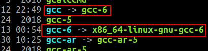
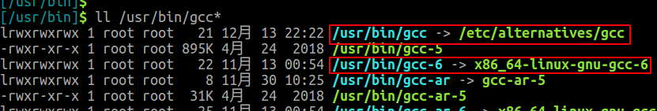
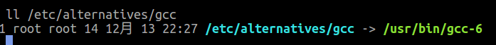
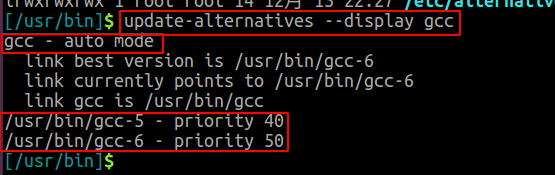
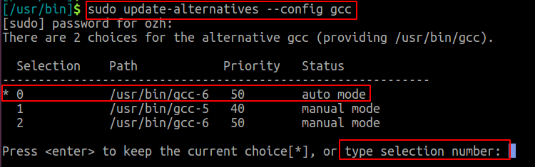

## 1 概述
ubuntu下可以借助update-alternatives工具来管理软连接（也就是实现软件各个版本的管理）
查看gcc/g++软链接指向

从下图可看出目前的gcc不是通过update-alternatives管理的

**向系统中添加一个新的alternatives组**
```bash
--install <link> <name> <path> <priority>
sudo update-alternatives --install /usr/bin/gcc gcc /usr/bin/gcc-5 40
sudo update-alternatives --install /usr/bin/g++ g++ /usr/bin/g++-5 40
```

注：最后那个数字代表优先级，默认选优先级高的

查看gcc/g++软链接指向
gcc软链接变成了/etc/alternatives/gcc

查看/etc/alternatives/gcc软链接指向，发现又链接回/usr/bin/gcc-6了，所以由此可看出update-alternatives为了管理方便增加了一层软链接


### 显示命令`<name>`的信息及目标文件--display \<name>



### 配置命令的版本  --config \<name>


### 移除系统中注册的某个`<name>`的某个软件版本`<path>`
--remove \<name> \<path>

- `sudo update-alternatives --remove gcc /usr/bin/gcc-5`


## 2 gcc个版本的管理

### 2.1 首先查看系统中安装了哪些gcc版本

`ls /usr/bin/gcc*`

```bash
/usr/bin/gcc    /usr/bin/gcc-ar    /usr/bin/gcc-nm    /usr/bin/gcc-ranlib /usr/bin/gcc-5 /usr/bin/gcc-ar-5  /usr/bin/gcc-nm-5  /usr/bin/gcc-ranlib-5 /usr/bin/gcc-7  /usr/bin/gcc-ar-7 /usr/bin/gcc-nm-7  /usr/bin/gcc-ranlib-7
```
可以看出我系统中安装了两个gcc版本，一个是gcc-5的版本，一个是gcc-7的版本
如果我想安装某个版本的gcc，可以用`sudo apt install gcc-version`安装，比如说我想安装gcc-6，则命令为`sudo apt install gcc-6`

### 2.2 然后用update-alternatives工具来管理版本
update-alternatives: --install <链接> <名称> <路径> <优先级>
可以把当前版本加入到update-alternatives工具的管理范围
如：
```bash
sudo update-alternatives --install /usr/bin/gcc gcc /usr/bin/gcc-6 2
```
注意<名称>表示这个软件的名字，之后--config后边接的就是名称
### 2.3 切换版本
使用
```bash
sudo update-alternatives --config gcc
```
打开gcc的设置项，如下图：


输入`选择`下面的编号，回车即可切换到指定的gcc版本

## 3.cmake多版本管理
```bash
update-alternatives --install /usr/bin/cmake cmake ~/develop_tools/cmake-3.15.6-linux-x86_64/bin/cmake 3 
update-alternatives --install /usr/bin/cmake cmake ~/develop_tools/cmake-3.12.1-linux-x86_64/bin/cmake 2 
update-alternatives --install /usr/bin/cmake cmake ~/usr/bin/cmake-3.5.1 1
```

通过以下命令选择所需的cmake版本

```bash
update-alternatives --config cmake
```


