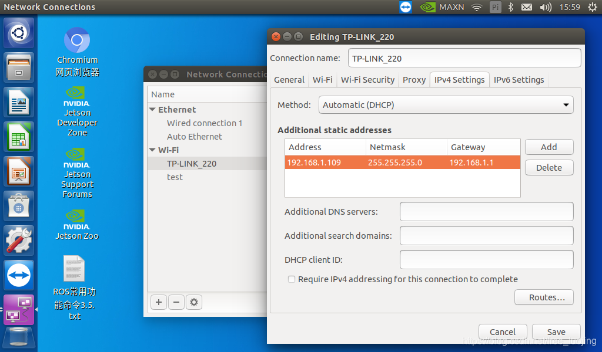

配置静态ip
# 查看ip地址，网关，掩码
```
wheeltec@wheeltec:~$ ip a
1: lo: <LOOPBACK,UP,LOWER_UP> mtu 65536 qdisc noqueue state UNKNOWN group default qlen 1
    link/loopback 00:00:00:00:00:00 brd 00:00:00:00:00:00
    inet 127.0.0.1/8 scope host lo
       valid_lft forever preferred_lft forever
    inet6 ::1/128 scope host 
       valid_lft forever preferred_lft forever
2: dummy0: <BROADCAST,NOARP> mtu 1500 qdisc noop state DOWN group default qlen 1000
    link/ether b6:f0:d6:29:0e:d9 brd ff:ff:ff:ff:ff:ff
3: eth0: <NO-CARRIER,BROADCAST,MULTICAST,UP> mtu 1500 qdisc pfifo_fast state DOWN group default qlen 1000
    link/ether 00:e0:4c:68:01:fd brd ff:ff:ff:ff:ff:ff
4: l4tbr0: <BROADCAST,MULTICAST> mtu 1500 qdisc noop state DOWN group default qlen 1000
    link/ether 5e:ce:9b:44:0b:e5 brd ff:ff:ff:ff:ff:ff
5: rndis0: <NO-CARRIER,BROADCAST,MULTICAST,UP> mtu 1500 qdisc pfifo_fast master l4tbr0 state DOWN group default qlen 1000
    link/ether 5e:ce:9b:44:0b:e5 brd ff:ff:ff:ff:ff:ff
6: usb0: <NO-CARRIER,BROADCAST,MULTICAST,UP> mtu 1500 qdisc pfifo_fast master l4tbr0 state DOWN group default qlen 1000
    link/ether 5e:ce:9b:44:0b:e7 brd ff:ff:ff:ff:ff:ff
7: wlan0: <BROADCAST,MULTICAST,UP,LOWER_UP> mtu 1500 qdisc mq state UP group default qlen 1000
    link/ether 34:13:e8:5e:70:31 brd ff:ff:ff:ff:ff:ff
    inet 192.168.1.109/24 brd 192.168.1.255 scope global dynamic noprefixroute wlan0 
       valid_lft 7104sec preferred_lft 7104sec
    inet6 fe80::1290:cc31:d44e:f537/64 scope link noprefixroute 
       valid_lft forever preferred_lft forever


```
inet 192.168.1.109/24 brd 192.168.1.255 scope global dynamic noprefixroute
表示ip地址是192.168.1.109，dynamic表示是动态ip

```
wheeltec@wheeltec:~$ route -n
Kernel IP routing table
Destination     Gateway         Genmask         Flags Metric Ref    Use Iface
0.0.0.0         192.168.1.1     0.0.0.0         UG    600    0        0 wlan0
169.254.0.0     0.0.0.0         255.255.0.0     U     1000   0        0 wlan0
192.168.1.0     0.0.0.0         255.255.255.0   U     600    0        0 wlan0
```


```
IP地址 192.168.1.109
子网掩码netmask 255.255.255.0
网关Gateway192.168.1.1
这是我的网络参数，大家的会有点不同
```

# 设置静态ip
- 点击nano桌面上角的网络图标
- 选择“Edit Connections”
- 双击自己连接的WIFI，点击IPV4 Settings，选择Add
- 填入ip地址，子网掩码和网关，保存



重启，设置的静态ip才会生效

# 验证
```
wheeltec@wheeltec:~$ ip a
1: lo: <LOOPBACK,UP,LOWER_UP> mtu 65536 qdisc noqueue state UNKNOWN group default qlen 1
    link/loopback 00:00:00:00:00:00 brd 00:00:00:00:00:00
    inet 127.0.0.1/8 scope host lo
       valid_lft forever preferred_lft forever
    inet6 ::1/128 scope host 
       valid_lft forever preferred_lft forever
2: dummy0: <BROADCAST,NOARP> mtu 1500 qdisc noop state DOWN group default qlen 1000
    link/ether 52:d1:a4:70:1a:28 brd ff:ff:ff:ff:ff:ff
3: eth0: <NO-CARRIER,BROADCAST,MULTICAST,UP> mtu 1500 qdisc pfifo_fast state DOWN group default qlen 1000
    link/ether 00:e0:4c:68:01:fd brd ff:ff:ff:ff:ff:ff
4: l4tbr0: <BROADCAST,MULTICAST> mtu 1500 qdisc noop state DOWN group default qlen 1000
    link/ether 5e:ce:9b:44:0b:e5 brd ff:ff:ff:ff:ff:ff
5: rndis0: <NO-CARRIER,BROADCAST,MULTICAST,UP> mtu 1500 qdisc pfifo_fast master l4tbr0 state DOWN group default qlen 1000
    link/ether 5e:ce:9b:44:0b:e5 brd ff:ff:ff:ff:ff:ff
6: usb0: <NO-CARRIER,BROADCAST,MULTICAST,UP> mtu 1500 qdisc pfifo_fast master l4tbr0 state DOWN group default qlen 1000
    link/ether 5e:ce:9b:44:0b:e7 brd ff:ff:ff:ff:ff:ff
7: wlan0: <BROADCAST,MULTICAST,UP,LOWER_UP> mtu 1500 qdisc mq state UP group default qlen 1000
    link/ether 34:13:e8:5e:70:31 brd ff:ff:ff:ff:ff:ff
    inet 192.168.1.109/24 brd 192.168.1.255 scope global noprefixroute wlan0
       valid_lft forever preferred_lft forever
    inet6 fe80::61c8:3ecc:e895:4556/64 scope link noprefixroute 
       valid_lft forever preferred_lft forever

```

inet 192.168.1.109/24 brd 192.168.1.255 scope global noprefixroute wlan0
valid_lft forever preferred_lft forever
ip地址为192.168.1.109,没有dynamic，是静态ip
