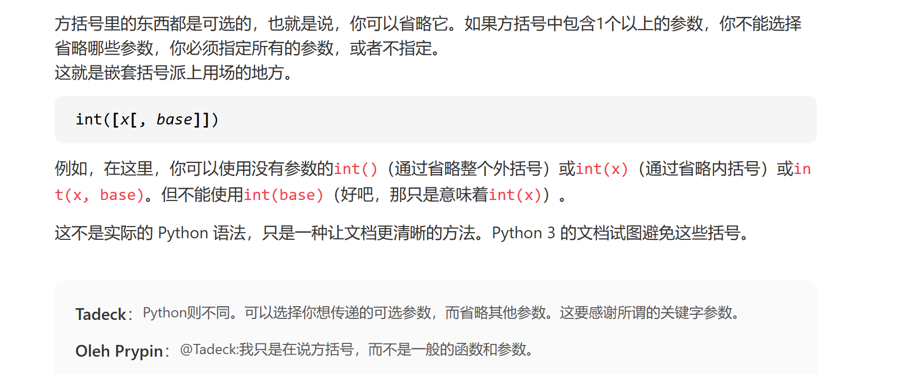

### 1.python函数参数中/和\*的意思

简单来说**除前位置，星后关键**

- \/ 符号之前的所有参数，都必须以位置参数穿参，不可以关键字参数传参
- \* 符号之后的所有参数，都必须以关键字方式传参，不得以位置方式传参

### 2.python文档中[]的意思

[Python 文档中函数中的方括号](https://www.qiniu.com/qfans/qnso-10053286)

