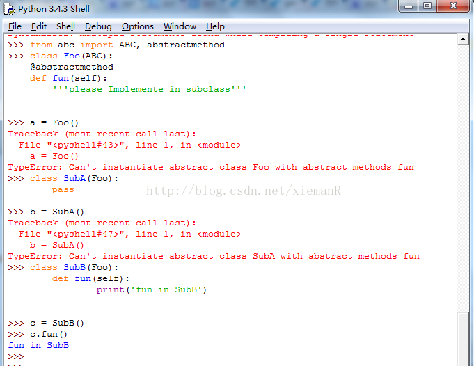

代码运行期间动态增加功能的方式，称之为“装饰器”（Decorator）

```python
def log(func):
    def wrapper(*args, **kw):
        print('call %s():' % func.__name__)
        return func(*args, **kw)
    return wrapper
@log
def now():
    print('2015-3-25')
>>> now()
call now():
2015-3-25
```

## 1 @property

修饰方法，使方法作为属性使用

```python
>>> class example(object):
...     @property
...     def example_method(self):
...         return 123
... 
>>> test=example()
>>> test.example_method
123
>>> test.example_method()
Traceback (most recent call last):
  File "<stdin>", line 1, in <module>
TypeError: 'int' object is not callable
```

## 2 @\<attr\>.setter：用于将一个普通的函数标记为属性的修改器方法（即 setter 方法）。

```python
class MyClass:
    def __init__(self, value):
        self._value = value

    @classmethod
    def class_method(cls):
        # 在类方法中访问类变量
        print(cls.class_variable)

    @staticmethod
    def static_method():
        # 在静态方法中不能访问类或实例变量
        print("This is a static method")

    @property
    def value(self):
        # 访问器方法，获取值
        return self._value

    @value.setter
    def value(self, value):
        # 修改器方法，设置值
        self._value = value

obj = MyClass(5)
obj.value = 10  # 调用修改器方法
print(obj.value)  # 调用访问器方法

```

## 3@abstractmethod

抽象方法表示基类的一个方法，没有实现，所以基类不能实例化，子类实现了该抽象方法才能被实例化。

```python
from abc import ABCMeta, abstractmethod
class Backbone(nn.Module, metaclass=ABCMeta):
    def __init__(self):
        super().__init__()

    @abstractmethod
    def forward(self):
        pass

    @property
    def size_divisibility(self):
        return 0
```

Python的abc提供了@abstractmethod装饰器实现抽象方法，下面以Python3的abc模块举例。
@abstractmethod：
见下图的代码，基类Foo的fun方法被@abstractmethod装饰了，所以Foo不能被实例化；子类SubA没有实现基类的fun方法也不能被实例化；子类SubB实现了基类的抽象方法fun所以能实例化。



完整代码：
在Python3.4中，声明抽象基类最简单的方式是子类话abc.ABC；Python3.0到Python3.3，必须在class语句中使用metaclass=ABCMeta；Python2中使用__metaclass__=ABCMeta


Python3.4 实现方法：
```python
from abc import ABC, abstractmethod
class Foo(ABC):
    @abstractmethod
    def fun(self):
        '''please Implemente in subclass'''


class SubFoo(Foo):
    def fun(self):
        print('fun in SubFoo')

a = SubFoo()
a.fun()
```


Python3.0到Python3.3的实现方法：
```python
from abc import abstractmethod, ABCMeta

class Bar(metaclass=ABCMeta):
    @abstractmethod
    def fun(self):
        '''please Implemente in subclass'''

class SubBar(Bar):
    def fun(self):
        print('fun in SubBar')
b = SubBar()
b.fun()
```

## 4 @classmethod @staticmethoed

@staticmethod不需要表示自身对象的self和自身类的cls参数，就跟使用函数一样。其实，静态方法**就是普通的函数，只是碰巧在类的定义体中**，而不是在模块层定义  
  
@classmethod也不需要self参数，但第一个参数需要是表示自身类的**cls**参数。

```python
>>> class Demo:
...    @classmethod
...    def klassmeth(*args):
...        return args
...    @staticmethod
...    def statmeth(*args):
...        return args
>>> Demo.klassmeth() # 无论是否传递参数第一个参数都是class本身
(<class '__main__.Demo'>,) 
>>> Demo.statmeth()
()
>>> Demo.klassmeth('apple') # 无论是否传递参数第一个参数都是class本身
(<class '__main__.Demo'>, 'apple')
>>> Demo.statmeth('apple')
('apple',)
```

example,

```python
class A(object):
    def foo(self, x):
        print "executing foo(%s, %s)" % (self, x)

    @classmethod
    def class_foo(cls, x):
        print "executing class_foo(%s, %s)" % (cls, x)

    @staticmethod
    def static_foo(x):
        print "executing static_foo(%s)" % x    
```

## 5 @lru_cache 基于缓存能够加速代码性能：尤其是递归结构：
```python
@lru_cache
def factorial(n):
	return n * factorial(n-1) if n else 1
```

## 6 @jit jit全称“Just In Time compilation”，也能加速代码运行速度，但是通常是对于数据量大的计算才能显示优势，简单的计算可能还会变慢：

```python
from numba import jit
import random

@jit(nopython=True)
def monte_carlo_pi(nsamples):
    acc = 0
    for i in range(nsamples):
        x = random.random()
        y = random.random()
        if (x ** 2 + y ** 2) < 1.0:
            acc += 1
    return 4.0 * acc / nsamples
```
