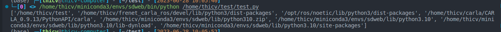
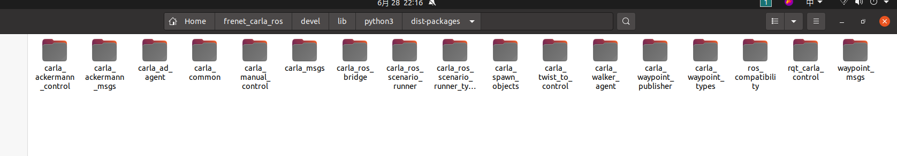

Python搜索模块的路径是由四部分构成的：

- 程序的主目录：当前文件的目录
- PATHONPATH目录：各种site-package
- 标准链接库目录：
- . pth文件的目录： 增加 .pth 文件：在 `/usr/local/lib/python3.5/site-packages` 下添加一个扩展名为 `.pth` 的配置文件（例如：`extras.pth`），内容为要添加的路径：
```bash
/home/wang/workspace
```

这四部分的路径都存储在sys.path 列表中。

如果在zshrc中source了 setup.zsh
那么PYTHONPATH中还会多一些路径
\['/home/thicv/test', 
**'/home/thicv/frenet_carla_ros/devel/lib/python3/dist-packages',** （自己工作空间python包路径，一个package就会产生一个包）
**'/opt/ros/noetic/lib/python3/dist-packages',** （原始ros的python包路径）
'/home/thicv/carla/CARLA_0.9.13/PythonAPI/carla', '/home/thicv/miniconda3/envs/sdweb/lib/python310.zip', '/home/thicv/miniconda3/envs/sdweb/lib/python3.10', '/home/thicv/miniconda3/envs/sdweb/lib/python3.10/lib-dynload', **'/home/thicv/miniconda3/envs/sdweb/lib/python3.10/site-packages'\**]（本身python的包路径）




