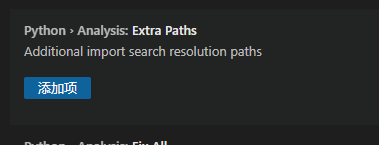
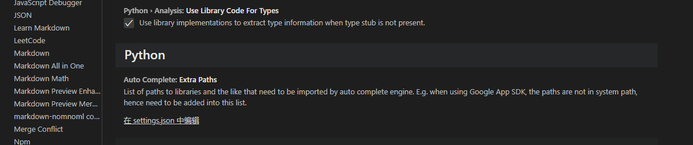
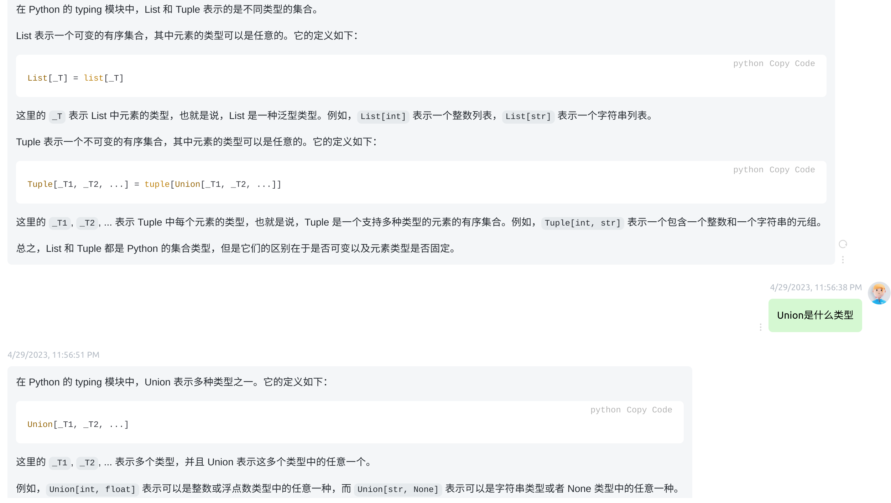
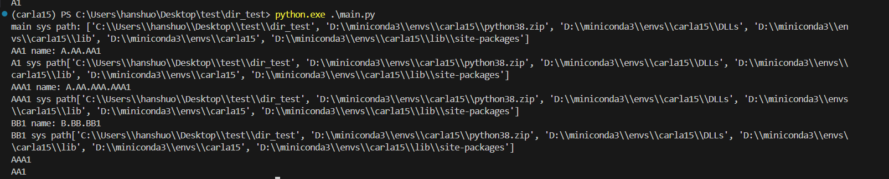
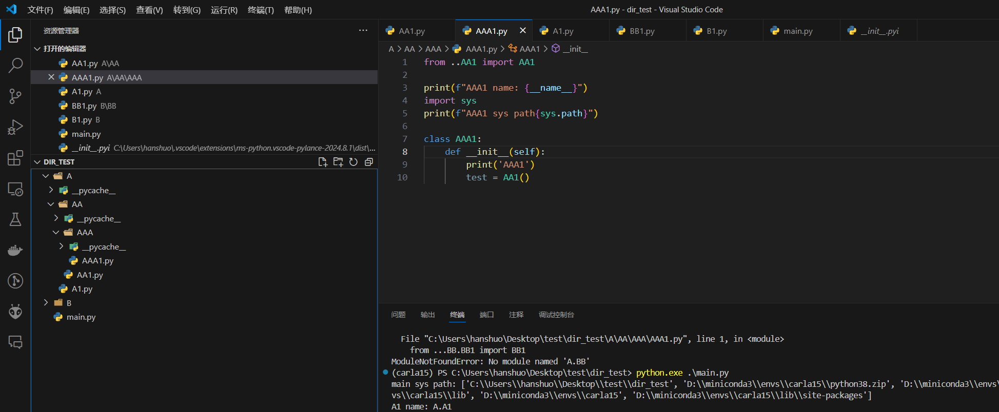

## 1. **python的包是一个文件夹，包名（文件夹名）不能和内部的.py文件名相同，否则会报错。一般用__init__.py文件放到文件夹下，来表示这是一个包**

## 2. **python中可以用sys来引入其他包，对于没有自动补全的问题，需要调vscode的pylance插件的**

## 3. python中typing模块是一个很有用的模块
List和Tuple是经常用的两个集合，此外还有Union

## 4. python中的路径关系全解

### 4.1 python中的能够读到的环境变量都存在sys.path这个list中，这个list会默认把python执行的主文件所在路径加入进去，且该list是全局共享的，所以在主文件调用的任何文件中打印，都是同一个值。

### 4.2 python在进行相对导入时，.代表当前所在文件的路径（AAA），..代表上一路径(AA)，注意相对导入最高到顶级包（即dir_test），且不包含dir_test，顶级包就是python主文件所在的路径，即main.py所在的路径。因此在AAA1.py中from ....B.B1会报错，因为....为dir_test路径，是main.py所在路径，也是顶级包的路径。

