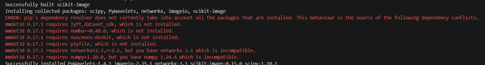

https://zhuanlan.zhihu.com/p/543335939
bevformer的显存最少需要24G（论文里给出的是20G）
bevformer是特征提取，最后输出的是一个特征图。这个特征可以直接输入给对应的BEV 3D的检测头去输出3D的目标框。


### 1.输入数据格式


### 2.可变性注意力机制


### 3.流程

先时间attention，再空间attention，每一个格子都是一个向量。整个bev是一个特征图。
一般bev格子的大小是200×200，分辨率是1m，bev的中心是自车。


## 4 训练时间
BEVFormer Base 模型需要每张 GPU 上 28G 的显存，在单张 A100 上训练完成（24 个 epoch）需要大约 14 天的时间，在 8 张 A100 上训练完成需要接近 2 天的时间。


## 5 安装

### 1 编译mmdection3d找不到cuda home

说明主机没有安装cuda，去cuda官网 安装11.1 版本（单独torch是不需要安装cuda的，因为torch的cuda版本已经集成好了二进制的cuda，但是mmdet3d需要cuda来编译，所以还是需要安装cuda的，很坑爹！！！）：

https://developer.nvidia.com/cuda-toolkit-archive


安装后
```
export LD_LIBRARY_PATH=$LD_LIBRARY_PATH:/usr/local/cuda/lib64
export PATH=$PATH:/usr/local/cuda/bin
export CUDA_HOME=/usr/local/cuda
```

多版本切换：
```bash
# 软链接方式
$ ls -lh /usr/local
lrwxrwxrwx  1 root root   19 Jul 15  2018 cuda -> /usr/local/cuda-10.1/
drwxr-xr-x 19 root root 4.0K Jun  5  2019 cuda-10.0/
drwxr-xr-x 14 root root 4.0K Sep 21 22:54 cuda-10.1/
......

# 需要切换版本时，执行如下操作
$ sudo rm -rf /usr/local/cuda
$ sudo ln -s /usr/local/cuda-10.0 /usr/local/cuda
```

为了确认，需要查看一下软连接


```
source ~/.zshrc
```

其实不需要sudo ldconfig：


LD_LIBRARY_PATH的优先级高于/etc/ld.so.conf.d，ldconfig命令只会影响ld.so.conf.d，与LD_LIBRARY_PATH无关。


检验安装的版本是否正确

```
nvcc -V
```

note:不要从conda中安装cuda，不管选什么版本，conda都会安装12.4很坑


### 2包依赖问题

从源码编译mmdection3d(0.17.1)时会报错，原因是mmdection里边的库很多都没有指定版本。

依次会遇到：


pip install scikit-image\==0.19.0




pip install networks \== 2.2


pip install numba\==0.48.0

pip install nuscenes-devkit\==1.1.10

pip install numpy\==1.19.5  :核心保证，最后的版本一定要是1.19.5

pip install matplotlib\==3.5.2

pip install pandas\==1.0.1
 
pip install plyfile\==0.7.3

pip install typing-extensions\==4.10.0


## vscode本地调试

多卡：

[VS Code 调试程序 — mmengine 0.8.4 文档](https://mmengine.readthedocs.io/zh-cn/v0.8.4/notes/debug_with_vscode.html)

单卡：
找到train.py

```
{
    "version": "0.2.0",
    "configurations": [
        {
            "name": "Python 调试程序: 包含参数的当前文件",
            "type": "debugpy",
            "request": "launch",
            "program": "/home/hanshuo/BEVFormer/tools/train.py",
            "console": "integratedTerminal",
            "args": [
                "/home/hanshuo/BEVFormer/projects/configs/bevformer/bevformer_tiny.py"
            ]

        }
    ]
}
```
