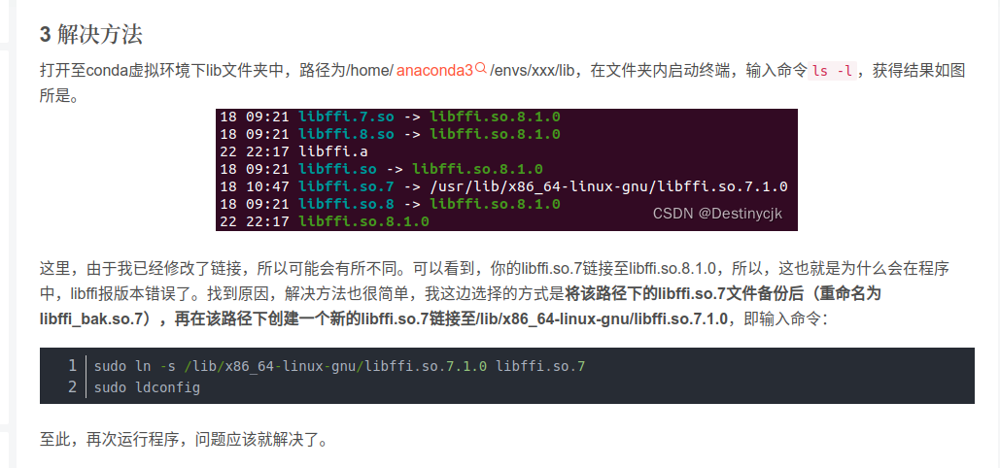
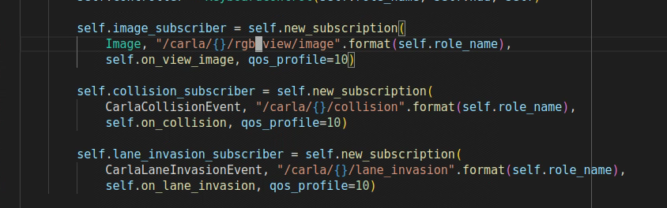
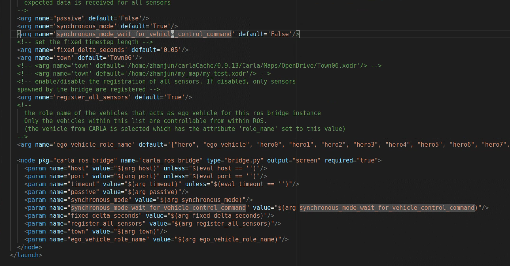

 Carla使用过程中的一些注意点

## 1.ros_manual_control一片黑的原因可是是ros的cv bradge的问题

https://blog.csdn.net/qq_38606680/article/details/129118491


## 2 carla安装后在zshrc或者bashrc中设置如下变量
```bash
#miniconda
PATH=$PATH:/home/thicv/miniconda3/bin
export CARLA_ROOT=/home/thicv/carla/CARLA_0.9.13 
export SCENARIO_RUNNER_ROOT=/home/thicv/scenario_runner-0.9.13
PYTHONPATH=$PYTHONPATH:${CARLA_ROOT}/PythonAPI/carla
PYTHONPATH=$PYTHONPATH:${CARLA_ROOT}/PythonAPI/carla/agents
```

## 3 carla的pygame的manual_control如果还是黑屏，可能是因为objects.json中没有配置好传感器

最少需要下列三个传感器，pygame才会有显示画面


## 4 carla_ros_bridge的同步模式有两个

synchronous mode是carla中client和server的同步。
synchronous mode wait for control command是需要有一个控制指令传过来，carla才会更新一步。这个更精确



## 5 carla源码编译

环境：ubuntu20.04、UE4（carla版本）、carla0.9.14

注意：UE4一定要用carla特供版本，不然make launch时会报错（在0.9.12的carla都使用carla特供版的UE4）

如果clang找不到头文件，需要装一下libstdc++-13-dev。
其他的按照官网一步一步走就行。


## 强化学习carla环境

### 1.carla-gym遇到pygame卡死的情况，在carla_env.py的531行

```python
    pygame.display.flip()
    for enent in pygame.event.get():
      if enent.type == pygame.QUIT:
        pygame.quit()
```

### 2 DQN代码

```python
import pygame
import abc
import glob
import os
import sys
from types import LambdaType
from collections import deque
from collections import namedtuple
import random 
import time
import numpy as np
import math
import torch
import torch.nn as nn
from torch.autograd import Variable
import torch.nn.functional as F
import torch.optim as optim
import torchvision.transforms as T
from torch import FloatTensor, LongTensor, ByteTensor
Tensor = FloatTensor
import gym
import gym_carla
import carla
# Hyperparameters
IM_WIDTH = 80
IM_HEIGHT = 60
SHOW_PREVIEW = False
SECOND_PER_EPISODE = 10
EPSILON = 0.9       # epsilon used for epsilon greedy approach
GAMMA = 0.9
TARGET_NETWORK_REPLACE_FREQ = 100       # How frequently target netowrk updates
MEMORY_CAPACITY = 100
BATCH_SIZE = 32
LR = 0.01           # learning rate
MODEL_NAME = "nnModule"
def select_action(action_number):
    if action_number == 0:
        real_action = [1, -0.2]
    elif action_number == 1:
        real_action = [1, 0]
    elif action_number == 2:
        real_action = [1, 0.2]
    elif action_number == 3:
        real_action = [2, -0.2]
    elif action_number == 4:
        real_action = [2, 0]
    elif action_number == 5:
        real_action = [2, 0.2]
    elif action_number == 6:
        real_action = [3.0, -0.2]
    elif action_number == 7:
        real_action = [3.0, 0]
    elif action_number == 8:
        real_action = [3.0, 0.2]
    return real_action
# Net construction
class Net(nn.Module):
    def __init__(self):
        super(Net, self).__init__()
        self.conv1 = nn.Conv2d(3, 16, kernel_size=5, stride=2)
        self.bn1 = nn.BatchNorm2d(16)
        self.conv2 = nn.Conv2d(16, 32, kernel_size=5, stride=2)
        self.bn2 = nn.BatchNorm2d(32)
        self.conv3 = nn.Conv2d(32, 32, kernel_size=5, stride=2)
        self.bn3 = nn.BatchNorm2d(32)
        self.head = nn.Linear(26912,5)  #self.head = nn.Linear(896,5)
    def forward(self, x):
        x = F.relu(self.bn1(self.conv1(x)))  # 一层卷积
        x = F.relu(self.bn2(self.conv2(x)))  # 两层卷积
        x = F.relu(self.bn3(self.conv3(x)))  # 三层卷积
        return self.head(x.view(x.size(0),-1)) # 全连接层 
class DQN(object):
    def __init__(self):
        self.eval_net,self.target_net = Net(),Net()
        # Define counter, memory size and loss function
        self.learn_step_counter = 0 # count the steps of learning process        
        self.memory = []
        self.position = 0 # counter used for experience replay buff        
        self.capacity = 200
        #------- Define the optimizer------#
        self.optimizer = torch.optim.Adam(self.eval_net.parameters(), lr=LR)
        # ------Define the loss function-----#
        self.loss_func = nn.MSELoss()
    def  choose_action(self, x):
        # This function is used to make decision based upon epsilon greedy
        x = torch.unsqueeze(torch.FloatTensor(x), 0) # add 1 dimension to input state x
        x = x.permute(0,3,2,1)  #把图片维度从[batch, height, width, channel] 转为[batch, channel, height, width]
        # input only one sample
        if np.random.uniform() < EPSILON:   # greedy
            # use epsilon-greedy approach to take action
            actions_value = self.eval_net.forward(x)
            #print(torch.max(actions_value, 1)) 
            # torch.max() returns a tensor composed of max value along the axis=dim and corresponding index
            # what we need is the index in this function, representing the action of cart.
            action = torch.max(actions_value, 1)[1].data.numpy()
            action = action[0]
        else: 
            action = np.random.randint(0, 5)
        return action
    def push_memory(self, obs, a, r, obs_):
        if len(self.memory) < self.capacity:
            self.memory.append(None)
        self.memory[self.position] = Transition(torch.unsqueeze(torch.FloatTensor(obs), 0),torch.unsqueeze(torch.FloatTensor(obs_), 0),\
                                                torch.from_numpy(np.array([a])),torch.from_numpy(np.array([r],dtype='int64')))
        self.position = (self.position + 1) % self.capacity
    def get_sample(self,batch_size):
        return random.sample(self.memory, batch_size)
    def learn(self):
        # Define how the whole DQN works including sampling batch of experiences,
        # when and how to update parameters of target network, and how to implement
        # backward propagation.
        # update the target network every fixed steps
        if self.learn_step_counter % TARGET_NETWORK_REPLACE_FREQ == 0:
            # Assign the parameters of eval_net to target_net
            self.target_net.load_state_dict(self.eval_net.state_dict())
        self.learn_step_counter += 1
        transitions = self.get_sample(BATCH_SIZE)  # 抽样
        # print(transitions)
        batch = Transition(*zip(*transitions))
        # extract vectors or matrices s,a,r,s_ from batch memory and convert these to torch Variables
        # that are convenient to back propagation
        b_s = Variable(torch.cat(batch.state))
        # convert long int type to tensor
        b_a = Variable(torch.cat(batch.action))
        b_r = Variable(torch.cat(batch.reward))
        b_s_ = Variable(torch.cat(batch.next_state))
        #b_s和b_s_分别对应当前帧和下一帧的图像数据，变量的维度是80*60*3(x*y*rgb_channel)，但进入神经网络需将其维度变为3*80*60
        b_s = b_s.permute(0,3,2,1)  
        b_s_ = b_s_.permute(0,3,2,1)        
        # calculate the Q value of state-action pair
        q_eval = self.eval_net(b_s).gather(1,b_a.unsqueeze(1)) # (batch_size, 1)
        # calculate the q value of next state
        q_next = self.target_net(b_s_).detach() # detach from computational graph, don't back propagate
        # select the maximum q value
        # q_next.max(1) returns the max value along the axis=1 and its corresponding index
        # print(q_next)
        # print(q_next.max(1))
        q_target = b_r + GAMMA * q_next.max(1)[0].view(BATCH_SIZE, 1) # (batch_size, 1)
        # print(q_target)
        #q_target shape:32 x 32,looks like that q_next.max didn't make sense.
        loss = self.loss_func(q_eval, q_target)
        self.optimizer.zero_grad() # reset the gradient to zero
        loss.backward()
        self.optimizer.step() # execute back propagation for one step
Transition = namedtuple('Transition',('state', 'next_state','action', 'reward'))
def main():
  # parameters for the gym_carla environment
  # parameters for the gym_carla environment
  params = {
    'number_of_vehicles': 100,
    'number_of_walkers': 0,
    'display_size': 256,  # screen size of bird-eye render
    'max_past_step': 1,  # the number of past steps to draw
    'dt': 0.1,  # time interval between two frames
    'discrete': False,  # whether to use discrete control space
    'discrete_acc': [-3.0, 0.0, 3.0],  # discrete value of accelerations
    'discrete_steer': [-0.2, 0.0, 0.2],  # discrete value of steering angles
    'continuous_accel_range': [-3.0, 3.0],  # continuous acceleration range
    'continuous_steer_range': [-0.3, 0.3],  # continuous steering angle range
    'ego_vehicle_filter': 'vehicle.lincoln*',  # filter for defining ego vehicle
    'port': 2000,  # connection port
    'town': 'Town07',  # which town to simulate
    'task_mode': 'random',  # mode of the task, [random, roundabout (only for Town03)]
    'max_time_episode': 1000,  # maximum timesteps per episode
    'max_waypt': 12,  # maximum number of waypoints
    'obs_range': 32,  # observation range (meter)
    'lidar_bin': 0.125,  # bin size of lidar sensor (meter)
    'd_behind': 12,  # distance behind the ego vehicle (meter)
    'out_lane_thres': 2.0,  # threshold for out of lane
    'desired_speed': 8,  # desired speed (m/s)
    'max_ego_spawn_times': 200,  # maximum times to spawn ego vehicle
    'display_route': True,  # whether to render the desired route
    'pixor_size': 64,  # size of the pixor labels
    'pixor': False,  # whether to output PIXOR observation
  }
  # Set gym-carla environment
  env = gym.make('carla-v0', params=params)
  obs = env.reset()
  dqn = DQN()
#   dqn.eval_net.load_state_dict(torch.load('EvalNet.pt'))  # 也可以不用load，自己搜一下怎么初始化就行
#   dqn.eval_net.eval()
#   dqn.target_net.load_state_dict(torch.load('TargetNet.pt'))
#   dqn.target_net.eval()
  # =============== push memory into buffer ================
  count = 0
  max_reward = float("-inf")
  reward_list = []
  for iteration in range(1,100):
    print("# Iteration{} start!".format(iteration))
    reward = 0
    # env.reset()
    obs = env.reset()
    print("restart")
    for episode in range(100):      
      a=dqn.choose_action(obs["camera"])
      action = select_action(a)
      print("# Episode{} start!".format(episode))
      print("choose_action:", action)
      obs_,r,done,info = env.step(action)
      dqn.push_memory(obs["camera"], a, r, obs_["camera"])
      reward += r
      obs=obs_
      print("dpn.position:",dqn.position)
      print("reward: {}, max_reward:{}".format(reward, max_reward))
      if  (dqn.position % (MEMORY_CAPACITY-1) )== 0 and reward > max_reward:
        dqn.learn()
        count+=1
        print('learned times:',count)
      if done:
        print("Done!")
        break
    print("# the reward of this iteration is", reward)
    if reward > max_reward:
      max_reward = reward
      torch.save(dqn.eval_net.state_dict(),'EvalNet-{}.pt'.format(count))
      torch.save(dqn.target_net.state_dict(),'TargetNet-{}.pt'.format(count))
if __name__ == '__main__':
    main()
```