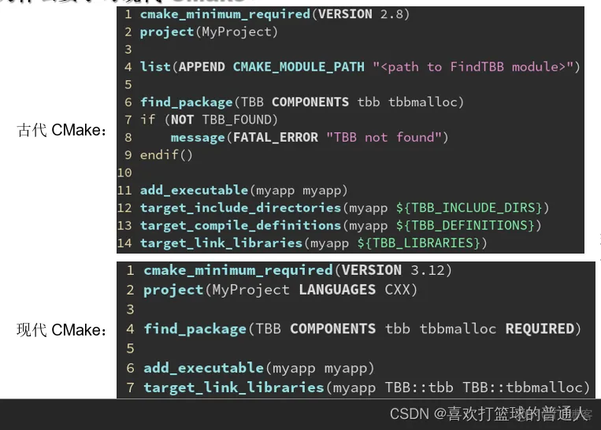
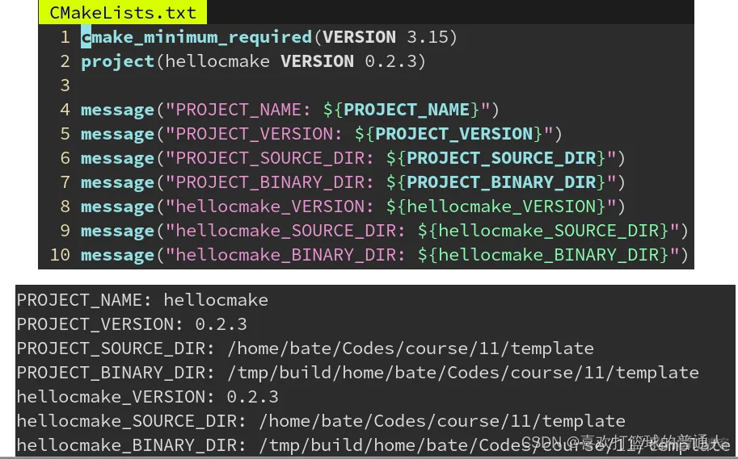
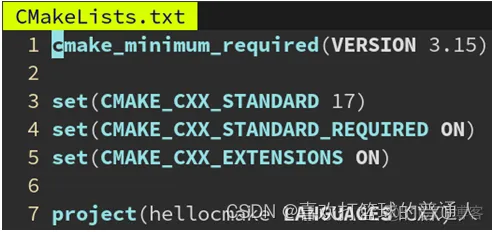
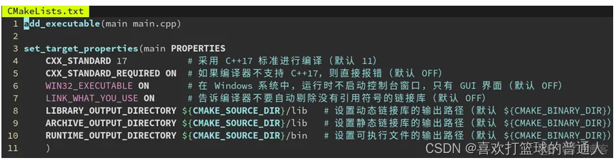

https://blog.51cto.com/u_12740336/6172908

## 1 使用-B build（相当于之前mkdir build && cd buld &&cmake ..） 和 --build build (相当于make)来替换 cmake .. 和make

也就是说现代cmake编译需要只需要两步，不需要再创建文件夹跳转
- 第一步是 cmake -B build，称为配置阶段（configure），这时只检测环境并生成构建规则，并在 build 目录下生成本地构建系统能识别的项目文件（Makefile 或是 .sln）
- 第二步是 cmake --build build，称为构建阶段（build），这时才实际调用编译器来编译代码

下图中
345行对应12
6行对应13
78行对应14



## 2 命令行速记

### **-D 选项：指定配置变量（又称缓存变量），在configure阶段使用**
```bash
cmake -B build -DCMAKE_INSTALL_PREFIX=/opt/openvdb-8.0
↑设置安装路径为 /opt/openvdb-8.0（会安装到 /opt/openvdb-8.0/lib/libopenvdb.so）

cmake -B build -DCMAKE_BUILD_TYPE=Release
↑设置构建模式为发布模式（开启全部优化）

cmake -B build   ←第二次配置时没有 -D 参数，但是之前的 -D 设置的变量都会被保留
（此时缓存里仍有你之前定义的 CMAKE_BUILD_TYPE 和 CMAKE_INSTALL_PREFIX）
```


### **-G 选项：指定要用的生成器**
CMake 是一个跨平台的构建系统，可以从 CMakeLists.txt 生成不同类型的构建系统（比如 Linux 的 make，Windows 的 MSBuild），从而让构建规则可以只写一份，跨平台使用。

过去的软件（例如 TBB）要跨平台，只好 Makefile 的构建规则写一份，MSBuild 也写一份。
现在只需要写一次 CMakeLists.txt，他会视不同的操作系统，生成不同构建系统的规则文件。
和操作系统绑定的构建系统（make、MSBuild）称为本地构建系统（native buildsystem）。
负责从 CMakeLists.txt 生成本地构建系统构建规则文件的，称为生成器（generator）。
eg：

- Linux 系统上的 CMake 默认用是 Unix Makefiles 生成器；
- Windows 系统默认是 Visual Studio 2019 生成器；
- MacOS 系统默认是 Xcode 生成器。
可以用 -G 参数改用别的生成器，

例如 **cmake -GNinja** 会生成 Ninja 这个构建系统的构建规则。Ninja 是一个高性能，跨平台的构建系统，Linux、Windows、MacOS 上都可以用。
Ninja 可以从包管理器里安装，没有包管理器的 Windows 可以用 Python 的包管理器安装：
**pip install ninja**
CMake 也可以通过 pip install cmake 安装

事实上，MSBuild 是单核心的构建系统，Makefile 虽然多核心但因历史兼容原因效率一般。
而 Ninja 则是专为性能优化的构建系统，他和 CMake 结合都是行业标准了。

#### **Ninja 和 Makefile 简单的对比**

**性能上：Ninja > Makefile > MSBuild**
Makefile 启动时会把每个文件都检测一遍，浪费很多时间。
特别是有很多文件，但是实际需要构建的只有一小部分，从而是 I/O Bound 的时候，Ninja 的速度提升就很明显。
然而某些专利公司的 CUDA toolkit 在 Windows 上只允许用 MSBuild 构建，不能用 Ninja


-E: CMake命令行模式。

## 3 善用target


## 4 常用变量

**CMAKE_BUILD_TYPE** 是 CMake 中一个特殊的变量，用于控制构建类型，他的值可以是：
```bash
Debug 调试模式，完全不优化，生成调试信息，方便调试程序
Release 发布模式，优化程度最高，性能最佳，但是编译比 Debug 慢
MinSizeRel 最小体积发布，生成的文件比 Release 更小，不完全优化，减少二进制体积
RelWithDebInfo 带调试信息发布，生成的文件比 Release 更大，因为带有调试的符号信息
```

**CMAKE_CURRENT_SOURCE_DIR** 表示当前源码目录的位置，例如 ~/hellocmake
**CMAKE_CURRENT_BINARY_DIR** 表示当前输出目录的位置，例如 ~/hellocmake/build

**CMAKE_SOURCE_DIR** 表示最为外层 CMakeLists.txt 的源码根目录。
**CMAKE_BINARY_DIR**：根项目输出路径（存放main.exe的地方）

**PROJECT_SOURCE_DIR**：当前项目源码路径（存放main.cpp的地方）
**PROJECT_BINARY_DIR**：当前项目输出路径（存放main.exe的地方）

如果有很多项目project，则可以用类似hellocmake_SOURCE_DIR等这样的，在当前目录下，与project是完全一致的。


子模块里也可以用 project 命令，将当前目录作为一个独立的子项目,这样一来 PROJECT_SOURCE_DIR 就会是子模块的源码目录而不是外层了。这时候 CMake 会认为这个子模块是个独立的项目，会额外做一些初始化。他的构建目录 PROJECT_BINARY_DIR 也会变成 build/<源码相对路径>。


project(项目名 LANGUAGES CXX) 指定了该项目使用了哪些编程语言。
**CMAKE_CXX_STANDARD** 是一个整数，表示要用的 C++ 标准。
	比如需要 C++17 那就设为 17，需要 C++23 就设为 23。注意不要用-std=c++17来设置标准，因为他只适用于linux。
**CMAKE_CXX_STANDARD_REQUIRED** 是 BOOL 类型，可以为 ON 或 OFF，默认 OFF。
	他表示是否一定要支持你指定的 C++ 标准：如果为 OFF 则 CMake 检测到编译器不支持 C++17 时不报错，而是默默调低到 C++14 给你用；为 ON 则发现不支持报错，更安全。
**CMAKE_CXX_EXTENSIONS** 也是 BOOL 类型，默认为 ON。
	设为 ON 表示启用 GCC 特有的一些扩展功能；OFF 则关闭 GCC 的扩展功能，只使用标准的 C++。
	g++ -std=c++17，
	g++ -std=gun++17，gcc夹带了一些私货，若只用gcc的话，并使用其特性，则可以设置为ON


可以用set_target_properties 为每个项目当都设置编译的属性，会覆盖掉上述的全局属性

## 5 find_library

与find_package不同，find_library更适用于没有提供cmake配置文件的一些库，比如apt安装的golg。


