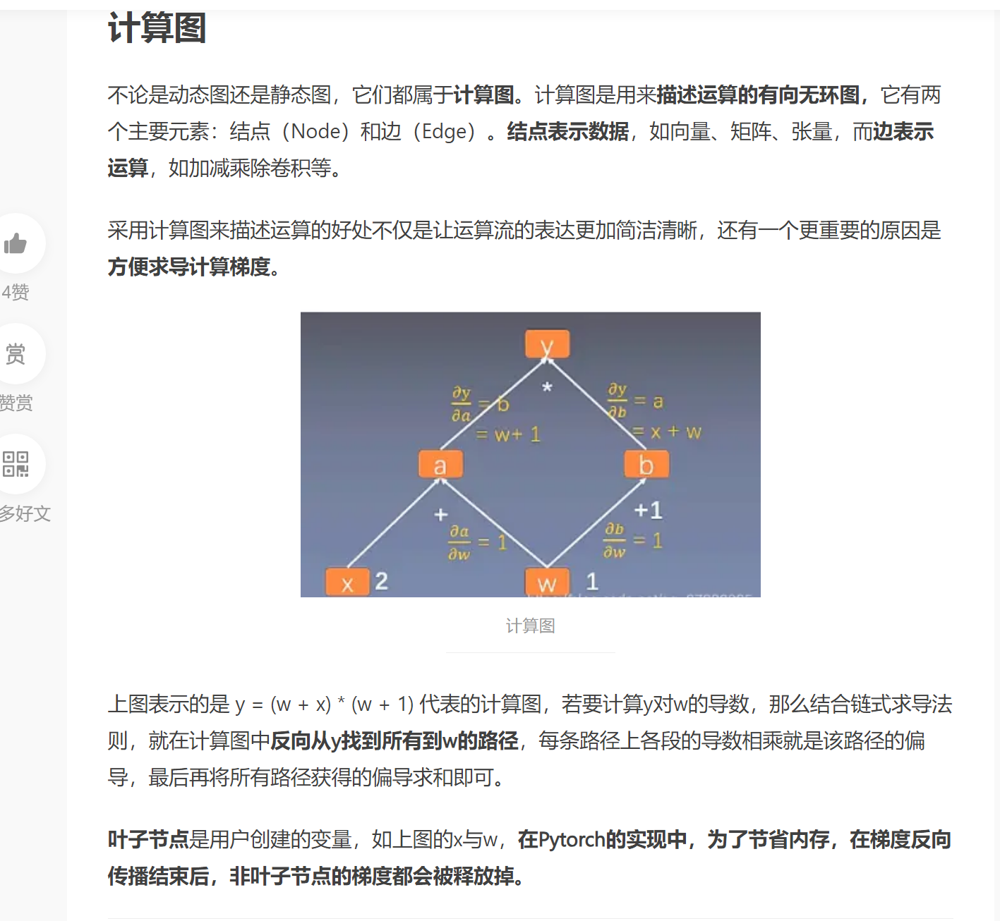

## 1. 计算图
下图中
y对w的导数等于5。$(w+1)×1 + (x+w)×1 =(1+1)×1 + (2+1)×1=5$
y对x的导数等于2。$(w+1)×1 =(1+1)×1=2$




## 2.静态图与动态图

动态图：边构建便计算，比较方便debug，使用者能够用任何他们喜欢的方式进行debug，同时非常直观。

静态图：是先构建再计算，之后再次运行的时候就不再需要重新构建计算图，所以速度会比动态图更快。

两者的区别在于:
静态图先说明数据要怎么计算，然后再放入数据。假设要放入50组数据，运算图因为是事先构建的，所以每一次计算梯度都很快、高效；
动态图的运算图是在数据计算的同时构建的，假设要放入50组数据，那么就要生成50次运算图。这样就没有那么高效。所以称为**动态图**。

## TensorFlow

```python
# tensorflow
import tensorflow as tf

first_counter = tf.constant(0)
second_counter = tf.constant(10)
```

```python
def cond(first_counter, second_counter, *args):
    return first_counter < second_counter

def body(first_counter, second_counter):
    first_counter = tf.add(first_counter, 2)
    second_counter = tf.add(second_counter, 1)
    return first_counter, second_counter
```

```python
#构建图
c1, c2 = tf.while_loop(cond, body, [first_counter, second_counter])
```

```python
#运行图
with tf.Session() as sess:
    counter_1_res, counter_2_res = sess.run([c1, c2])
```

```python
print(counter_1_res)
print(counter_2_res)
```

```python
20
20
```

可以看到 TensorFlow 需要将整个图构建成静态的，换句话说，每次运行的时候图都是一样的，是不能够改变的，所以不能直接使用 Python 的 while 循环语句，需要使用辅助函数 `tf.while_loop` 写成 TensorFlow 内部的形式

这是非常反直觉的，学习成本也是比较高的

下面我们来看看 PyTorch 的动态图机制，这使得我们能够使用 Python 的 while 写循环，非常方便


## PyTorch

```python
# pytorch
import torch
first_counter = torch.Tensor([0])
second_counter = torch.Tensor([10])
```

```python
while (first_counter < second_counter)[0]:
    first_counter += 2
    second_counter += 1
```

```python
print(first_counter)
print(second_counter)
```

```python
 20
[torch.FloatTensor of size 1]


 20
[torch.FloatTensor of size 1]
```

可以看到 PyTorch 的写法跟 Python 的写法是完全一致的，没有任何额外的学习成本