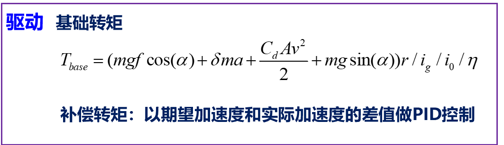
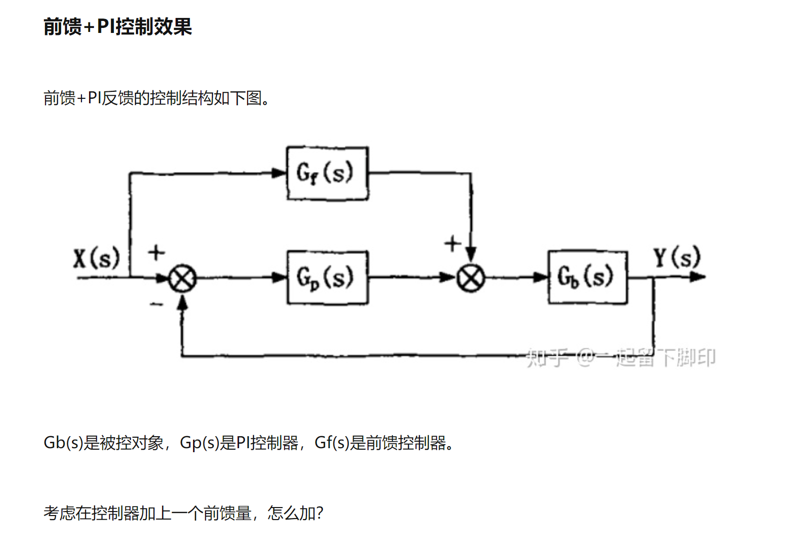
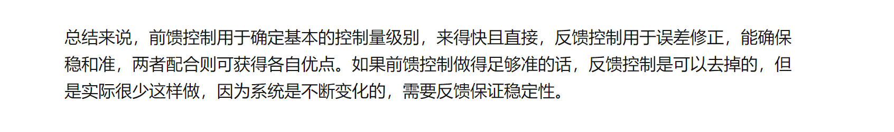

个人对于前馈+反馈控制的理解：

前馈可以认为是基于模型/基于经验的，是典型的开环控制，通过期望的加速度直接计算转矩。
反馈是基于误差的，期望加速度-当前加速度的误差，P I D 给出控制量（转矩）

前馈控制速度快，理论上，如果前馈模型够准确，可以用反馈，但是前馈不可能很准，有时候只是一个大致的量，比如用某个变化趋势一致的量作为前馈两.....
因此前馈一般和反馈控制同时设计实现

基础转矩的计算 ：前馈

补偿转矩的计算：反馈

