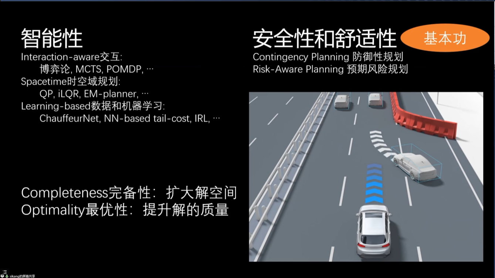

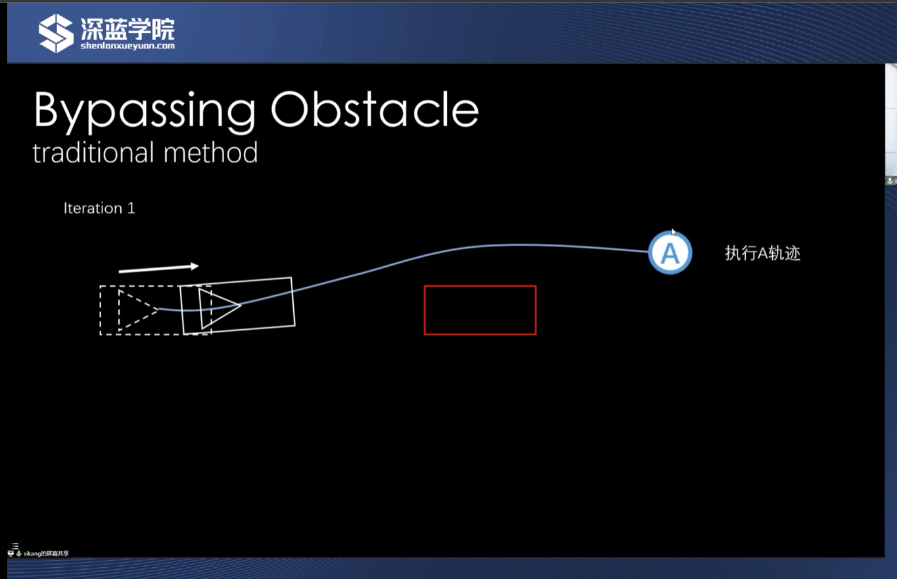

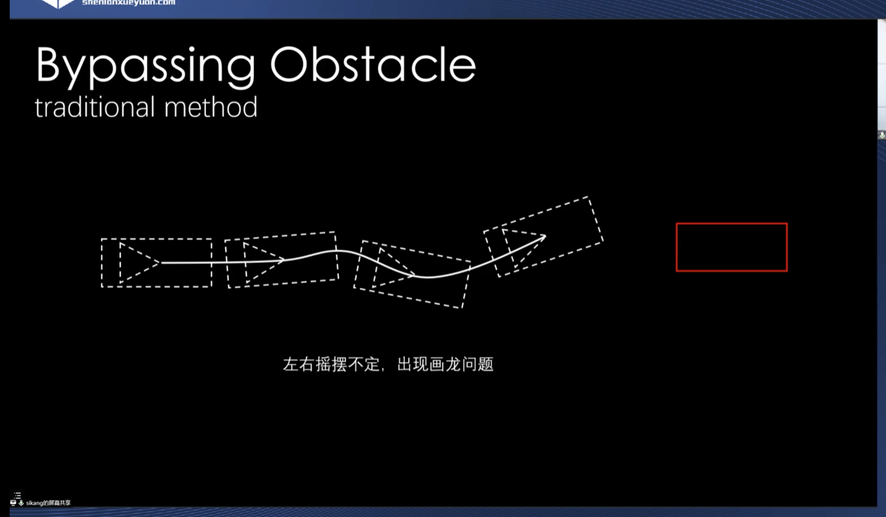

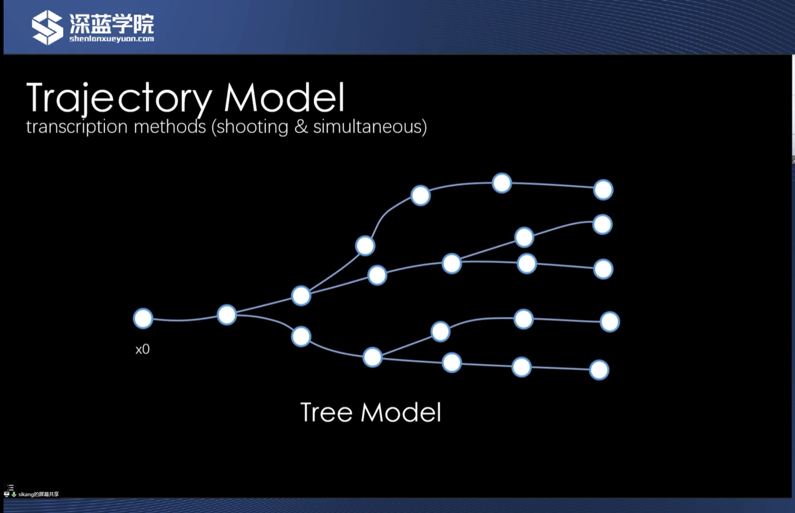

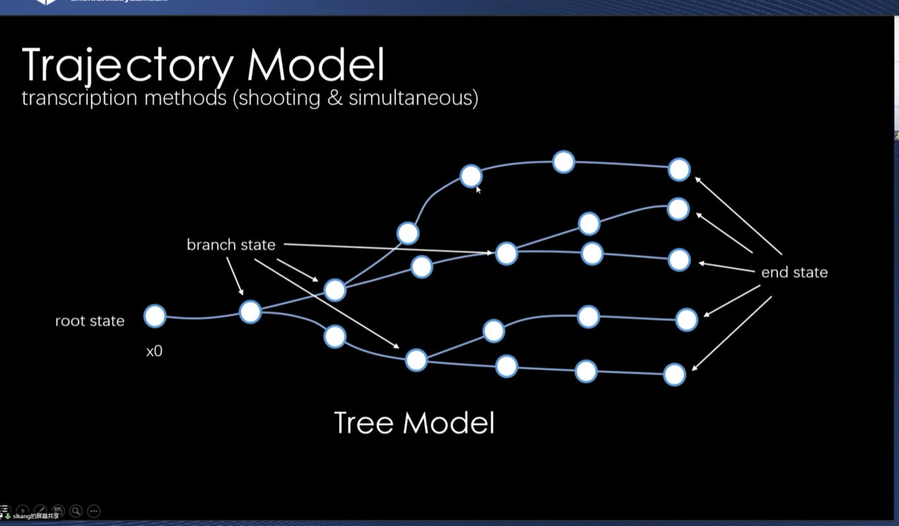

 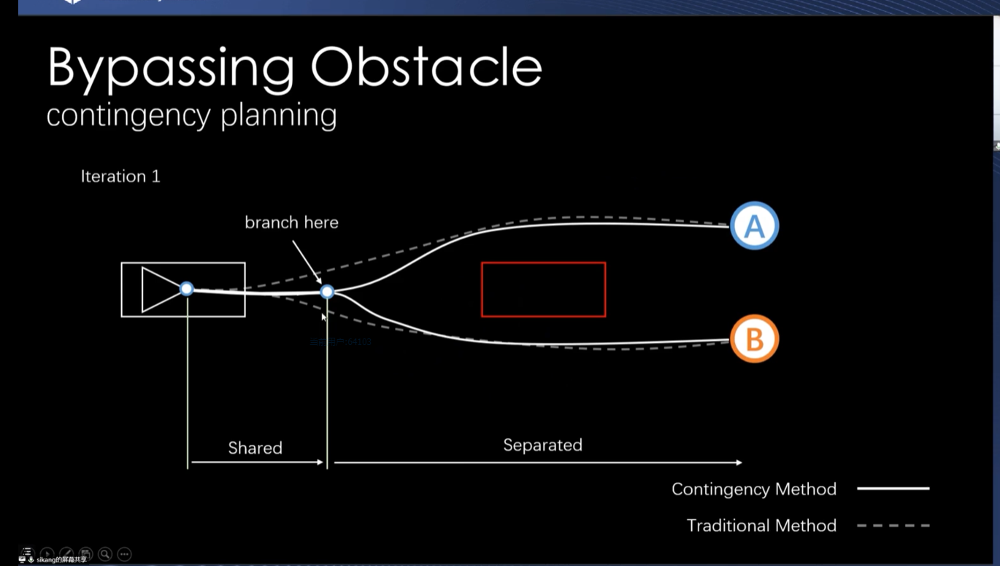

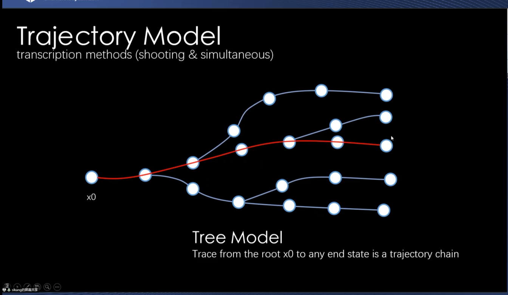

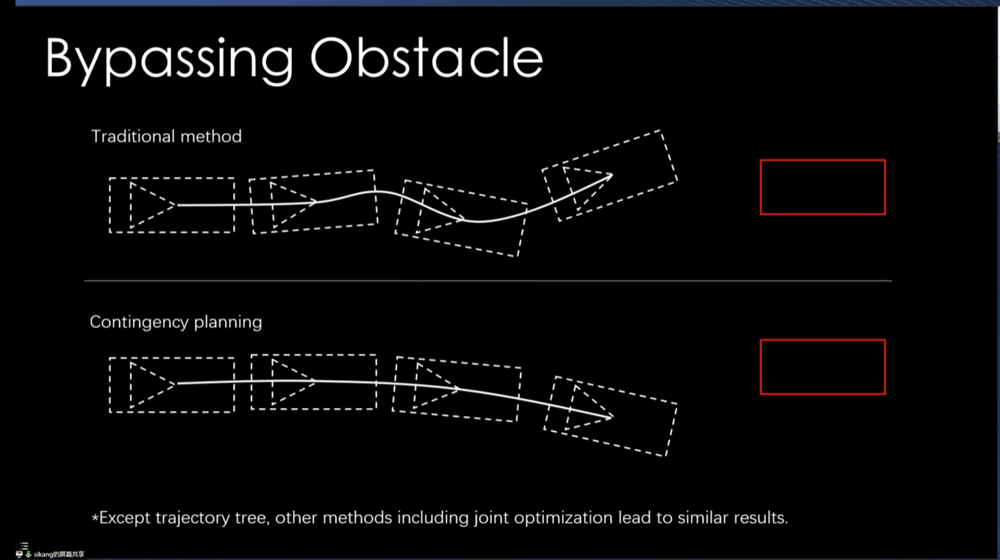

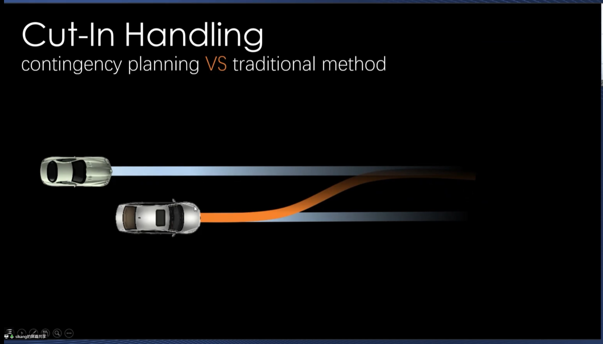

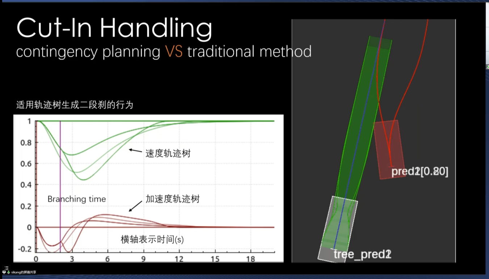

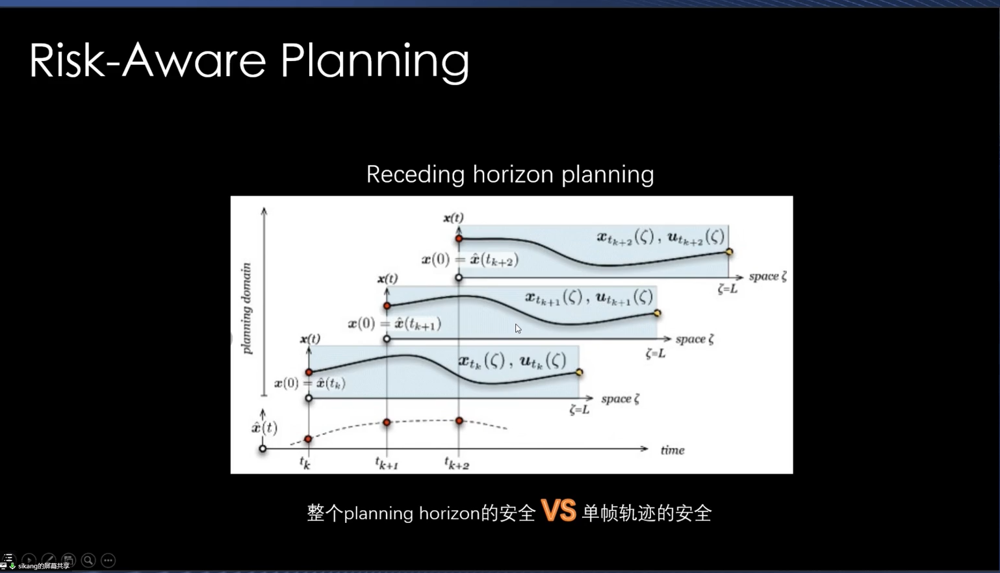

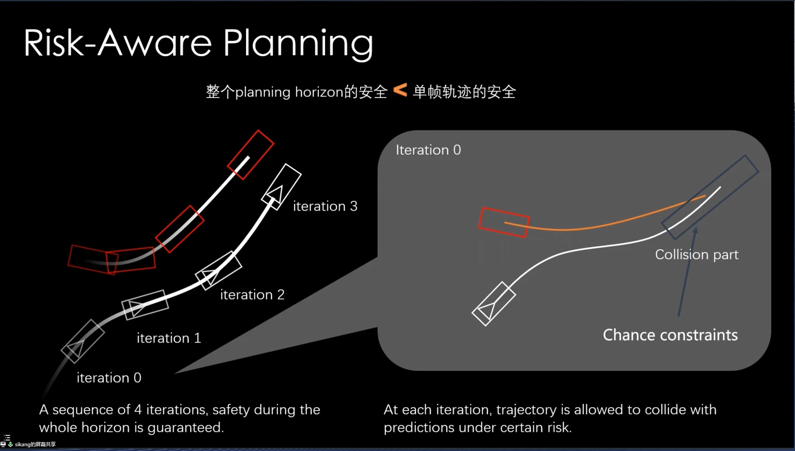

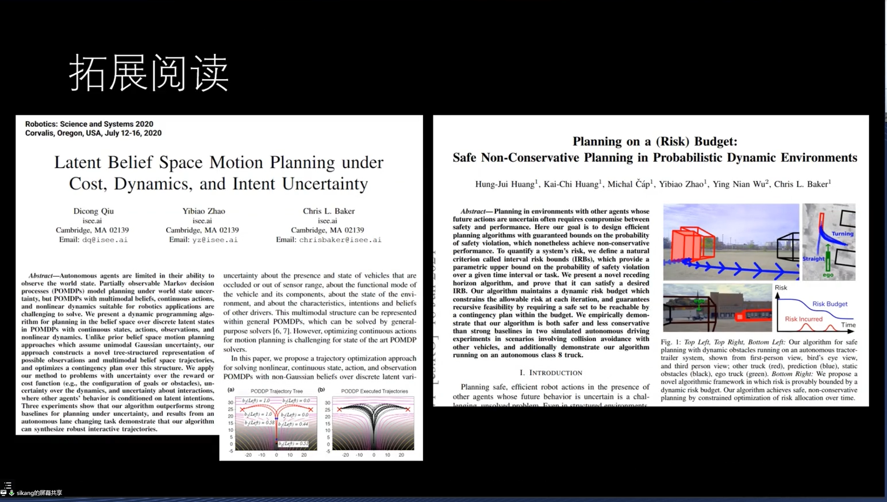

Risk-aware的概念是保证自动驾驶从a点到b点上整个的安全性。一般通过保证每一帧规划轨迹是安全的得以实现，实际上有个问题：保证自动驾驶整个周期的安全性需不需要保证每一帧轨迹的安全性？

通常考虑两个点：第一，轨迹规划不能撞上一些静态的障碍物，比如马路边、静止车等。第二与交通参与者的交互有关，比如车辆、行人等交通参与者的未来行为会随着自车的决策规划而产生变化。

传统系统的考虑方式是，当前方突然出现一辆车，那会规划出一个预测轨迹，再根据预测轨迹在时空域规划出对应的障碍物，然后规划出一个不会相撞的轨迹。但当舒适性和安全性出现一定冲突的时候，这样的规划思路比较保守。实际上要保证整个自动驾驶周期的安全性，**单帧轨迹的规划性是更高的**。

具体来说，预测往往具备一个特性： **预测时间越往后，置信度越低**。也就是在预测初期是不可能相撞的(比如2秒内)，那2秒后是不是可以允许适当的接触，同时让规划出来轨迹的舒适性和安全性之间达到平衡，从而保证整个自动驾驶的安全性。