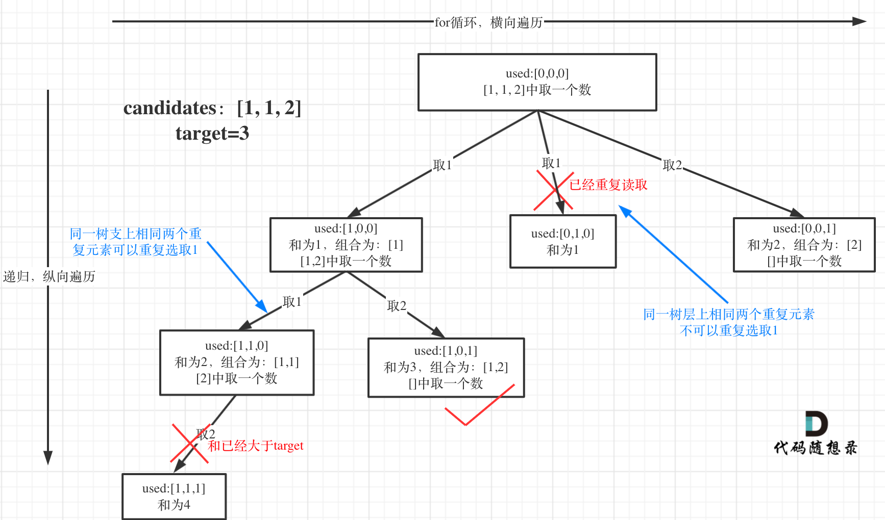

## 0 C++刷题基本语法

### 0.1 min、max、sort、reverse
```cpp
#include <algorithm>
int a=2;
int b=3;
max(a,b);
min(a,b);
```

```cpp
main()
{
　　//sort函数第三个参数采用默认从小到大
　　int a[]={45,12,34,77,90,11,2,4,5,55};
　　sort(a,a+10);//或lambda表达式sort(a,a+10,[](int a, int b) {return a > b; });
　　for(int i=0;i<10;i++)
　　cout<<a[i]<<" ";
}


int main(){
    string str;
    str = "Hello,world!";
    reverse(str.begin(),str.end());
    cout<<str;
    return 0;
}

```
### 0.2 lambda表达式

```cpp
[](int a,int b){ //do some thing  return a+b }
```

### 0.3 容器用法

https://zh.cppreference.com/w/cpp/container


###  0.4常用函数


https://perper.site/2019/01/21/C-%E5%88%B7%E9%A2%98%E5%B8%B8%E7%94%A8%E6%95%B0%E6%8D%AE%E5%8F%8A%E5%87%BD%E6%95%B0%E7%9A%84%E8%AF%AD%E6%B3%95%E8%AE%B0%E5%BD%95/

## 1 动态规划

### 1.1基本套路

用空间换时间，用一个数组来保存中间变量，最重要的是要找到递推公式。

**动态规划五部曲：**
1. 确定dp数组（dp table）以及下标的含义
2. 确定递推公式
3. dp数组如何初始化
4. 确定遍历顺序
5. 举例推导dp数组

### 1.2leetcode常见题型

[70. 爬楼梯](https://leetcode.cn/problems/climbing-stairs/)
[53. 最大子数组和](https://leetcode.cn/problems/maximum-subarray/)
[1143. 最长公共子序列](https://leetcode.cn/problems/longest-common-subsequence/)
[5. 最长回文子串](https://leetcode.cn/problems/longest-palindromic-substring/)

## 2 DFS（深度优先搜索）

### 2.1基本套路

DFS一般用**递归或者栈**来解决。常见的题型有二叉树的前序（根->左->右）、中序（左->根->右）、后序遍历（左->右->根）

```c++
//递归方法
class Solution {
public:

    void inorder(TreeNode* root, vector<int>& res) {
        if (!root) return;
        inorder(root->left,res);
        res.push_back(root->val);
        inorder(root->right,res);
    }
    vector<int> inorderTraversal(TreeNode* root) {
        vector<int> res;
        inorder(root, res);
        return res;
    }
};
```

```c++
//栈方法
class Solution {
public:
    vector<int> preorderTraversal(TreeNode* root) 
    {
        vector<int> v;
        stack<TreeNode*> s;
        while (root || !s.empty()) 
        {
            while (root) 
            {
                v.push_back(root->val);
                s.push(root);
                root = root->left;
            }
            root = s.top()->right;
            s.pop();
        }    
        return v;
    }
};

```
### 2.2 leetcode题型

[94. 二叉树的中序遍历](https://leetcode.cn/problems/binary-tree-inorder-traversal/)
[144. 二叉树的前序遍历](https://leetcode.cn/problems/binary-tree-preorder-traversal/)
[14. 二叉树的后序遍历]https://leetcode.cn/problems/binary-tree-postorder-traversal/description/

## 3 BFS（广度优先搜索）

### 3.1基本套路

广度优先搜索一般用**队列（优先队列）来解决**，常见的题型有二叉树的层序遍历

```c++
class Solution {
public:
    vector<vector<int>> levelOrder(TreeNode* root) {
        vector<vector<int>> res;
        if (!root) return res;
        queue<TreeNode*> q;
        q.push(root);
        while (!q.empty()){
            res.push_back(vector<int>());
            int level_size = q.size();
            for (int i = 0; i < level_size; ++i){
                TreeNode* top = q.front();
                q.pop();
                res.back().push_back(top->val);
                if (top->left) q.push(top->left);
                if (top->right) q.push(top->right);
            }
        }
        return res;
    }
};
```

### 3.2leetcode常见题型

[102. 二叉树的层序遍历](https://leetcode.cn/problems/binary-tree-level-order-traversal/)
[133克隆图](https://leetcode.cn/problems/clone-graph/description/)

## 4 二叉树的遍历

- 二叉树的**前、中、后序遍历**属于DFS，可以用**递归或者栈**解决。
- 二叉树的**层次遍历**属于BFS，可以用**队列**解决
### 4.1 前序

#### 递归

```cpp
/**
 * Definition for a binary tree node.
 * struct TreeNode {
 *     int val;
 *     TreeNode *left;
 *     TreeNode *right;
 *     TreeNode() : val(0), left(nullptr), right(nullptr) {}
 *     TreeNode(int x) : val(x), left(nullptr), right(nullptr) {}
 *     TreeNode(int x, TreeNode *left, TreeNode *right) : val(x), left(left), right(right) {}
 * };
 */
class Solution {
public:
    void reversal(TreeNode* root, vector<int> &res){
      if (root == nullptr) return;
      res.push_back(root->val);
      reversal(root->left, res);
      reversal(root->right, res);
    }
    vector<int> preorderTraversal(TreeNode* root) {
      vector<int> res{};
      reversal(root, res);
      return res;
    }
};
```

#### 栈
```cpp
/**
 * Definition for a binary tree node.
 * struct TreeNode {
 *     int val;
 *     TreeNode *left;
 *     TreeNode *right;
 *     TreeNode() : val(0), left(nullptr), right(nullptr) {}
 *     TreeNode(int x) : val(x), left(nullptr), right(nullptr) {}
 *     TreeNode(int x, TreeNode *left, TreeNode *right) : val(x), left(left), right(right) {}
 * };
 */
class Solution {
public:
    vector<int> preorderTraversal(TreeNode* root) {
      stack<TreeNode*> st;
      vector<int> res;
      if(root == nullptr) return res;
      st.push(root);
      while (!st.empty()) {
        TreeNode* node = st.top();
        st.pop();
        res.push_back(node->val);
        if(node->right) st.push(node->right);
        if(node->left) st.push(node->left);
      }
      return res;

    }
};
```

### 4.2 中序
#### 递归

```cpp
/**
 * Definition for a binary tree node.
 * struct TreeNode {
 *     int val;
 *     TreeNode *left;
 *     TreeNode *right;
 *     TreeNode() : val(0), left(nullptr), right(nullptr) {}
 *     TreeNode(int x) : val(x), left(nullptr), right(nullptr) {}
 *     TreeNode(int x, TreeNode *left, TreeNode *right) : val(x), left(left), right(right) {}
 * };
 */
class Solution {
public:
    void reversal(TreeNode* root, vector<int> &res){
      if (root == nullptr) return;
      reversal(root->left, res);
      res.push_back(root->val);
      reversal(root->right, res);
    }
    vector<int> inorderTraversal(TreeNode* root) {
      vector<int> res{};
      reversal(root, res);
      return res;
    }
};
```

#### 栈

```cpp
/**
 * Definition for a binary tree node.
 * struct TreeNode {
 *     int val;
 *     TreeNode *left;
 *     TreeNode *right;
 *     TreeNode() : val(0), left(nullptr), right(nullptr) {}
 *     TreeNode(int x) : val(x), left(nullptr), right(nullptr) {}
 *     TreeNode(int x, TreeNode *left, TreeNode *right) : val(x), left(left), right(right) {}
 * };
 */
class Solution {
public:
    vector<int> inorderTraversal(TreeNode* root) {
      stack<TreeNode*> st;
      vector<int> res;
      TreeNode* cur = root;
      if (root == nullptr) return res;
      while (!st.empty() || cur != nullptr) {
        if (cur != nullptr) {
          st.push(cur);
          cur = cur->left;
        } else {
          cur = st.top();
          st.pop();
          res.push_back(cur->val);
          cur = cur->right;
        }
      }
      return res;

    }
};
```

### 4.3 后序

#### 递归
```cpp
/**
 * Definition for a binary tree node.
 * struct TreeNode {
 *     int val;
 *     TreeNode *left;
 *     TreeNode *right;
 *     TreeNode() : val(0), left(nullptr), right(nullptr) {}
 *     TreeNode(int x) : val(x), left(nullptr), right(nullptr) {}
 *     TreeNode(int x, TreeNode *left, TreeNode *right) : val(x), left(left), right(right) {}
 * };
 */
class Solution {
public:
    void reversal(TreeNode* root, vector<int> &res){
      if (root == nullptr) return;
      reversal(root->left, res);
      reversal(root->right, res);
      res.push_back(root->val);
    }
    vector<int> postorderTraversal(TreeNode* root) {
      vector<int> res{};
      reversal(root, res);
      return res;
    }
};
```

#### 栈
```cpp
/**
 * Definition for a binary tree node.
 * struct TreeNode {
 *     int val;
 *     TreeNode *left;
 *     TreeNode *right;
 *     TreeNode() : val(0), left(nullptr), right(nullptr) {}
 *     TreeNode(int x) : val(x), left(nullptr), right(nullptr) {}
 *     TreeNode(int x, TreeNode *left, TreeNode *right) : val(x), left(left), right(right) {}
 * };
 */
class Solution {
public:
    vector<int> postorderTraversal(TreeNode* root) {
      stack<TreeNode*> st;
      vector<int> res;
      if (root == nullptr) return res;
      st.push(root);
      while (!st.empty()) {
        TreeNode* node = st.top();
        st.pop();
        res.push_back(node->val);
        if (node->left) st.push(node->left);
        if (node->right) st.push(node->right);
      }
      reverse(res.begin(), res.end());
      return res;

    }
};
```
### 4.4层次遍历（等同于BFS）


## 4 回溯（+剪枝）

**回溯法（back tracking）**（探索与回溯法）是一种选优搜索法，又称为试探法，按选优条件向前搜索，以达到目标。但当探索到某一步时，发现原先选择并不优或达不到目标，就退回一步重新选择，这种走不通就退回再走的技术为回溯法，而满足回溯条件的某个状态的点称为“回溯点”。

本质上回溯=穷举+剪枝

回溯能够解决：组合、切割、子集、排列等问题。**所有的回溯问题都可以抽象为一棵树！**

**回溯三部曲：**
1. 确定回溯函数模板返回值以及参数
2. 确定终止条件（纵向）
3. 回溯遍历（横向）

注意：回溯的参数中一定要有res，cur的引用。在终止条件满足时，res.push_back(cur)

**模板:**
```cpp
void backtracking(参数) {
    if (终止条件) {
        存放结果;
        return;
    }

    for (选择：本层集合中元素（树中节点孩子的数量就是集合的大小）) {//横向
        处理节点;
        backtracking(路径，选择列表); // 递归，纵向
        回溯，撤销处理结果
    }
}
```
### 4.1 回溯和递归的区别

**递归是一种算法结构**。递归会出现在子程序中，形式上表现为直接或间接的自己调用自己。典型的例子是阶乘，计算规律为：n!=n×(n−1)!，如果用 C++ 代码表示，基本如下所示：

```cpp
int fac(int n) {
    if(n  1) return n;
    else 
        return (n*fac(n - 1)); 
}
```

**回溯是一种算法思想**，它是用递归实现的。回溯的过程类似于穷举法，**但回溯有“剪枝”功能**，即自我判断过程。例如有求和问题，给定有 7 个元素的组合 \[ 1, 2, 3, 4, 5, 6, 7 \]，求加和为 7 的子集。累加计算中，选择 1+2+3+4 时，判断得到结果为 10 大于 7，那么后面的 5, 6, 7 就没有必要计算了。这种方法属于搜索过程中的优化，即“剪枝”功能。

### 4.2 题型

- 组合：N个数里面按一定规则找出k个数的集合（不强调顺序，比如{1, 2} 和 {2, 1} 在组合上，就是一个），所以取过的元素不会重复取，**for就要从startIndex开始**
- 分割：一个字符串按一定规则有几种切割方式
- 子集：一个N个数的集合里有多少符合条件的子集
- 排列：N个数按一定规则全排列，有几种排列方式（强调顺序，{1, 2} 和 {2, 1} 在排列上属于一个），**for就要从0开始**
- 棋盘问题：N皇后，解数独等等

#### （0）组合问题（无序，for就要从startIndex开始，收集叶子）

**需不需要startindex？**
如果是**一个集合**来求组合的话，就需要startIndex，例如：[77.组合 (opens new window)](https://programmercarl.com/0077.%E7%BB%84%E5%90%88.html)，[216.组合总和III (opens new window)](https://programmercarl.com/0216.%E7%BB%84%E5%90%88%E6%80%BB%E5%92%8CIII.html)。；

如果是**多个集合**取组合，各个集合之间相互不影响，那么就不用startIndex，例如：[17.电话号码的字母组合](https://programmercarl.com/0017.%E7%94%B5%E8%AF%9D%E5%8F%B7%E7%A0%81%E7%9A%84%E5%AD%97%E6%AF%8D%E7%BB%84%E5%90%88.html)
**startindex需要不需要+1**
组合中可以选取重复的数组（每个元素可以重复利用）：递归时startindex不变
组合中不可以选取重复的数组（每个元素只能用一次）：递归时startindex+1

**去重问题**
所谓去重，其实就是使用过的元素不能重复选取。都知道组合问题可以抽象为树形结构，那么“使用过”在这个树形结构上是有两个维度的，一个维度是**同一树枝**上使用过（每个集合内的重复比如{1，1，2}），一个维度是**同一树层**上使用过（集合之间的重复，比如{1,2}与{1,2}）。**没有理解这两个层面上的“使用过” 是造成大家没有彻底理解去重的根本原因。**[组合总和2](https://leetcode.cn/problems/combination-sum-ii/)


#### （1）分割问题（无序，for就要从startIndex开始，收集叶子）

我们来分析一下切割，**其实切割问题类似组合问题**。

例如对于字符串abcdef：

- 组合问题：选取一个a之后，在bcdef中再去选取第二个，选取b之后在cdef中再选取第三个.....。
- 切割问题：切割一个a之后，在bcdef中再去切割第二段，切割b之后在cdef中再切割第三段.....。

**那么在代码里什么是切割线呢？**

在处理组合问题的时候，递归参数需要传入startIndex，表示下一轮递归遍历的起始位置，这个startIndex就是切割线。（终止条件startIndex >= s.size()）


#### （2）子集（无序，for就要从startIndex开始，收集所有）

组合问题和分割问题都是收集树的叶子节点，而子集问题是**找树的所有节点**！其实子集也是一种组合问题，因为它的集合是无序的，子集{1,2} 和 子集{2,1}是一样的。

**那么既然是无序，取过的元素不会重复取，写回溯算法的时候，for就要从startIndex开始，而不是从0开始！**


#### （3）排列（有序，for从0开始，无start_index，需要used数组，收集叶子）

- 收集叶子节点。
- 使用used数组，其实就是记录此时path里都有哪些元素使用了，一个排列里一个元素只能使用一次。
- 不再需要无start_index，因为排列问题，每次都要从头开始搜索，例如元素1在\[1,2\]中已经使用过了，但是在\[2,1\]中还要再使用一次1。


**去重**
一定要先对元素排序，然后使用used去重，不能像组合和分割一样用start_Index去重，因为for是从0开始的。


**如果`candidates[i] == candidates[i - 1]` 并且 `used[i - 1] == false`，就说明：前一个树枝，使用了candidates\[i - 1\]，也就是说同一树层使用过candidates\[i - 1\]**。


#### （4）数独与N皇后


## 5 滑动窗口

一般就求最短序列的算法，所谓滑动窗口，**就是不断的调节子序列的起始位置和终止位置，从而得出我们要想的结果**。

### 5.1基本讨论
用一个for循环解决问题，循环的索引是窗口的终止位置。滑动窗口最重要的是如何移动窗口的起始位置。


在写代码之前需要确定如下三点：
- 窗口内是什么？
- 如何移动窗口的起始位置？
- 如何移动窗口的结束位置？
### 5.2 题型

力扣209长度最小子数组
题目描述
给定一个含有 n 个正整数的数组和一个正整数 s ，找出该数组中满足其和 ≥ s 的长度最小的 连续 子数组，并返回其长度。如果不存在符合条件的子数组，返回 0。

示例：

- 输入：s = 7, nums = \[2,3,1,2,4,3\]
- 输出：2
- 解释：子数组 \[4,3\] 是该条件下的长度最小的子数组。
```cpp
class Solution {
public:
    int minSubArrayLen(int target, vector<int>& nums) {
      int n = nums.size();
      int result = INT_MAX;
      int sum = 0;
      int i = 0;//起始位置
      for (int j = 0; j < n; j++) {
        sum += nums[j];
        while (sum >= target) {
          result = min(result, j - i + 1);
          sum -= nums[i++];
        }
      }
      return result  INT_MAX ? 0 : result;
    }
};
```

力扣239 滑动窗口最大值

```cpp
class Solution {
public:
    vector<int> maxSlidingWindow(vector<int>& nums, int k) {
        int n = nums.size();
        auto gt = [](pair<int, int> a, pair<int, int> b) {
            return a.first < b.first;
        };
        priority_queue<pair<int, int>, vector<pair<int, int>>, decltype(gt)> q;
        for (int i = 0; i < k; ++i) {
            q.push({nums[i], i});
        }
        vector<int> ans;
        ans.push_back(q.top().first);
        for (int i = k; i < n; ++i) {
            q.push({nums[i], i});
            while (q.top().second <= i - k) {
                q.pop();
            }
            ans.push_back(q.top().first);
        }
        return ans;      
    }
};
```


## 6 牛顿法求根号


求$f(x) = 0$的根，设初值为$x_0$ ，迭代公为：
$$
x_{n+1} = x_n - \frac{f(x_n)}{f'(x_n)}
$$

原理是


求根的C++代码
求$f(x)=x^2 - C=0$ ,取$x_0=C$, 已知$f'(x_n)=2x_n$

```cpp
class Solution {
public:
    int mySqrt(int x) {
      if (x == 0) return 0;
      double C = x;
      double x0 = x;
      double xi = 0.0;
      while (true) {
        xi = x0 - ((x0 * x0 - C)/(2 * x0));
        if (fabs(xi - x0) < 1e-7) break;
        else {
          x0 = xi;
        }
      }
      return int(xi);
    }
};
```
## 7路径规划算法

- Dijkstra和A\*的统一伪代码


### Dijkstra
https://zhuanlan.zhihu.com/p/360276556

#### 邻接表和邻接矩阵
三个量分别需要定义：
- `priority_queue<PII, vector<PII>, decltype(gt)> q;//{node,distance}`
- `vector<int> distance(N, INT_MAX);`
- `vector<int> vis(N, 0);`

初始化：
- `distance[src] = 0;`
- vis初始化为0
- `q.push({src, distance[src]});`

```c++
using PII = pair<int, int>;
//邻接表 key = src ，val = {adj,cost}
int dijkstra (unordered_map<int, vector<PII>>& graph, int src, int tar, int N) {
  auto gt = [](auto& a, auto& b) { return a.second > b.second; };
  priority_queue<PII, vector<PII>, decltype(gt)> q;//{node,distance}
  vector<int> distance(N, INT_MAX);
  distance[src] = 0;
  vector<int> vis(N, 0);
  q.push({src, distance[src]});
  while(!q.empty()) {
	auto [node, dis] = q.top();
	q.pop();
	if (vis[node]) continue;
	vis[node] = 1;
	//如果是邻接矩阵，就扫描node所在行
	for (auto& [adj, cost] : graph[node]) {
	  if (distance[adj]  > distance[node] + cost) {
		distance[adj] = distance[node] + cost;
		q.push({adj, distance[adj]});
	  }
	}
  }
  return distance[tar] == INT_MAX ? -1 : distance[tar];
}
```

#### 二维矩阵

```cpp
#include <vector>
#include <queue>
#include <climits>
using namespace std;

using PII = pair<int, int>;//x,y 位置

int dijkstra(vector<vector<int>>& grid, PII src, PII tar) {
    int m = grid.size(), n = grid[0].size();
    auto gt = [](auto& a, auto& b) { return a.second > b.second; };
    priority_queue<pair<PII, int>, vector<pair<PII, int>>, decltype(gt)> q; // {{i, j}, distance}
    vector<vector<int>> distance(m, vector<int>(n, INT_MAX));//{i,j}到target的举例
    distance[src.first][src.second] = 0;
    vector<vector<bool>> vis(m, vector<bool>(n, false));
    q.push({src, distance[src.first][src.second]});
    vector<PII> directions{{-1, 0}, {1, 0}, {0, -1}, {0, 1}}; // 上下左右

    while(!q.empty()) {
        auto [[i, j], dis] = q.top();
        q.pop();
        if (vis[i][j]) continue;
        vis[i][j] = true;
        for (auto& [di, dj] : directions) {
            int ni = i + di, nj = j + dj;
            if (ni >= 0 && ni < m && nj >= 0 && nj < n) {
                if (distance[ni][nj] > distance[i][j] + grid[i][j]) {
                    distance[ni][nj] = distance[i][j] + grid[i][j];
                    q.push({{ni, nj}, distance[ni][nj]});
                }
            }
        }
    }
    return distance[tar.first][tar.second] == INT_MAX ? -1 : distance[tar.first][tar.second];
}

```
### a star

https://zhuanlan.zhihu.com/p/360282185

#### 邻接表和邻接矩阵
- 优先队列存储的是actual+heuristic distance，不再是actua distance
- distance数组不再是vector\<int\>，而变为`vector<pair<int, int>>`存actual 和 heuristic distance
- 其他不变

```cpp
using PII = pair<int, int>;

// 启发式函数，估计从当前节点到目标节点的距离
int h(int node, int tar) {
  // 根据实际情况编写启发式函数
  // 例如，可以使用曼哈顿距离或欧几里得距离
  //如果返回0，则等价于dijkstra
}

int astar(unordered_map<int, vector<PII>>& graph, int src, int tar, int N) {
  auto gt = [](auto& a, auto& b) { return a.second > b.second; };
  priority_queue<PII, vector<PII>, decltype(gt)> q; // {node, actual+heuristic distance}
  vector<pair<int, int>> distance(N, {INT_MAX, 0}); // {actual distance, heuristic distance}
  distance[src] = {0, h(src, tar)}; // 初始化起始节点的距离{实际距离, 启发距离}
  vector<int> vis(N, 0);
  q.push({src, distance[src].first + distance[src].second}); // 综合评估值为实际距离加启发式函数估计距离

  while (!q.empty()) {
    auto [node, dis] = q.top();
    q.pop();
    if (vis[node]) continue;
    vis[node] = 1;
    for (auto& [adj, cost] : graph[node]) {
      if (distance[adj].first > distance[node].first + cost) {
        distance[adj].first = distance[node].first + cost;
        distance[adj].second = h(adj, tar); // 更新启发式函数估计距离
        q.push({adj, distance[adj].first + distance[adj].second});
      }
    }
  }

  return distance[tar].first == INT_MAX ? -1 : distance[tar].first;
}
```

#### 二维矩阵

```cpp
#include <vector>
#include <queue>
#include <cmath>
using namespace std;

using PII = pair<int, int>;

// 启发式函数，估计从当前节点到目标节点的距离
int h(PII node, PII tar) {
    return abs(node.first - tar.first) + abs(node.second - tar.second);
}
//grid存的i，j到其他点的代价
int astar(vector<vector<int>>& grid, PII src, PII tar) {
    int m = grid.size(), n = grid[0].size();
    auto gt = [](auto& a, auto& b) { return a.second > b.second; };
    priority_queue<pair<PII, int>, vector<pair<PII, int>>, decltype(gt)> q; // {{i, j}, actual+heuristic distance}
    vector<vector<pair<int, int>>> distance(m, vector<pair<int, int>>(n, {INT_MAX, 0})); // {actual distance, heuristic distance}
    distance[src.first][src.second] = {0, h(src, tar)};
    vector<vector<bool>> vis(m, vector<bool>(n, false));
    q.push({src, distance[src.first][src.second].first + distance[src.first][src.second].second});
    vector<PII> directions{{-1, 0}, {1, 0}, {0, -1}, {0, 1}}; // 上下左右

    while(!q.empty()) {
        auto [[i, j], dis] = q.top();
        q.pop();
        if (vis[i][j]) continue;
        vis[i][j] = true;
        if (i == tar.first && j == tar.second) return distance[i][j].first; // Found the target
        for (auto& [di, dj] : directions) {
            int ni = i + di, nj = j + dj;
            if (ni >= 0 && ni < m && nj >= 0 && nj < n) {
                if (distance[ni][nj].first > distance[i][j].first + grid[i][j]) {
                    distance[ni][nj].first = distance[i][j].first + grid[i][j];
                    distance[ni][nj].second = h({ni, nj}, tar);
                    q.push({{ni, nj}, distance[ni][nj].first + distance[ni][nj].second});
                }
            }
        }
    }
    return -1; // Target not reachable
}

```

### DFS(递归版本)

#### 邻接表与邻接矩阵
```cpp
#include <iostream>
#include <vector>

using namespace std;

void dfs(const vector<vector<int>>& graph, int node, vector<bool>& visited) {
    // 检查节点是否已被访问
    if (visited[node]) {
        return;
    }

    // 处理当前节点
    cout << node << " ";
    visited[node] = true;

    // 递归访问所有邻居,邻接表
    for (int neighbor : graph[node]) {
        dfs(graph, neighbor, visited);
    }
    // 递归访问所有邻居,邻接矩阵
	//for (int neighbor = 0; neighbor < n; ++neighbor) { 
	//	if (graph[node][neighbor] == 1 && !visited[neighbor]) { 
	//		dfs(graph, neighbor, visited);
	//	}
	//}
}

int main() {
    // 示例图的邻接表表示法
    // graph[i] 是一个包含所有节点 i 的邻居的列表
    vector<vector<int>> graph = {
        {1, 2},    // 0 的邻居是 1, 2
        {0, 3, 4}, // 1 的邻居是 0, 3, 4
        {0, 4},    // 2 的邻居是 0, 4
        {1, 4, 5}, // 3 的邻居是 1, 4, 5
        {1, 2, 3}, // 4 的邻居是 1, 2, 3
        {3}        // 5 的邻居是 3
    };

    vector<bool> visited(graph.size(), false);

    cout << "DFS starting from node 0:" << endl;
    dfs(graph, 0, visited);

    return 0;
}


```

#### 二维矩阵

```cpp
#include <iostream>
#include <vector>

using namespace std;

void dfs(const vector<vector<int>>& grid, int x, int y, vector<vector<bool>>& visited) {
    int rows = grid.size();
    int cols = grid[0].size();

    // 检查当前位置是否在边界内并且没有被访问过
    if (x < 0 || x >= rows || y < 0 || y >= cols || visited[x][y]) {
        return;
    }

    // 处理当前节点
    cout << grid[x][y] << " ";
    visited[x][y] = true;

    // 四个方向的移动：上、下、左、右
    vector<pair<int, int>> directions = {{-1, 0}, {1, 0}, {0, -1}, {0, 1}};

    // 遍历四个方向
    for (auto [dx, dy] : directions) {
        dfs(grid, x + dx, y + dy, visited);
    }
}

int main() {
    vector<vector<int>> grid = {
        {1, 2, 3},
        {4, 5, 6},
        {7, 8, 9}
    };

    vector<vector<bool>> visited(grid.size(), vector<bool>(grid[0].size(), false));

    cout << "DFS starting from node (0, 0):" << endl;
    dfs(grid, 0, 0, visited);

    return 0;
}

```
### DFS（迭代版本）

```cpp
#include <unordered_map>
#include <vector>
#include <stack>

std::vector<int> dfs(std::unordered_map<int, std::vector<int>>& graph, int src, int N) {
    std::stack<int> stk;
    std::vector<int> vis(N, 0);
    stk.push(src);
    vis[src] = 1;
    std::vector<int> res;

    while (!stk.empty()) {
        int node = stk.top();
        stk.pop();
        res.push_back(node);
        // 如果是邻接矩阵，就扫描node所在行
        for (auto it = graph[node].rbegin(); it != graph[node].rend(); ++it) {
            int adj = *it;
            if (vis[adj] == 1) continue;
            stk.push(adj);
            src[adj] = 1;
        }
    }

    return res;
}

```
### BFS

- BFS和dijkstra的vis设置不同，bfs需要在push的时候就将vis设置为1，因为每个节点只入队一次就可以了。
- dijkstra需要在节点弹出的时候将vis设置为1，因为每个节点可能入队多次，只有弹出才说明已经找到最短路径了。

#### 邻接表和邻接矩阵
```cpp
//邻接表 key = src ，val = {adj1,adj2...}
vector<int> bfs (unordered_map<int, vector<int>>& graph, int src, int N) {
  queue<int> q;
  vector<int> vis(N, 0);
  q.push(src);
  vis[src] = 1;
  vector<int> res;
  while(!q.empty()) {
	int node = q.front();
	q.pop();

	res.push_back(node);
	//如果是邻接矩阵，就扫描node所在行
	for (auto& adj : graph[node]) {
	  q.push(adj);
	  vis[adj] = 1;
	}
	//邻接矩阵
	//for (int neighbor = 0; neighbor < n; ++neighbor) { 
	//	if (graph[node][neighbor] == 1 && !visited[neighbor]) { 
	//		q.push(neighbor);
	//      visited[neighbor] = true;
	//	}
	//}
  }
  return res;
}
```

#### 二维矩阵
```cpp
#include <iostream>
#include <vector>
#include <queue>

using namespace std;

void bfs(const vector<vector<int>>& grid, int startX, int startY) {
    int rows = grid.size();
    int cols = grid[0].size();

    vector<vector<bool>> visited(rows, vector<bool>(cols, false));
    queue<pair<int, int>> q;

    // 四个方向的移动：上、下、左、右
    vector<pair<int, int>> directions = {{-1, 0}, {1, 0}, {0, -1}, {0, 1}};

    q.push({startX, startY});
    visited[startX][startY] = true;

    while (!q.empty()) {
        auto [x, y] = q.front();
        q.pop();

        // 处理当前节点
        cout << grid[x][y] << " ";

        // 遍历四个方向
        for (auto [dx, dy] : directions) {
            int newX = x + dx;
            int newY = y + dy;

            // 检查新位置是否在边界内并且没有被访问过
            if (newX >= 0 && newX < rows && newY >= 0 && newY < cols && !visited[newX][newY]) {
                q.push({newX, newY});
                visited[newX][newY] = true;
            }
        }
    }
}

int main() {
    vector<vector<int>> grid = {
        {1, 2, 3},
        {4, 5, 6},
        {7, 8, 9}
    };

    cout << "BFS starting from node (0, 0):" << endl;
    bfs(grid, 0, 0);

    return 0;
}

```

## 8 背包问题

### 1 完全背包与01背包

01背包：物品只能够使用一次，先遍历物品再遍历背包，背包从后往前遍历

完全背包：物品可以使用多次，先遍历物品再遍历背包，背包从前往后遍历

### 2 组合与排列

组合：不分前后顺序，先遍历物品再遍历背包

排列：分前后顺序，先遍历背包再遍历物品

## 排序

### 快速排序
寻找一个pivot，把数组分为两部分，左边全都小于pivot，右边全都大于pivot，具体的方法是通过左右两个指针，左指针找到第一个大于pivot的位置，右指针找到第一个小于pivot的位置，然后交换，最后相遇的位置和pivot交换。递归的去对左右部分做相同的操作。

```cpp
class Solution {
private:
    void quick_sort(vector<int>& nums, int l, int r) {
        if (l >= r) return;
        int left = l;
        int right = r;
        int pivot = nums[l];
        while (left < right) {
	        //从右往左找到第一个小于pivot的索引
            while (left < right && nums[right] >= pivot) right--;
            //从左往右找到第一个大于pivot的索引
            while (left < right && nums[left] <= pivot) left++;
            if (left < right) swap(nums[left], nums[right]);
        }
        //此时 left == right
        swap(nums[left], nums[l]);
        quick_sort(nums, l, left - 1);
        quick_sort(nums, right + 1, r);
    }
    void random_quick_sort(vector<int>& nums, int l, int r) {
        if (l >= r) return;
        int left = l;
        int right = r;
        srand((unsigned)time(NULL));
        int random_index = rand() % (r - l + 1) + l;
        swap(nums[l], nums[random_index]);

        int pivot = nums[l];
        while (left < right) {
            //从右往左找到第一个小于pivot的索引
            while (left < right && nums[right] >= pivot) right--;
            //从左往右找到第一个大于pivot的索引
            while (left < right && nums[left] <= pivot) left++;
            //交换
            if (left < right) swap(nums[left], nums[right]);
        }
        //此时 left == right，交换pivot和相遇位置的数，把pivot放到中间（之前一直在最左边）
        swap(nums[left], nums[l]);
        random_quick_sort(nums, l, left - 1);
        random_quick_sort(nums, right + 1, r);
    }

public:
    vector<int> sortArray(vector<int>& nums) {
        random_quick_sort(nums, 0, nums.size() - 1);
        return nums;
    }
};
```

### 冒泡排序
```cpp
#include <iostream>
#include <vector>

void bubbleSort(std::vector<int>& nums) {
    int n = nums.size();
    for (int i = 0; i < n - 1; i++) {
        for (int j = 0; j < n - i - 1; j++) {
            if (nums[j] > nums[j + 1]) {
                std::swap(nums[j], nums[j + 1]);
            }
        }
    }
}

int main() {
    std::vector<int> nums = {9, 2, 5, 1, 7, 3};

    bubbleSort(nums);

    std::cout << "Sorted array: ";
    for (int num : nums) {
        std::cout << num << " ";
    }
    std::cout << std::endl;

    return 0;
}

```

### 归并排序

```cpp
#include <iostream>
#include <vector>

void merge(std::vector<int>& arr, int l, int m, int r) {
    int n1 = m - l + 1;
    int n2 = r - m;

    // 创建两个临时数组
    std::vector<int> L(n1);
    std::vector<int> R(n2);

    // 复制数据到临时数组 L[] 和 R[] 
    for (int i = 0; i < n1; i++)
        L[i] = arr[l + i];
    for (int j = 0; j < n2; j++)
        R[j] = arr[m + 1 + j];

    // 合并两个临时数组回到 arr[l..r]
    int i = 0;
    int j = 0;
    int k = l;
    while (i < n1 && j < n2) {
        if (L[i] <= R[j]) {
            arr[k] = L[i];
            i++;
        } else {
            arr[k] = R[j];
            j++;
        }
        k++;
    }

    // 如果 L[] 还有剩余元素，将它们复制到 arr
    while (i < n1) {
        arr[k] = L[i];
        i++;
        k++;
    }

    // 如果 R[] 还有剩余元素，将它们复制到 arr
    while (j < n2) {
        arr[k] = R[j];
        j++;
        k++;
    }
}

void mergeSort(std::vector<int>& arr, int l, int r) {
    if (l < r) {
        int m = l + (r - l) / 2;

        // 分别对前半部分和后半部分进行排序
        mergeSort(arr, l, m);
        mergeSort(arr, m + 1, r);

        merge(arr, l, m, r);  // 合并两部分
    }
}

int main() {
    std::vector<int> arr = {12, 11, 13, 5, 6, 7};
    int arr_size = arr.size();

    std::cout << "Given array: ";
    for (auto num : arr) std::cout << num << " ";
    std::cout << std::endl;

    mergeSort(arr, 0, arr_size - 1);

    std::cout << "Sorted array: ";
    for (auto num : arr) std::cout << num << " ";
    std::cout << std::endl;

    return 0;
}

```

### 插入排序
```cpp
#include <iostream>
#include <vector>

void insertionSort(std::vector<int>& arr) {
    int n = arr.size();
    for (int i = 1; i < n; i++) {
        int key = arr[i];
        int j = i - 1;

        // 移动元素 arr[0..i-1]，它们大于key，
        // 到它们的下一个位置
        while (j >= 0 && arr[j] > key) {
            arr[j + 1] = arr[j];
            j--;
        }
        arr[j + 1] = key;
    }
}

int main() {
    std::vector<int> arr = {12, 11, 13, 5, 6};
    
    std::cout << "Given array: ";
    for (auto num : arr) std::cout << num << " ";
    std::cout << std::endl;

    insertionSort(arr);

    std::cout << "Sorted array: ";
    for (auto num : arr) std::cout << num << " ";
    std::cout << std::endl;

    return 0;
}

```

### 选择排序

```cpp
#include <iostream>
#include <vector>

void selectionSort(std::vector<int>& arr) {
    int n = arr.size();
    for (int i = 0; i < n - 1; i++) {
        int min_idx = i; // 找到最小元素的索引
        for (int j = i + 1; j < n; j++) {
            if (arr[j] < arr[min_idx]) {
                min_idx = j;
            }
        }

        // 将找到的最小元素与第i个元素交换
        if (min_idx != i) {
            std::swap(arr[i], arr[min_idx]);
        }
    }
}

int main() {
    std::vector<int> arr = {64, 34, 25, 12, 22, 11, 90};
    
    std::cout << "Given array: ";
    for (auto num : arr) std::cout << num << " ";
    std::cout << std::endl;

    selectionSort(arr);

    std::cout << "Sorted array: ";
    for (auto num : arr) std::cout << num << " ";
    std::cout << std::endl;

    return 0;
}

```

### 堆排序

```cpp
#include <iostream>
#include <vector>

// 调整为大顶堆
void heapify(std::vector<int>& arr, int n, int i) {
    int largest = i;  // 初始化当前结点为最大值
    int left = 2 * i + 1;
    int right = 2 * i + 2;

    // 如果左孩子大于根
    if (left < n && arr[left] > arr[largest])
        largest = left;

    // 如果右孩子大于所标记的最大值
    if (right < n && arr[right] > arr[largest])
        largest = right;

    // 如果最大值不是根
    if (largest != i) {
        std::swap(arr[i], arr[largest]);

        // 递归地调整受影响的子树
        heapify(arr, n, largest);
    }
}

void heapSort(std::vector<int>& arr) {
    int n = arr.size();

    // 构建大顶堆
    for (int i = n / 2 - 1; i >= 0; i--)
        heapify(arr, n, i);

    // 一个个地从堆中提取元素
    for (int i = n - 1; i > 0; i--) {
        // 当前最大的元素和当前元素交换
        std::swap(arr[0], arr[i]);

        // 因为交换了根元素，所以调整堆大小并重新heapify
        heapify(arr, i, 0);
    }
}

int main() {
    std::vector<int> arr = {12, 11, 13, 5, 6, 7};

    std::cout << "Given array: ";
    for (auto num : arr) std::cout << num << " ";
    std::cout << std::endl;

    heapSort(arr);

    std::cout << "Sorted array: ";
    for (auto num : arr) std::cout << num << " ";
    std::cout << std::endl;

    return 0;
}

```
### TOPK问题（找到最大的k个元素）

- 排序sort（nlogn）
- 优先队列（nlogn）
- 局部排序
函数使用冒泡排序算法将数组中的元素进行局部排序，使得最大的k个元素位于数组的末尾。然后，我们通过逆序输出数组的末尾k个元素，即得到了前k个最大的元素。
```cpp
#include <iostream>
#include <vector>

void bubbleSort(std::vector<int>& nums, int k) {
    int n = nums.size();
    for (int i = 0; i < k; i++) {
        // 每次遍历找到当前未排序部分的最大值，并将其冒泡到末尾
        for (int j = 0; j < n - i - 1; j++) {
            if (nums[j] > nums[j + 1]) {
                std::swap(nums[j], nums[j + 1]);
            }
        }
    }
}

int main() {
    std::vector<int> nums = {9, 2, 5, 1, 7, 3};
    int k = 3; // 找出前k个最大的元素

    bubbleSort(nums, k);

    std::cout << "Top " << k << " elements: ";
    for (int i = nums.size() - 1; i >= nums.size() - k; i--) {
        std::cout << nums[i] << " ";
    }
    std::cout << std::endl;

    return 0;
}

```

- 快速排序的思想(只找到最大的K个，但是k个数没有顺序)
```cpp
#include <iostream>
#include <vector>

// 快速排序的分区函数
int partition(std::vector<int>& nums, int l, int r) {
	if (l >= r) return;
	int left = l;
	int right = r;
	int pivot = nums[l];
	while (left < right) {
		//判断符号和快排相反
		while (left < right && nums[right] <= pivot) right--;
		while (left < right && nums[left] >= pivot) left++;
		if (left < right) swap(nums[left], nums[right]);
	}
	//此时 left == right
	swap(nums[left], nums[l]);
    return left;  // 返回基准值的位置
}

// 使用快速排序找到数组中前 k 个最大的元素
std::vector<int> topKFrequent(std::vector<int>& nums, int k) {
    std::vector<int> result;
    int left = 0;
    int right = nums.size() - 1;

    while (left <= right) {
        int pivotIndex = partition(nums, left, right);
        if (pivotIndex == k - 1) {
            // 找到了前 k 个最大的元素
            result.assign(nums.begin(), nums.begin() + k);
            break;
        } else if (pivotIndex > k - 1) {
            // 前 k 个最大的元素在基准值的左侧
            right = pivotIndex - 1;
        } else {
            // 前 k 个最大的元素在基准值的右侧
            left = pivotIndex + 1;
        }
    }

    return result;
}

int main() {
    std::vector<int> nums = {3, 1, 5, 2, 4};
    int k = 3;

    std::vector<int> result = topKFrequent(nums, k);

    std::cout << "Top " << k << " frequent elements: ";
    for (int num : result) {
        std::cout << num << " ";
    }
    std::cout << std::endl;

    return 0;
}

```

## 拓扑排序

```cpp
#include <iostream>
#include <vector>
#include <queue>

using namespace std;

// Function to perform topological sort on a DAG
bool topologicalSort(const vector<vector<int>>& graph, vector<int>& result) {
    int n = graph.size();
    vector<int> inDegree(n, 0);
    for(int i = 0; i < n; i++) {
        for(int neighbor : graph[i]) {
            inDegree[neighbor]++;
        }
    }

    queue<int> q;
    for(int i = 0; i < n; i++) {
        if(inDegree[i] == 0) {
            q.push(i);
        }
    }

    while(!q.empty()) {
        int node = q.front();
        q.pop();
        result.push_back(node);
        for(int neighbor : graph[node]) {
            inDegree[neighbor]--;
            if(inDegree[neighbor] == 0) {
                q.push(neighbor);
            }
        }
    }

    // Check if topological sort is possible (i.e., no cycle exists)
    return result.size() == n;
}

int main() {
    // Example graph represented as an adjacency list
    // graph[i] is a list of vertices that node i points to.
    vector<vector<int>> graph = {
        {1},        // 0 -> 1
        {2, 3},     // 1 -> 2, 3
        {3, 4},     // 2 -> 3, 4
        {4},        // 3 -> 4
        {}          // 4 -> no outgoing edge
    };

    vector<int> result;
    if(topologicalSort(graph, result)) {
        cout << "Topological Order: ";
        for(int node : result) {
            cout << node << " ";
        }
        cout << endl;
    } else {
        cout << "Graph has a cycle. Topological sort not possible." << endl;
    }

    return 0;
}

```