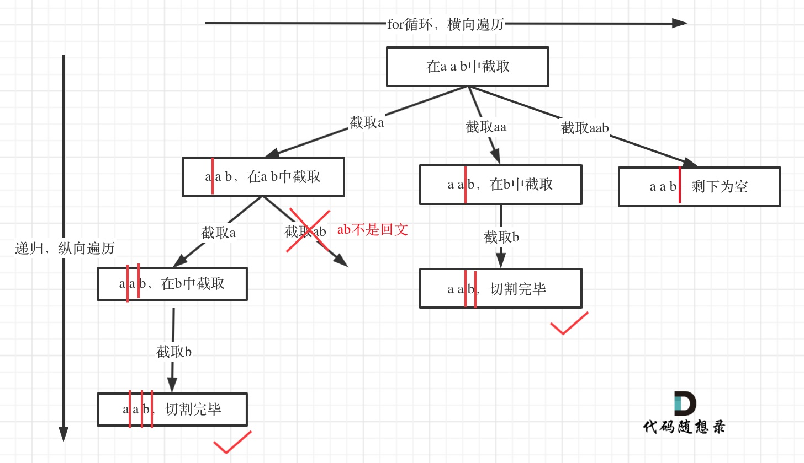
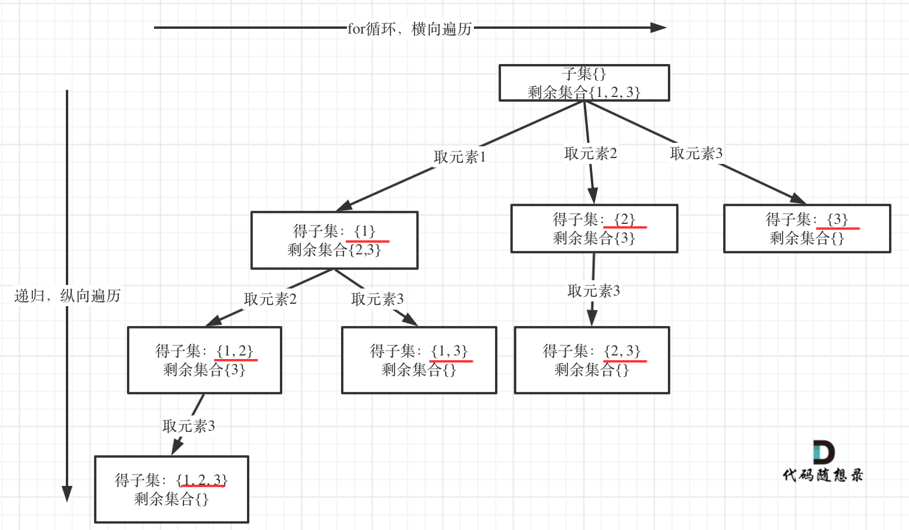

## 0 C++刷题基本语法

### 0.1 min、max、sort、reverse
```cpp
#include <algorithm>
int a=2;
int b=3;
max(a,b);
min(a,b);
```

```cpp
main()
{
　　//sort函数第三个参数采用默认从小到大
　　int a[]={45,12,34,77,90,11,2,4,5,55};
　　sort(a,a+10);//或lambda表达式sort(a,a+10,[](int a, int b) {return a > b; });
　　for(int i=0;i<10;i++)
　　cout<<a[i]<<" ";
}


int main(){
    string str;
    str = "Hello,world!";
    reverse(str.begin(),str.end());
    cout<<str;
    return 0;
}

```
### 0.2 lambda表达式

```cpp
[](int a,int b){ //do some thing  return a+b }
```

### 0.3 容器用法

https://zh.cppreference.com/w/cpp/container


###  0.4常用函数


https://perper.site/2019/01/21/C-%E5%88%B7%E9%A2%98%E5%B8%B8%E7%94%A8%E6%95%B0%E6%8D%AE%E5%8F%8A%E5%87%BD%E6%95%B0%E7%9A%84%E8%AF%AD%E6%B3%95%E8%AE%B0%E5%BD%95/

## 1 动态规划

### 1.1基本套路

用空间换时间，用一个数组来保存中间变量，最重要的是要找到递推公式。

**动态规划五部曲：**
1. 确定dp数组（dp table）以及下标的含义
2. 确定递推公式
3. dp数组如何初始化
4. 确定遍历顺序
5. 举例推导dp数组

### 1.2leetcode常见题型

[70. 爬楼梯](https://leetcode.cn/problems/climbing-stairs/)
[53. 最大子数组和](https://leetcode.cn/problems/maximum-subarray/)
[1143. 最长公共子序列](https://leetcode.cn/problems/longest-common-subsequence/)
[5. 最长回文子串](https://leetcode.cn/problems/longest-palindromic-substring/)

## 2 DFS（深度优先搜索）

### 2.1基本套路

DFS一般用**递归或者栈**来解决。常见的题型有二叉树的前序（根->左->右）、中序（左->根->右）、后序遍历（左->右->根）

```c++
//递归方法
class Solution {
public:

    void inorder(TreeNode* root, vector<int>& res) {
        if (!root) return;
        inorder(root->left,res);
        res.push_back(root->val);
        inorder(root->right,res);
    }
    vector<int> inorderTraversal(TreeNode* root) {
        vector<int> res;
        inorder(root, res);
        return res;
    }
};
```

```c++
//栈方法
class Solution {
public:
    vector<int> preorderTraversal(TreeNode* root) 
    {
        vector<int> v;
        stack<TreeNode*> s;
        while (root || !s.empty()) 
        {
            while (root) 
            {
                v.push_back(root->val);
                s.push(root);
                root = root->left;
            }
            root = s.top()->right;
            s.pop();
        }    
        return v;
    }
};

```
### 2.2 leetcode题型

[94. 二叉树的中序遍历](https://leetcode.cn/problems/binary-tree-inorder-traversal/)
[144. 二叉树的前序遍历](https://leetcode.cn/problems/binary-tree-preorder-traversal/)
[14. 二叉树的后序遍历]https://leetcode.cn/problems/binary-tree-postorder-traversal/description/

## 3 BFS（广度优先搜索）

### 3.1基本套路

广度优先搜索一般用**队列（优先队列）来解决**，常见的题型有二叉树的层序遍历

```c++
class Solution {
public:
    vector<vector<int>> levelOrder(TreeNode* root) {
        vector<vector<int>> res;
        if (!root) return res;
        queue<TreeNode*> q;
        q.push(root);
        while (!q.empty()){
            res.push_back(vector<int>());
            int level_size = q.size();
            for (int i = 0; i < level_size; ++i){
                TreeNode* top = q.front();
                q.pop();
                res.back().push_back(top->val);
                if (top->left) q.push(top->left);
                if (top->right) q.push(top->right);
            }
        }
        return res;
    }
};
```

### 3.2leetcode常见题型

[102. 二叉树的层序遍历](https://leetcode.cn/problems/binary-tree-level-order-traversal/)
[133克隆图](https://leetcode.cn/problems/clone-graph/description/)

## 4 二叉树的遍历

- 二叉树的**前、中、后序遍历**属于DFS，可以用**递归或者栈**解决。
- 二叉树的**层次遍历**属于BFS，可以用**队列**解决
### 4.1 前序

#### 递归

```cpp
/**
 * Definition for a binary tree node.
 * struct TreeNode {
 *     int val;
 *     TreeNode *left;
 *     TreeNode *right;
 *     TreeNode() : val(0), left(nullptr), right(nullptr) {}
 *     TreeNode(int x) : val(x), left(nullptr), right(nullptr) {}
 *     TreeNode(int x, TreeNode *left, TreeNode *right) : val(x), left(left), right(right) {}
 * };
 */
class Solution {
public:
    void reversal(TreeNode* root, vector<int> &res){
      if (root == nullptr) return;
      res.push_back(root->val);
      reversal(root->left, res);
      reversal(root->right, res);
    }
    vector<int> preorderTraversal(TreeNode* root) {
      vector<int> res{};
      reversal(root, res);
      return res;
    }
};
```

#### 栈
```cpp
/**
 * Definition for a binary tree node.
 * struct TreeNode {
 *     int val;
 *     TreeNode *left;
 *     TreeNode *right;
 *     TreeNode() : val(0), left(nullptr), right(nullptr) {}
 *     TreeNode(int x) : val(x), left(nullptr), right(nullptr) {}
 *     TreeNode(int x, TreeNode *left, TreeNode *right) : val(x), left(left), right(right) {}
 * };
 */
class Solution {
public:
    vector<int> preorderTraversal(TreeNode* root) {
      stack<TreeNode*> st;
      vector<int> res;
      if(root == nullptr) return res;
      st.push(root);
      while (!st.empty()) {
        TreeNode* node = st.top();
        st.pop();
        res.push_back(node->val);
        if(node->right) st.push(node->right);
        if(node->left) st.push(node->left);
      }
      return res;

    }
};
```

### 4.2 中序
#### 递归

```cpp
/**
 * Definition for a binary tree node.
 * struct TreeNode {
 *     int val;
 *     TreeNode *left;
 *     TreeNode *right;
 *     TreeNode() : val(0), left(nullptr), right(nullptr) {}
 *     TreeNode(int x) : val(x), left(nullptr), right(nullptr) {}
 *     TreeNode(int x, TreeNode *left, TreeNode *right) : val(x), left(left), right(right) {}
 * };
 */
class Solution {
public:
    void reversal(TreeNode* root, vector<int> &res){
      if (root == nullptr) return;
      reversal(root->left, res);
      res.push_back(root->val);
      reversal(root->right, res);
    }
    vector<int> inorderTraversal(TreeNode* root) {
      vector<int> res{};
      reversal(root, res);
      return res;
    }
};
```

#### 栈

```cpp
/**
 * Definition for a binary tree node.
 * struct TreeNode {
 *     int val;
 *     TreeNode *left;
 *     TreeNode *right;
 *     TreeNode() : val(0), left(nullptr), right(nullptr) {}
 *     TreeNode(int x) : val(x), left(nullptr), right(nullptr) {}
 *     TreeNode(int x, TreeNode *left, TreeNode *right) : val(x), left(left), right(right) {}
 * };
 */
class Solution {
public:
    vector<int> inorderTraversal(TreeNode* root) {
      stack<TreeNode*> st;
      vector<int> res;
      TreeNode* cur = root;
      if (root == nullptr) return res;
      while (!st.empty() || cur != nullptr) {
        if (cur != nullptr) {
          st.push(cur);
          cur = cur->left;
        } else {
          cur = st.top();
          st.pop();
          res.push_back(cur->val);
          cur = cur->right;
        }
      }
      return res;

    }
};
```

### 4.3 后序

#### 递归
```cpp
/**
 * Definition for a binary tree node.
 * struct TreeNode {
 *     int val;
 *     TreeNode *left;
 *     TreeNode *right;
 *     TreeNode() : val(0), left(nullptr), right(nullptr) {}
 *     TreeNode(int x) : val(x), left(nullptr), right(nullptr) {}
 *     TreeNode(int x, TreeNode *left, TreeNode *right) : val(x), left(left), right(right) {}
 * };
 */
class Solution {
public:
    void reversal(TreeNode* root, vector<int> &res){
      if (root == nullptr) return;
      reversal(root->left, res);
      reversal(root->right, res);
      res.push_back(root->val);
    }
    vector<int> postorderTraversal(TreeNode* root) {
      vector<int> res{};
      reversal(root, res);
      return res;
    }
};
```

#### 栈
```cpp
/**
 * Definition for a binary tree node.
 * struct TreeNode {
 *     int val;
 *     TreeNode *left;
 *     TreeNode *right;
 *     TreeNode() : val(0), left(nullptr), right(nullptr) {}
 *     TreeNode(int x) : val(x), left(nullptr), right(nullptr) {}
 *     TreeNode(int x, TreeNode *left, TreeNode *right) : val(x), left(left), right(right) {}
 * };
 */
class Solution {
public:
    vector<int> postorderTraversal(TreeNode* root) {
      stack<TreeNode*> st;
      vector<int> res;
      if (root == nullptr) return res;
      st.push(root);
      while (!st.empty()) {
        TreeNode* node = st.top();
        st.pop();
        res.push_back(node->val);
        if (node->left) st.push(node->left);
        if (node->right) st.push(node->right);
      }
      reverse(res.begin(), res.end());
      return res;

    }
};
```
### 4.4层次遍历（等同于BFS）


## 4 回溯（+剪枝）

**回溯法（back tracking）**（探索与回溯法）是一种选优搜索法，又称为试探法，按选优条件向前搜索，以达到目标。但当探索到某一步时，发现原先选择并不优或达不到目标，就退回一步重新选择，这种走不通就退回再走的技术为回溯法，而满足回溯条件的某个状态的点称为“回溯点”。

本质上回溯=穷举+剪枝

回溯能够解决：组合、切割、子集、排列等问题。**所有的回溯问题都可以抽象为一棵树！**

**回溯三部曲：**
1. 确定回溯函数模板返回值以及参数
2. 确定终止条件（纵向）
3. 回溯遍历（横向）

注意：回溯的参数中一定要有res，cur的引用。在终止条件满足时，res.push_back(cur)

**模板:**
```cpp
void backtracking(参数) {
    if (终止条件) {
        存放结果;
        return;
    }

    for (选择：本层集合中元素（树中节点孩子的数量就是集合的大小）) {//横向
        处理节点;
        backtracking(路径，选择列表); // 递归，纵向
        回溯，撤销处理结果
    }
}
```
### 4.1 回溯和递归的区别

**递归是一种算法结构**。递归会出现在子程序中，形式上表现为直接或间接的自己调用自己。典型的例子是阶乘，计算规律为：n!=n×(n−1)!，如果用 C++ 代码表示，基本如下所示：

```cpp
int fac(int n) {
    if(n  1) return n;
    else 
        return (n*fac(n - 1)); 
}
```

**回溯是一种算法思想**，它是用递归实现的。回溯的过程类似于穷举法，**但回溯有“剪枝”功能**，即自我判断过程。例如有求和问题，给定有 7 个元素的组合 \[ 1, 2, 3, 4, 5, 6, 7 \]，求加和为 7 的子集。累加计算中，选择 1+2+3+4 时，判断得到结果为 10 大于 7，那么后面的 5, 6, 7 就没有必要计算了。这种方法属于搜索过程中的优化，即“剪枝”功能。

### 4.2 题型


#### （1）子集与全排列

**非空子集**

题目描述

请编写一个方法，返回某集合的所有非空子集。

给定一个int数组A和数组的大小int n，请返回A的所有非空子集。保证A的元素个数小于等于20，且元素互异。各子集内部从大到小排序,子集之间字典逆序排序，见样例。

测试样例：

[123,456,789]

返回：{[789,456,123],[789,456],[789,123],[789],[456 123],[456],[123]}

代码如下

```cpp
class Subset {
public:
    static bool cmp(int a,int b){
        return a>b;
    }
    vector<vector<int> >ans;
    vector<int> temp;
    void D(vector<int> a,int index){
        if(index>=a.size()){
            if(temp.size()!=0)
                ans.push_back(temp);
            return;
        }
        temp.push_back(a[index]);
        D(a,index+1);
        temp.pop_back();
        D(a,index+1);
    }
    vector<vector<int> > getSubsets(vector<int> A, int n) {
        // write code here
        if(n0)return ans;
        sort(A.begin(),A.end(),cmp);
        D(A,0);
        return ans;
    }
};
```

**全排列**

题目描述

请编写一个方法，返回某集合的所有全排列。

Example:

```text
Input: [1,2,3]
Output:
[
  [1,2,3],
  [1,3,2],
  [2,1,3],
  [2,3,1],
  [3,1,2],
  [3,2,1]
]
```

代码如下

```cpp
class Solution {
public:
    vector<vector<int>> permute(vector<int>& num) {
        vector<vector<int>> res;
        permuteDFS(num, 0, res);
        return res;
    }
    void permuteDFS(vector<int>& num, int start, vector<vector<int>>& res) {
        if (start >= num.size()) res.push_back(num);
        for (int i = start; i < num.size(); ++i) {
            swap(num[start], num[i]);
            permuteDFS(num, start + 1, res);
            swap(num[start], num[i]);
        }
    }
};
```

#### （2）满足求和条件的组合

**组合之和1**

题目描述：给定一个无重复元素的数组 candidates 和一个目标数 target ，找出 candidates 中所有可以使数字和为 target 的组合。 candidates 中的数字可以无限制重复被选取。

```text
所有数字（包括 target）都是正整数。
解集不能包含重复的组合。 
示例 1:

输入: candidates = [2,3,6,7], target = 7,
所求解集为:
[
  [7],
  [2,2,3]
]
示例 2:

输入: candidates = [2,3,5], target = 8,
所求解集为:
[
  [2,2,2,2],
  [2,3,3],
  [3,5]
]
```

这些题目发现都是一个套路，都是需要另写一个递归函数，这里我们新加入三个变量，start 记录当前的递归到的下标，out 为一个解，res 保存所有已经得到的解，每次调用新的递归函数时，此时的 target 要减去当前数组的的数，具体看代码如下：

```cpp
class Solution {
public:
    vector<vector<int>> combinationSum(vector<int>& candidates, int target) {
        vector<vector<int>> res;
        vector<int> out;
        combinationSumDFS(candidates, target, 0, out, res);
        return res;
    }
    void combinationSumDFS(vector<int>& candidates, int target, int start, vector<int>& out, vector<vector<int>>& res) {
        if (target < 0) return;
        if (target  0) {res.push_back(out); return;}
        for (int i = start; i < candidates.size(); ++i) {
            out.push_back(candidates[i]);
            combinationSumDFS(candidates, target - candidates[i], i, out, res);
            out.pop_back();
        }
    }
};
```

**数组之和2**

题目描述：

给定一个数组 candidates 和一个目标数 target ，找出 candidates 中所有可以使数字和为 target 的组合。

candidates 中的每个数字在每个组合中只能使用一次。

```text
所有数字（包括目标数）都是正整数。
解集不能包含重复的组合。 
示例 1:

输入: candidates = [10,1,2,7,6,1,5], target = 8,
所求解集为:
[
  [1, 7],
  [1, 2, 5],
  [2, 6],
  [1, 1, 6]
]
示例 2:

输入: candidates = [2,5,2,1,2], target = 5,
所求解集为:
[
  [1,2,2],
  [5]
]
```

这道题跟之前上一道题本质没有区别，只需要改动一点点即可，之前那道题给定数组中的数字可以重复使用，而这道题不能重复使用，只需要在之前的基础上修改两个地方即可，首先在递归的 for 循环里加上 if (i > start && num[i]  num[i - 1]) continue; 这样可以防止 res 中出现重复项，然后就在递归调用 helper 里面的参数换成 i+1，这样就不会重复使用数组中的数字了，代码如下：

```cpp
class Solution {
public:
    vector<vector<int>> combinationSum2(vector<int>& num, int target) {
        vector<vector<int>> res;
        vector<int> out;
        sort(num.begin(), num.end());
        helper(num, target, 0, out, res);
        return res;
    }
    void helper(vector<int>& num, int target, int start, vector<int>& out, vector<vector<int>>& res) {
        if (target < 0) return;
        if (target  0) { res.push_back(out); return; }
        for (int i = start; i < num.size(); ++i) {
            if (i > start && num[i]  num[i - 1]) continue;
            out.push_back(num[i]);
            helper(num, target - num[i], i + 1, out, res);
            out.pop_back();
        }
    }
};
```

**3数组之和3**

题目描述:

找出所有相加之和为 n 的 k 个数的组合。组合中只允许含有 1 - 9 的正整数，并且每种组合中不存在重复的数字。

```text
所有数字都是正整数。
解集不能包含重复的组合。 
示例 1:

输入: k = 3, n = 7
输出: [[1,2,4]]
示例 2:

输入: k = 3, n = 9
输出: [[1,2,6], [1,3,5], [2,3,4]]
```

这道题的个数是固定的，为k。n是k个数字之和，如果n小于0，则直接返回，如果n正好等于0，而且此时out中数字的个数正好为k，说明此时是一个正确解，将其存入结果res中，具体实现参见代码入下：

```cpp
class Solution {
public:
    vector<vector<int> > combinationSum3(int k, int n) {
        vector<vector<int> > res;
        vector<int> out;
        combinationSum3DFS(k, n, 1, out, res);
        return res;
    }
    void combinationSum3DFS(int k, int n, int level, vector<int> &out, vector<vector<int> > &res) {
        if (n < 0) return;
        if (n  0 && out.size()  k) res.push_back(out);
        for (int i = level; i <= 9; ++i) {
            out.push_back(i);
            combinationSum3DFS(k, n - i, i + 1, out, res);
            out.pop_back();
        }
    }
};
```

## 5 滑动窗口

一般就求最短序列的算法，所谓滑动窗口，**就是不断的调节子序列的起始位置和终止位置，从而得出我们要想的结果**。

### 5.1基本讨论
用一个for循环解决问题，循环的索引是窗口的终止位置。滑动窗口最重要的是如何移动窗口的起始位置。


在写代码之前需要确定如下三点：
- 窗口内是什么？
- 如何移动窗口的起始位置？
- 如何移动窗口的结束位置？
### 5.2 题型

题目描述
给定一个含有 n 个正整数的数组和一个正整数 s ，找出该数组中满足其和 ≥ s 的长度最小的 连续 子数组，并返回其长度。如果不存在符合条件的子数组，返回 0。

示例：

- 输入：s = 7, nums = \[2,3,1,2,4,3\]
- 输出：2
- 解释：子数组 \[4,3\] 是该条件下的长度最小的子数组。
```cpp
class Solution {
public:
    int minSubArrayLen(int target, vector<int>& nums) {
      int n = nums.size();
      int result = INT_MAX;
      int sum = 0;
      int i = 0;//起始位置
      for (int j = 0; j < n; j++) {
        sum += nums[j];
        while (sum >= target) {
          result = min(result, j - i + 1);
          sum -= nums[i++];
        }
      }
      return result  INT_MAX ? 0 : result;
    }
};
```

## 6 牛顿法求根号


求$f(x) = 0$的根，设初值为$x_0$ ，迭代公为：
$$
x_{n+1} = x_n - \frac{f(x_n)}{f'(x_n)}
$$

原理是


求根的C++代码
求$f(x)=x^2 - C=0$ ,取$x_0=C$, 已知$f'(x_n)=2x_n$

```cpp
class Solution {
public:
    int mySqrt(int x) {
      if (x == 0) return 0;
      double C = x;
      double x0 = x;
      double xi = 0.0;
      while (true) {
        xi = x0 - ((x0 * x0 - C)/(2 * x0));
        if (fabs(xi - x0) < 1e-7) break;
        else {
          x0 = xi;
        }
      }
      return int(xi);
    }
};
```
## 7路径规划算法

- Dijkstra和A\*的统一伪代码



### Dijkstra
https://zhuanlan.zhihu.com/p/360276556

三个量分别需要定义：
- `priority_queue<PII, vector<PII>, decltype(gt)> q(gt);//{node,distance}`
- `vector<int> distance(N, INT_MAX);`
- `vector<int> vis(N, 0);`

初始化：
- `distance[src] = 0;`
- vis初始化为0
- `q.push({src, distance[src]});`

```c++
using PII = pair<int, int>;
//邻接表 key = src ，val = {adj,cost}
int dijkstra (unordered_map<int, vector<PII>>& graph, int src, int tar, int N) {
  auto gt = [](auto& a, auto& b) { return a.second > b.second; };
  priority_queue<PII, vector<PII>, decltype(gt)> q(gt);//{node,distance}
  vector<int> distance(N, INT_MAX);
  distance[src] = 0;
  vector<int> vis(N, 0);
  q.push({src, distance[src]});
  while(!q.empty()) {
	auto [node, dis] = q.top();
	q.pop();
	if (vis[node]) continue;
	vis[node] = 1;
	for (auto& [adj, cost] : graph[node]) {
	  if (distance[adj]  > distance[node] + cost) {
		distance[adj] = distance[node] + cost;
		q.push({adj, distance[adj]});
	  }
	}
  }
  return distance[tar] == INT_MAX ? -1 : distance[tar];
```

### a star

https://zhuanlan.zhihu.com/p/360282185

- 优先队列存储的是actual+heuristic distance，不再是actua distance
- distance数组不再是vector\<int\>，而变为`vector<pair<int, int>>`存actual 和 heuristic distance
- 其他不变

```cpp
using PII = pair<int, int>;

// 启发式函数，估计从当前节点到目标节点的距离
int h(int node, int tar) {
  // 根据实际情况编写启发式函数
  // 例如，可以使用曼哈顿距离或欧几里得距离
  //如果返回0，则等价于dijkstra
}

int astar(unordered_map<int, vector<PII>>& graph, int src, int tar, int N) {
  auto gt = [](auto& a, auto& b) { return a.second > b.second; };
  priority_queue<PII, vector<PII>, decltype(gt)> q(gt); // {node, actual+heuristic distance}
  vector<pair<int, int>> distance(N, {INT_MAX, 0}); // {actual distance, heuristic distance}
  distance[src] = {0, h(src, tar)}; // 初始化起始节点的距离
  vector<int> vis(N, 0);
  q.push({src, distance[src].first + distance[src].second}); // 综合评估值为实际距离加启发式函数估计距离

  while (!q.empty()) {
    auto [node, dis] = q.top();
    q.pop();
    if (vis[node]) continue;
    vis[node] = 1;
    for (auto& [adj, cost] : graph[node]) {
      if (distance[adj].first > distance[node].first + cost) {
        distance[adj].first = distance[node].first + cost;
        distance[adj].second = distance[adj].first + h(adj, tar); // 更新启发式函数估计距离
        q.push({adj, distance[adj].first + distance[adj].second});
      }
    }
  }

  return distance[tar].first == INT_MAX ? -1 : distance[tar].first;
}
```