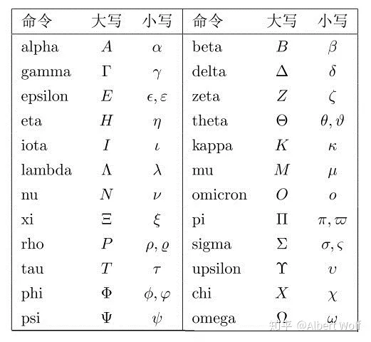

希腊字母 中英对照一览表  
  
大写 小写 中文名 英文注音 意义  
  
A α 阿尔法 Alpha 角度；系数  
  
B β 贝塔 Beta 磁通系数；角度；系数  
  
Γ γ 伽玛 Gamma 电导系数（小写）  
  
Δ δ 德尔塔 Delta 变动；密度；屈光度；方程判别式（大写）  
  
Ε ε 伊普西隆 Epsilon 对数之基数  
  
Ζ ζ 泽塔 Zeta 系数；方位角；阻抗；相对粘度；原子序数  
  
Η η 伊塔 Eta 磁滞系数；效率（小写）  
  
Θ θ 西塔 Theta 温度；相位角  
  
Ι ι yao塔 iota 微小，一点儿  
  
Κ κ 卡帕 Kappa 介质常数  
  
∧ λ 兰姆达 Lambda 波长（小写）；体积  
  
Μ μ 米欧 Mu 磁导系数；微（千分之一）；放大因数（小写）  
  
Ν ν 纽 Nu 磁阻系数  
  
Ξ ξ 克西 Xi  
  
Ο ο 欧米克隆 Omicron  
  
∏ π 派 Pi 圆周率=圆周÷直径=3.1416  
  
Ρ ρ 柔 Rho 电阻系数（小写）  
  
∑ σ 西格玛 Sigma 总和（大写），表面密度；跨导（小写）  
  
Τ τ 陶 Tau 时间常数  
  
Υ υ 玉普西隆 Upsilon 位移  
  
Φ φ 弗爱 Phi 磁通； 角；空集（大写）  
  
Χ χ 凯 Chi  
  
Ψ ψ 普赛 Psi 角速；介质电通量（静电力线）；角  
  
Ω ω 奥米伽 Omega 欧姆（大写）；角速（小写）；角

