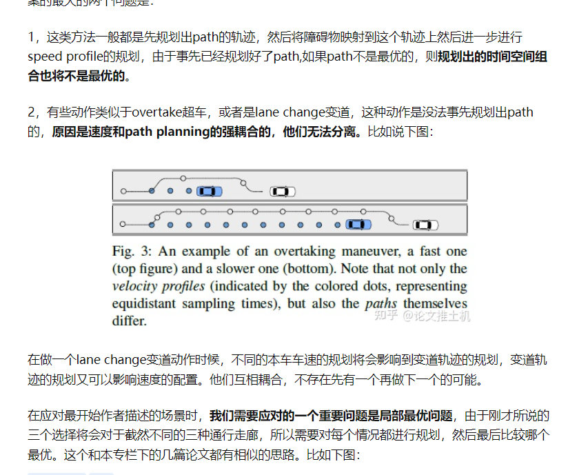

# 10.30

1. 解决了ros-carla-brige的配置问题(注意catkin_make时切换到carla的python环境下)
2. 解决了gpir的配置问题(主要是opencv的配置问题)：
gpir构建时会报找不到opencv2的错误，只需要把/usr/local/include/opencv4目录下的opencv2 copy一份到/usr/local/include，使opencv2和opencv4并列即可

更换默认终端
sudo update-alternatives --config x-terminal-emulator

terminator快捷键
Alt+Up                          //移动到上面的终端
Alt+Down                        //移动到下面的终端
Alt+Left                        //移动到左边的终端
Alt+Right                       //移动到右边的终端
Ctrl+Shift+O                    //水平分割终端
Ctrl+Shift+E                    //垂直分割终端
Ctrl+Shift+Right                //在垂直分割的终端中将分割条向右移动
Ctrl+Shift+Left                 //在垂直分割的终端中将分割条向左移动
Ctrl+Shift+Up                   //在水平分割的终端中将分割条向上移动
Ctrl+Shift+Down                 //在水平分割的终端中将分割条向下移动

vscode跳转设置：

打开快捷键设置：
搜索 go forward和go back

# 11.1
1. 时空走廊、规划相关论文搜集与整理
2. 多边形走廊推导，目前已经解决前方轨迹为凹时的情况（凸凹通过加速度来判断）

# 11.2
1. 推非凹的公式
2. 看二维时空走廊的neolix代码
3. 看论文，看gpir代码
4. 无人机的path planning方法是不是都可移植到时空规划上
5. 时空耦合的优点

6. 轻舟文章：https://zhuanlan.zhihu.com/p/551381336
https://mp.weixin.qq.com/s/8uqU01PmVp28ximKaHOlOg
有的图很好
https://mp.weixin.qq.com/s/FJ3QPZzqBDvY8h9mAu_yIw

7. 分析目前车上搜二维走廊的方式的代码

两个路线：
直接搜走廊：把走廊构建成DAG格式，目前想不到太好的方法（我自己分析，主要是在三维时空里，每一段时间的free space是不定的，不想在二维里只搜路径那么好建立，这个主要是今天看二维走廊的方法得出的感悟）
目前来看，除了昨天分享的那篇论文（把自车所有可能的free space找到，然后把被其他车辆轨迹给占据的地方给删掉），我想不到太好的方法去构建三维时空的走廊的DAG

第二个路线：先搜粗轨迹在构建走廊。
其实很多搜索方法都可以用，比如JPS和
目前想到一个思路是八叉树：

# 11.5
1. 高飞论文(完成)
2. HPIPM论文(完成)
3. Octree路径规划（Improved A* Path Planning Method Based on the Grid Map）(完成)
4. A*+CFS论文(完成)
5. 二维搜索代码(未完成)

# 11.6
1. 看二维搜索代码
2. 扩展到3维的推导