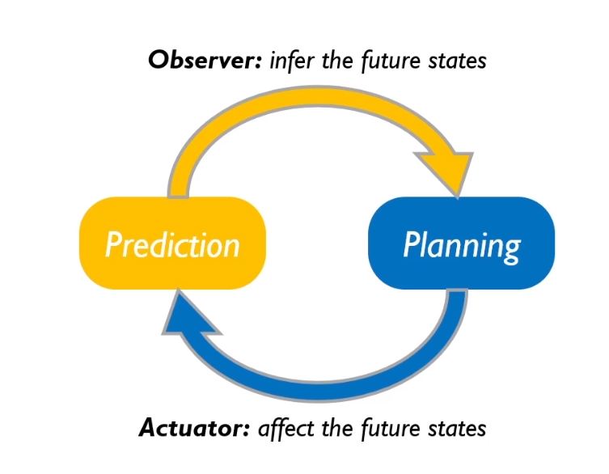

# 5.8
RNN代码

GIRL理论

GAN代码
# 5.9
PPO算法的证明

TRPO/PPO笔记
滑动平均

广义优势函数

PPO代码

# 5.10
sumo的学习，实例代码的编写

MPC与RL的关系

贝叶斯SVM的视角看SVM

# 5.12
gym 的各种包装器

pytorch lt库的学习

python面向对象中typing的学习

optuna学习

# 5.13
博弈论

python精炼

matplotlib精炼

github创建仓库及使用

Dataset、Tensordata、Datloader的代码

# 5.13
VAE项目代码：观测模型与PF滤波器代码的编写

# 5.15

1、python模块编程文件路径

2、CNN
RNN
MLP的单元测试

3、LSTM做交叉口控制的论文（输入时当前车和附近车的一个
状态向量序列）、输出是当前车的推荐速度 Multi-Agent Deep Reinforcement Learning to Manage Connected Autonomous Vehicles at Tomorrow’s Intersections

4、MPC+RL，用DL学一个环境模型，然后随机撒点解MPC  Addressing crash-imminent situations caused by human driven vehicle errors in a mixed traffic stream: a model-based reinforcement learning approach for CAV

5、交叉口MPC问题，由于约束太多不好解，把问题转化为无约束问题，然后用RL的方法学习一个状态s到a的映射。状态s被构造为41-d向量，由6-d自车状态、与自车存在潜在冲突的8辆车辆中的每辆车辆的4-d向量和参考路径的3-d向量组成（6+4*8+3），包括位置、速度和航向的跟踪误差 ,Learn collision-free self-driving skills at urban intersections with model-based reinforcement learning

# 5.16 CPS会议
## 整个研究的流程是
### 1.定义需求：
1.利益攸关者需求

2.安全需求

3.战略需求

4.服务需求

5.标准化需求

6.系统需求:产业级规划与分析（中心云）、区域交通应用（区域云）、边缘级车辆智能驾驶需求（边缘云）

7.防护需求

8.需求追溯关系（建立不同需求之间的追溯关系，也就是画一个邻接矩阵）

### 2.定义功能：（不同场景对应不同功能）
1.安全功能

2.标准化功能

3.防护功能

4.服务功能

5.利益攸关者功能

6.系统功能（我们关注的重点），我们重点关注车路协同智能驾驶（又可分为道路安全预警、智能驾驶、协同驾驶），其中道路安全预警这些模块又可以继续细分，对于组内涉及到的应用，我们把他的颗粒度可以做细（如果是感知黑盒的画就不考虑系统内部结构，如果是simulink模型，可以继续细化，这样可以形成追溯），对于组内不涉及的应用，可以不太关注，交给外包。

7.
### 3.定义逻辑：（包含在功能定义之内了，对应较细的颗粒度，其实可以理解为是画一个状态机出来）

### 4.定义物理层：（同样在功能定义之内，可以理解为状态机内部更细的物理模型）

## NOTE：
杜老师的架构可以给我们直接复用，我们需要结合我们的应用再往下探，我需要把顶层的架构做填空，结合我们的东西做一下修改。

他这个软件只能定义一些计算，如果涉及到矩阵计算矩阵切片等就不好弄了

算法还是要用matlab或者python写

# 5.17 
## 1统计学习课程总结
**1** .深度生成模型和深度判别模型是不同的，深度判别模型是传统的神经网络，比如CNN RNN等

**2** .深度生成模型主要用在无监督任务和半监督任务上
**3** .VAE：主要关注重参数化技巧

**4** .GAN：主要关注目标函数

 GAN-D判别器目标函数 

 GAN-G生成器目标函数 

 GAN-判别器生成器合并后的目标函数（其实是一种JS divergence between） 

**4.1** GAN的一些前沿Topic

**(1)** 用控制论拉普拉斯变换来这证明稳定性

**(2)** triple GAN ：用GAN来解决半监督学习问题

**5.** FLOW模型：主要关注反函数原理

**(1)** 我们有了p(z)的概率密度函数，我们又知道x=g(z)，现在我们想要求得x的概率密度函数，具体方法如下

 det |雅可比矩阵| 表示雅可比矩阵的行列式的值 

 FLOW模型一般假设的变换的形式很简单，主要是为了让雅可比矩阵为对角阵，这也导致模型的表示能力不强，所以需要多叠几层，这也是为什么称为“流”模型 

**(2)** FLOW模型有一个缺陷就是，每叠一层就要重新reshape到低维（输入的维度）这是为了保持雅可比矩阵为对角阵，这也导致网络变成  胖->瘦->胖->瘦交替的形式。VFLOW模型解决了这个问题，它不要求雅可比矩阵为对角阵，这样可以用更少的层数达到同样的效果。、

**6.** 珠算：概率编程库，从概率图的视角来编程

## 2关于控制的一些感想
**7.** 开环控制与闭环控制

开环控制是指在模型非常精确的情况下，给定初始状态，对于想要达到的目标状态，可知直接求得一个控制序列出来。

闭环控制是指每次控制的时候参考当前的状态，也就是有状态反馈

一个例子:

MPC中在一个时域内预测的过程可以看作是一个开环控制（用当前状态，根据系统模型，往后预测n个状态，求出一个有n个控制量的序列，但是只作用第一个控制量）

在时域与时域之间，也就是对应现实中两个状态，属于闭环控制，因为每一次控制都需要参考当前的状态，因此MPC可以说是时域内开环，整个系统闭环

## 3代码实战
**8.** 数据集自定义流程(主要关注继承Dataset类时重写的方法、transform中数据增广的流程 -> 需要注意的是数据增强并不会增加数据集的数量，而是每次epoch时读进的去数据都是不一样的，即使你的dataloader写在了epoch循环的外边)

**9.** Auto Encoder的代码实现

**10.** VAE的代码实现

（见[龙曲良老师实战代码](https://github.com/dragen1860/Deep-Learning-with-PyTorch-Tutorials)，[龙曲良老师实战课程](https://www.bilibili.com/video/BV11r4y1e76A?p=114&spm_id_from=pageDriver)）

## 4蒙特卡洛树搜索
**11.** MCTS的整体流程：MCTS其实是一种启发式搜索（通过较少的探索次数，找到目前最优的决策），相比于穷举效率更高，实际上也不可能穷举，因为探索空间非常大。所以MCTS通过一种高效的探索方式，在较少模拟次数下，就可以找到一种近似最优的决策。

核心思想在UCB值的选择上

从UCB公式中可以看到，在探索树的节点的过程中:

一方面我希望选择价值较大的节点

一方面我也希望选择没有探索过的节点，也就是$n_i$(被探索的次数)较小的节点（这是因为如果一味选择价值较大的，也就是说如果UCB只包括V，一些没有被探索的节点V初始值为0，那么它永远不会被探索，这是不合理的）

算法的终止条件:可以到达一定时间终止，也可以达到一定探索次数终止。

# 5.18 
## 1.RNN的一些问题复盘
1.RNN如果在序列比较长的情况下会出现梯度消失和梯度爆炸的情况

2.解决方案：
1）.解决梯度爆炸： 做clipping，如果梯度大于某一个值，就把它除以它的模，但是方向不变

2）.解决梯度消失： LSTM(比RNN记得更长了，由于引入了输入门，输出门，遗忘门，使求梯度时的累乘变成了累加)

 遗忘门

 输入门

 输出门

## 2.MPC的一些回顾
1.最优控制问题可以归纳为在约束下求costfunction最小的输入量的问题，一般地说，考虑的时域是无限长的，试图求得一个控制序列u，使无限长下的cost最小。MPC相对于最优控制来说只往后预测了有限多步，也就是考虑N步一个总的costfunction，希望求一个控制序列让总的costfunction最小，但是最后只应用第一个控制量

2.MPC的costfunction中是包含终止状态的代价的

3.一般来说MPC的控制时域比预测时域少一步（这也是为什么会有一个终止状态代价），因为在控制的最后一步，给定k+N-1时刻的控制量以后，k+N-1时刻的状态会转移到k+N时刻的状态，这个状态就是最终状态，它也有一个代价。

4.我们之所以说MPC既能做控制也能做规划的原因是：
（1）如果MPC只是跟随一条参考路径（这条参考路径已经规划好了(包含有时间信息，也就是第k步的xy坐标，第k+1步的xy坐标)，此路径上完全可行，没有障碍物），给的约束是很简单的一个控制量范围约束，那么这个可以理解为是一个控制问题，这是先规划后控制的问题

（2）如果MPC跟随一条没有规划好的很粗略的参考路径（也就是routing的参考路径，没有时间信息），在跟随的同时，对未来的状态做约束（比如和邻车距离要大于某一值，与障碍物距离大于某一值等），这样的过程可以等价为规划的过程，这样的约束下求出来的控制量相当于 规划+控制 结合在一起求出来的控制量。

5.MPC步骤

X(K)已知，所以第一项可以省略

要计算的量：M,C,Q_bar,R_bar,G,E,H

转换为MATLAB可求解的方式，求出来的U_k是一个N个值   （0~N-1）的序列，只应用第一个。
Reference：[B站Dr_CAN](https://www.bilibili.com/video/BV1dv411M763/?spm_id_from=333.788.recommend_more_video.0)

## 2.路径规划与轨迹优化
1.）路径规划主要只是routing，给出一条粗略的跟踪曲线，没有时间信息，只有xy的坐标

2.）轨迹优化是在路径规划的基础上对rouing的结果每隔一段进行取点分段，添加时间信息（按照路径长度和速度），每段进行多项式平滑，使其能够用控制算法跟踪。最常见的优化方法就是在约束条件（包括等式约束：起始点、终止点、中间取的点的位置..不等式约束：碰撞。思考：为什么routing考虑了障碍物，在优化时仍要有碰撞约束。答：这是因为1.可能routing时只考虑了静态障碍物，比如在静态地图上routing，优化时还要考虑动态障碍物，比如旁车。2.可能routing的结果正好卡在了障碍物的点上，由于车是有体积的，所以可能还是会碰撞。）

在约束下下最小化snap（位置的四阶导数，三阶导数为jerk），最后解得一个带时间信息的平滑曲线（包含每一时刻的位置速度加速度）见下图PPT

3）就像之前MPC讲的一样，这种思路属于先路径规划在轨迹优化，其中轨迹优化已经考虑了障碍物、平顺等条件，那么在设计控制器时只需要简单的PID能够耿总优化好的轨迹即可。

4）MPC的思路就是把轨迹优化和控制一起做了，MPC的思路是，先把routing结果带上时间信息，然后MPC跟踪这条routing，然后再MPC的约束中，把平顺性，障碍物等因素考虑进去，直接进行控制。也就相当于轨迹优化+PID轨迹跟踪。其中轨迹优化的部分放在了MPC的约束里和目标函数里。

多项式轨迹中p（t）是一维的，可能是x、y或z，是时间t的函数，多项式有n+1项，对y、z的求取过程是一样的。

这图有错，第三行、四行、五行中的p，应该是$p_i$，右下角的没错，是p，代表是的某一个维度（行数是k*n+1，列数为1）

最终就转换为了二次规划问题，求解的是最优的p，也就是这几段轨迹中的所有的位置速度加速度。

求解非常慢，一般采用闭式求解法，如果只考虑等式约束，把等式约束转化到目标函数中，求得一个解析解。但是就没办法考虑到不等式约束了，这可能会导致碰撞问题（碰撞问题是一个不等式约束）。

如果只考虑等式约束，对于碰撞问题可以采用的一种解决思路是，在可能碰撞的障碍物附近增加一些密集的点（也就是增加等式约束的数量，这样让优化的轨迹不容易碰到障碍物）。

5）软约束的轨迹优化
mini snap的闭式求解方法是求解一个只有等式约束的优化问题，没有考虑碰撞约束，因为碰撞约束是不等式约束，没办法求解析解（之前的解决思路是在可能碰撞的障碍物附近增加一些密集的点（也就是增加等式约束的数量，这样让优化的轨迹不容易碰到障碍物））。

另一个解决思路：一个很自然的想法是能不能把不等式约束放到目标函数里当作惩罚项，来构成一种软约束。采用梯度下降的方法求解。下面就来简单分析一下这种思路。

构建轨迹的曲线仍然是分段多项式曲线，不过表述不太一样，上图的t是总的时间，$T_0$,$T_1$,$T_2$是每一段多项式曲线起点的时间。$f_s$是snap，$f_o$是碰撞惩罚，$f_v$，$f_a$是速度和加速度的惩罚。这样就相当于转化为了无约束问题。需要注意的是$f_o$的设计是有技巧的，需要保证可导。

6）贝塞尔曲线和硬约束
如果用多项式曲线进行规划，对于不等式约束很难处理，即使把它转化为软约束，仍然可能陷入局部最优解。这时我们就想到用贝塞尔曲线来代替多项式曲线。

具体做法是先开辟凸空间，在凸空间中找到贝塞尔曲线（这是因为贝塞尔曲线可以由固定个数的点控制生成，而多项式曲线没有这个性质），进行求解。关于贝塞尔曲线的动画很直观

[贝塞尔曲线动画](https://www.jasondavies.com/animated-bezier/)

从上面的贝塞尔曲线的表达式，我们可以看到，贝塞尔曲线是一种特殊的多项式曲线。可以通过矩阵变换成多项式曲线。转化为多项式曲线后，进行轨迹优化的过程就和mini snap的过程类似了。这种方法是直接求解QP问题（包括等式约束和不等式约束，但是参数量少，容易求解，**解出来的是比较稀疏的点控制生成贝塞尔曲线的点**），之所以mini snap不直接解QP问题是因为，**mini snap解的的所有点**，比较难解。

由于贝塞尔曲线的导数也是贝塞尔曲线，所以对于速度加速度仍然可以采用上面的方法求解。所以才采用闭式解、软约束等等

开辟凸空间时也有一些技巧，比如找圆的内接矩形。

目标函数还是最小化snap。

约束包括等式约束和不等式约束，但是求解的是控制贝塞尔曲线生成的控制点（很少的一些点，比如一段曲线中可能只需要求解4个点即可）

# 5.19
## 1.预测与规划之间的关系

规划模块一般会采用采样的方式，一次性生成多条规划轨迹，然后选择更好的规划轨迹来进行跟踪（看5.20的记录后有感：这种规划是决策规划一起做，也就是说生成的轨迹中包含不同的决策，当然也可以分开，先基于预测的结果来设计cost函数进行决策，然后在进行运动规划）。预测模块可以帮助选择更好的轨迹。同样预测模块也可以帮助更好的决策。（我的想法是我们有了routing路线，可以在routing的基础上进行小范围采样，选择更好的采样轨迹，然后进行轨迹优化->也就是之前总结的mini snap方法，规划出一条可以让车辆跟踪的轨迹，采样的过程是一个决策的过程），这相当于是在路径规划和轨迹优化中间插入了一个局部路径采样的过程，也就是决策的过程。

一个新的idea：在预测时考虑自车的规划。也就是说传统的规划是上述所说的，拿到周围车的预测轨迹来帮助选择自车更好的轨迹。两者是解耦的。很自然的想法是，我先对自车进行规划，生成多个轨迹，对应不同的轨迹，周围车的预测结果也是不同的，换句话说，假如自车执行了轨迹1，那么周围车的预测结果可能是预测1，假如自车执行了轨迹1，那么周围车的预测结果可能是预测2，预测结果是根据自车的规划结果变化的。通过这个预测来选择自车的最优规划路径，效果将会变好。
这很符合人类的直觉：人在确定变道规划的时机时，会假设如果我t1时刻变道，其他车会往哪走，他会不会和我相撞。如果我t2时刻变道，其他车会往哪走，他会不会和我相撞。通过这些不同的对自车的规划假设得到不同的预测结果，从而指导自己选择最优的决策。

之前的工作：

宋浩然的工作：

[具体参考文章PIP](http://song-haoran.com/planning-informed-prediction/)

PIP这篇文章只做了规划指导预测的工作，那么我的一个想法时能不能做一个工作，来规划->推测预测->反过来在指导规划。这样工作重心就在规划上了。

## 2.目前决策规划控制的主流路线
**路线1：**
见论文A Survey of Motion Planning and Control Techniques for Self-Driving Urban Vehicles

->长距离规划（routing，接下来几分钟，从A到B的最短距离，代表算法有迪杰斯特拉、A*） 

-> 行为决策（基于routing结果和预测结果来做对接下来的几秒到十几秒做宏观决策，即左转还是直行还是右转，并给出目标状态，如目标位置）主流算法是状态机 

->行为规划（motion planning）也叫运动规划,接下来的几十毫秒到几秒，具体的运动轨迹是什么，需要考虑约束。输入是自车位置，目的地（由行为决策层给出），约束；输出是最优的可跟随的轨迹（包括对应时间的位置速度等）。行为规划其实就是之前总结的轨迹优化，但是行为规划的方法不止有mini snap，接下来再介绍几种方法。

基于采样的规划算法在**5.19-1**做了说明，可以通过采样设计cost来把决策规划一起做了。也可以先决策，然后再采样-优化做运动规划

**路线2：** 
决策规划控制一起做（强化学习）

运动规划和控制一起做（MPC，直接把平顺性约束、安全约束放到MPC的约束中）

决策规划一起做：比如宋浩然的工作，决策时就采样，利用预测结果求决策采样时cost最小的轨迹，然后对轨迹优化。

# 5.20 上课，处理雷达数据，写控制作业

# 5.21 apollo EM planner算法的学习与代码实践，处理雷达数据

# 5.22 RCNN
Fast RCNN 
Faster RCNN的学习与代码
1. 可解约束与不可解约束
   可解约束是不等式约束，不可解约束是等式约束。

2. 几何约束与微分约束（他们都是不可解约束的子集，也就是都是等式约束）
   几何约束：不包含微分的等式约束（也就是没有速度约束），所有的几何约束都可以转化为微分约束。

   微分约束：包含微分的等式约束（速度约束），并不是所有的微分约束都可以转化为几何约束。可进一步分为可积分的微分约束（既约束位置也约束速度）和不可积分的微分约束（只约束速度）

3. 完整约束和不完整约束
1） 完整约束包括几何约束和可积分的微分约束（即所有的可积分的等式约束和无微分的等式约束）

2） 不完整约束包括不等式约束和不可积分的微分约束（即所有的不等式约束（可解约束）和不可积分的等式约束）

# 5.25 
1. CPS会议
   paas:平台级 云控基础平台

   saas：软件级 云控应用平台

   杜老师观点：软件比如滤波通行，只能部署在区域云上，边缘云需要向区域云传数据。如果需要部署在边缘云上，只能当作标准件和其他标准件协同。

   我们的观点：边缘云可以直接下发数据

   目前license还没搞定，只有一个30天的适用版本

   目前说的基于7S的体系架构框架，主要指的是需求定义上遵循7S体系架构。

   目前magic主要还是逻辑仿真，对参数级别的仿真支持不好，如果涉及到解微分积分的问题，应该解决不了。

   

   天啸：magic-grid目前还是做过程管理（前期的设计部分），把之前的文档，变了一个比较严谨的管理说明，如果模型出了问题，有一些模块之间的逻辑关系可以追溯(逻辑仿真)。如果涉及到复杂计算，优化求解，搭建模型，还是需要matlab，magic应该是可以调用matlab的模型（但是他不太确定调用的范围的效果）。
2. 现代控制理论：
   主要讲了把泛函分解成 欧拉拉格朗日方程+边界条件方程的形式。

   针对欧拉拉格朗日方程与t，x，$
dot x$ 相关或者无关时欧拉拉格朗日方程的化简问题。

   针对边界条件方程，分别讨论了起始约束和终端约束都给定、只给定起始约束，终端约束自由、终端约束为一个函数（轨迹）等形式的边界条件方程的化简
3. FaterRCNN
   1). 数据预处理：首先将所有数据缩小到（1333，800）->H × W 之内，这时，每张图片的大小只是进行了按比例缩放，还没有统一缩放成一个尺寸。
   2). 接下来将每一个batch中图片缩放到统一的尺寸：具体做法为，取每个batch中最大的宽和高，对其他图片做填充。这样能够保存原始图像的比例
    
   3）.mmdect中数据处理管道是通过字典的方式传递的，其中绿色代表新加的键，橙色代表对键值进行了更新
    

# 5.30
1. 偏导数和导数的区别：偏导数只考虑显含变量的求导，而dx（导数）还好考虑隐含变量的求导。

# 6.1
1. 架构是否能够考虑多次信息交互的过程
2. 对于同时发生的一些任务，时序图没有办法很好的表述，一般用活动图。

