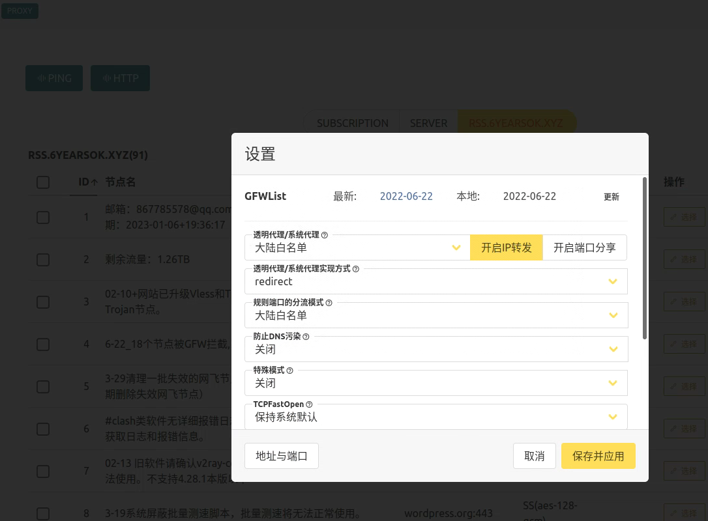
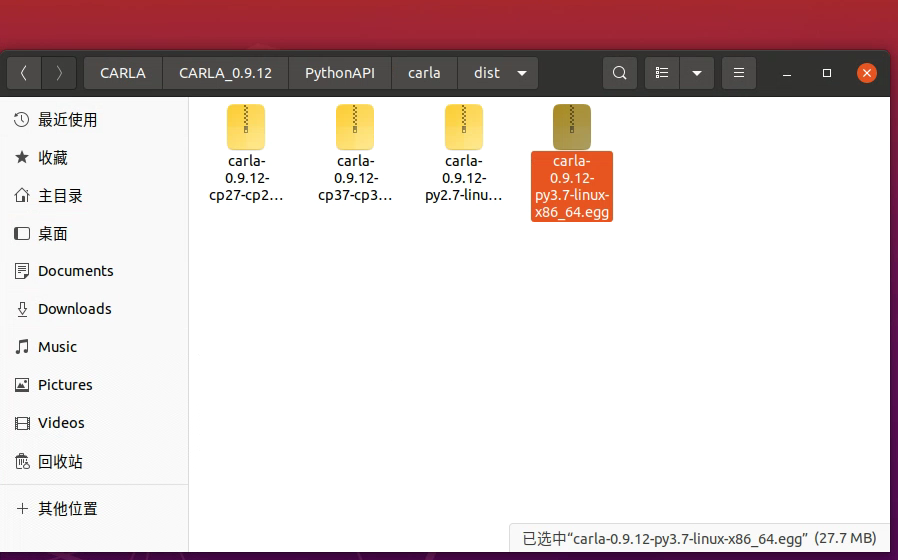

# 6.20
1. 大数据竞赛
2. 论文阅读

   （1）智能网联汽车协同决策与规划技术

       
       

# 6.23
## linux vpn的安装
按照网站上的提示走，不执行添加V2rayA软件源和更新V2rayA，安装V2rayA这几步，参考知乎帖子方法二：手动安装 deb 包进行安装。

 

按照提示进入github，下载如下文件，然后需要进行安装sudo apt install _xxx_vxxx.deb

 

最后按照提示进行开机自启动和浏览器的设置即可。（注意，在浏览器打开时候，需要设置成大陆白名单）
 

## carla、OPENCDA联合仿真
### 1） carla的安装
参考B站视频：

https://www.bilibili.com/video/BV13T4y1U71D/?spm_id_from=333.788&vd_source=d31a858cc26ae1ffa19e14058b339f40

注意：不需要安装unreal，也不需要编译安装，只需要在GitHub上找到realease的安装包解压即可（大约需要6G+3G的空间）。解压后由于后续OPENCDA需要用到TOWN6地图，所以最好把附加的地图也下载下来，将安装包解压到carla的安装文件夹下，替换掉重复的文件（CarlaUE4和Engine）
       

另外还需要配置环境变量，最好conda create一个carla专属环境

 

如果上述环境变量配置不好，import carla报错(但是carla官方在文档里一般都加了try，可以引入carla，但是在vscode里会有波浪线，不好看)，可以输入下列命令，消除波浪线，直接import carla：

方法1：可能不太好用，实测方法2好用

 
也可以参考视频后边段：
https://www.bilibili.com/video/BV1BQ4y167dq?spm_id_from=333.788.top_right_bar_window_history.content.click&vd_source=d31a858cc26ae1ffa19e14058b339f40

在终端运行 ./CarlaUE4.sh 即可启动carla/
测试是否安装成功，进入到pythonAPI-example文件夹下，输入 python maual_control.py测试

方法2：

找到该文件夹，解压0.9.12-py3.7.egg到当前文件夹。然后在opencda中的，scripts文件夹下找到setup.py，复制到0.9.12-py3.7.egg解压后的文件夹下。然后离线安装carla库。
 
 
 
  

### 2） OPENCDA的安装
参考官网opencda
 
 
 
注意：安装pytorch的版本，cuda一定要是10.1(根据电脑的cuda
版本来，可以安装不同版本，pytorch同理)，pytorch版本不所谓只要大于1.8就可以。安装yolov5时，可能等待时间过长,可以去网站上把requirement.txt下载下来

运行./setup.sh时注意把里边的0.9.11改成0.9.12

在和sumo pytorch联合仿真时会报错没有traci.sumolib这个属性，这时候需要去改代码，找到报错的文件，在304行处，把traci.sumolib改为sumolib

# 6.27在python中引入自己模块时，sys.path中加入永久路径的办法。

## 1.anaconda下创建的虚拟环境，可以在对应的site-package文件夹下新建 .pth 文件，会自动加入sys.path下

比如在路径 ~/anaconda3/envs/{环境名}/lib/python3.7/site-packages 下新建 mine.pth，里面写入 /home/stone/projects/python，sys.path 下就会加入该路径。注意pth文件中，每一行每一个路径。

这样就可以直接在该conda虚拟环境下直接import carla.xxxxx或者import agents.xxxxxxx

## 2.linux下现实隐藏文件夹快捷键 ctrl+h

## 3.论文idea

发现的问题：
* 1.目前大部分论文只考虑交叉口的通行顺序决策，场景比较简单，比如只在一条道路上行驶不涉及换道（给定驶入和驶出的路口）
* 2.一些顺序决策方法更为简单，比如FIFO，在同一时间，只允许一辆车通过交叉口，这样势必会导致通行效率低，也有一些考虑同时通行的，但是也仅仅局限于没有路径交叉，而没有考虑到时间上是否交叉，过于保守，因为空间上的路径交叉但是时间上可能不交叉。
* 3.暂时还没看到涉及进入交叉路口提前换道的论文（涉及横向规划），我认为可以利用云控的超视距感知的优势，提前决策换道（防止进入红灯区间或者，防止进入等待时间较长的车队），更高效的通过交叉口。

# 6.29carla的学习

* carla中waypoint十分重要，waypoint.next（d），返回的是一个列表，代表距离当前waypoint  为d的所有可能的waypoint，比如以d为半径画一个圆，在圆周围的所有可能的waypoint都在返回值里，这就能就是代码中为什么waypoint.next（d）[0]了。
 

* carla中map.get_topology()，返回的是一个list，每个元素包含一对waypoint，表示的是一个segment的进入点和退出点。
