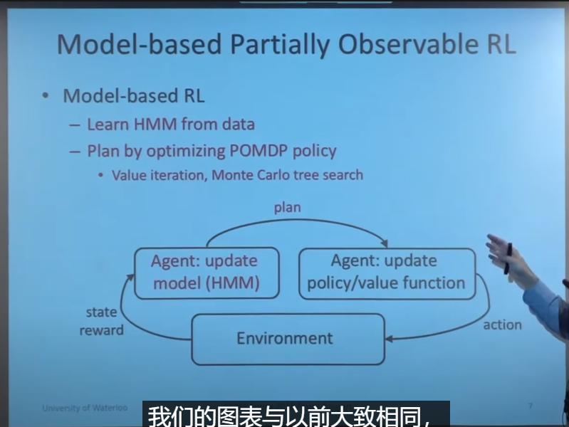
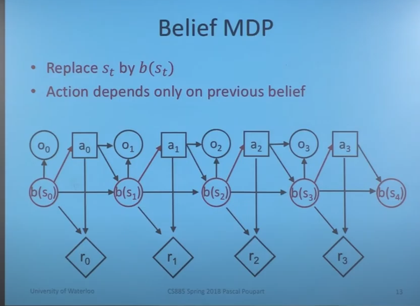

# 7.1

## 1. apollo强化学习规划算法的学习
B站视频：https://www.bilibili.com/video/BV1Qt4y1s7D8?spm_id_from=333.999.header_right.history_list.click&vd_source=d31a858cc26ae1ffa19e14058b339f40

思路：apollo 用强化学习做规划的方法主要是借鉴了Google的ChauffeurNet，是一种mid-mid的模型，输入是9个通道的语义地图，输出是三秒内的轨迹点。

对于强化学习输出的轨迹点，需要进行平滑和轨迹拼接，最后输出给控制模块。强化学习规划相当于整合了预测和规划两个模块，不再依赖于预测。

# 7.10

## POMDP
* 状态转移过程
   
* 目标以及定义
  
* 进一步简化
  
  
  有一个错误（reward and observation）

  
  
  
   
   HMM前向后向算法
   
   
   

## LQR和LQG
* LQR的控制为u=-Kx
* LQG相对于LQR来说只是引入了过程噪声和观测噪声，先用kalman滤波器观测出状态的最优估计$x^{hat}$，然后u=-K$x^{hat}$
  
  
  

# 7.15
## 和高老师会议讨论讨论
* 1.高精度地图的位置应该放到映射和预测之间
* 2.POMDP先不考虑不确定性，先考虑周车的确定性意图（先把整个框架流程跑通）
* 3.把信号灯集成到终端约束里
* 4.取消准备区的说法

# 7.16 今天出去滑冰了，休息一天，主要了解了以下轨迹优化

# 7.17 最优控制的解法
* 最优控制的解法可以包含间接法和直接法、动态规划。
* 间接法主要指的是先优化再离散的一些算法，比如变分法、极小值原理，其主要思路是引入协态变量，建立哈密顿函数，将轨迹优化问题转化为两点边值问题。间接法由于计算量太大，难以解决复杂问题，一般不用。
* 直接法主要指的是先离散再优化的算法，包括两大类（1）打靶法和（2）配点法
* 打靶法包括单次打靶、多次打靶、MPC等，主要是通过把动力学约束转化到cost中，然后只优化控制变量。
* 配点法包括直接配点、维谱法等，主要是离散化状态量和控制量。约束也做相应的离散化。
* 动态规划规划一般指迭代求解value function
  

Reference:
https://zhuanlan.zhihu.com/p/340981788  CMU课程PPT
https://zhuanlan.zhihu.com/p/492906065
https://zhuanlan.zhihu.com/p/346617896
https://blog.csdn.net/qq_35007540/article/details/105672547   关于配点法的描述
https://zhuanlan.zhihu.com/p/434984223
https://zhuanlan.zhihu.com/p/51372134  关于自动驾驶轨迹规划的一些总结
https://blog.csdn.net/NICAI001/article/details/119270814

# 7.17 深蓝学院轨迹优化的讲座

* 三种高自由度的轨迹优化方法：
* （1）DDP/ILQR：不能考虑约束 
* （2）直接配点法：能考虑约束，把最优控制问题转化为NLP问题，但是求解较慢  
* （3）规划即推断，引入不确定性，目前处于初级研究，大部分只考虑高斯分布。
* MPC是一种思想，而不是一种具体的算法

比较好的一些学习资料：
1. 一个大神的博客，ILQR代码讲解  https://studywolf.wordpress.com/2016/02/03/the-iterative-linear-quadratic-regulator-method/
2. MIT轨迹优化公开课，非常好，一定要看看 http://underactuated.mit.edu/    B站上有相应的双语版本https://www.bilibili.com/video/BV1LA411v75c?spm_id_from=333.999.0.0&vd_source=d31a858cc26ae1ffa19e14058b339f40
3. 一篇关于配点法的很好的文章An Introduction to Trajectory Optimization: How to Do Your Own Direct Collocation∗  在C:\Users\hanshuo\Desktop\C-ITS and 多车
   
# 7.18 深蓝学院轨迹优化的讲座

* 看了kelly大神的轨迹优化讲座，感受颇深。在大神看来，最优控制问题，可以分为两大部分，第一是u=f（x），第二是u=f（t）。轨迹优化问题就属于第二种问题。第一种问题是一种闭环控制，强化学习就属于这种方法。第一种是一种全局算法，难求解，只适用于低维。实际中，一般采用第二种（典型的方法包括配点法和打靶法）
  
reference： http://www.matthewpeterkelly.com/index.html

* 又了解了轨迹规划的方法：（由于轨迹规划解NLP的实时性很难得到保证，所以很难迭代求解。一般只能离线求解。轨迹优化问题的求解不是很大的难题，难就难在其算法的实时性。我们前面说的直接法和间接法都涉及到迭代求解，问题稍微一复杂，可能就会花十几秒才能得出解。但是我们的记载计算机和我们的笔记本，台式机相比，其算力就差了很多很多。当然我们也可以用地面的计算机求解，再通信给飞行器，但这又存在一个通信延迟，这又不可行了）有三种思路：
* （1）简化数学模型
* （2）用分段多项式代替轨迹，不直接求解轨迹点，而是间接求解多项式系数，这样可以降低求解维度。但是有一个问题，求解多项式系数必然会涉及到迭代求解，迭代求解最大的问题是我们需要提供一个初值，一旦我们提供的初值不对或者说差的太远，那么得出的解肯定就不对了。而且，对于很多问题，我们都无法确定这个迭代方程有多少个解。如果我们能证明这个多项式解的个数，并且能提供其初值大概范围，那么我们当然就可以实现其算法实时性了。
* （3）机器学习：离线对轨迹优化问题进行求解，生成一条标称轨迹 $\bar{x}$，然后给初始状态一个扰动，再用标称轨迹的解作为初值代入，求得标称轨迹附近的最优轨迹$x^{*}$，$x^{*}$是很多轨迹的集合。（$x^{*}_1$,$x^{*}_2$,$x^{*}_3$,...$x^{*}_N$）这种思路就是同伦方法(Homotopy)。那么我们就可以生成很多很多最优轨迹，将这些最优轨迹的状态作为输入，控制量作为输出，然后用这些数据集来用机器学习的回归思路进行训练。得到初始值附近的最优轨迹到控制量的映射。训练完之后我们就可以将训练好的网络存下来。这样就可以直接根据状态x前向传播得到控制u，解的速度大大加快。

当前解的最优性问题：无论直接法还是间接法都无法满足解的最优性，因为他们都是必要条件。当前论文似乎都不会考虑这个解的最优性，为什么呢？因为这个问题太难了。但是我们又不得不深入思考这个问题，因为即使很多非常简单的问题，我们所得出的解都不一定是局部最优，更别说全局最优了。那么我们就需要去寻找如何判断我们所求的解是不是局部最优解了。

# 7.20 
* 轨迹优化kelly大神的教程
* 智能网联汽车协同规划与决策书（1、2、4章） 

* simulink中模型管理与封装的学习
* simulink model explore 的学习
* matlab 数值求导和符号求导命令

# 7.22

* 今天看了一篇文IROS文章，比较有意思。是把LQR的结果作为一个高斯概率分布来进行跟踪。均值为求解器求出来的LQR/ILQR的最优解，方差，同样可以计算出来。方差指明了cost的下降方向。
  
  
   
    

# 7.23

## 看了一篇上汽的文章：
和百度类似的路径规划算法，但是只有路径规划，没有速度规划（只针对静止障碍物）

1.用二次规划生成指引线（QP）

2.用非线性规划生成最优轨迹（SQP），且个分割端长度可变，约束采用驾驶走廊的方式，并迭代改变驾驶走廊的范围，防止连接两个驾驶走廊的轨迹与障碍物碰撞。

## 关于规划的一些见解：
  规划本身可以考虑是一个优化问题，目标函数包括最优化舒适性，通行时间，燃油消耗率等.....，约束包括系统动力学约束、执行机构的约束（box constrain），碰撞约束（栅格、矩形、圆形）等。规划本身有两条路可以走，分别对应下边的两种转化方法，一条路是先规划后控制（即规划时不考虑控制u，只考虑给出一条光滑曲线，对应第二种思路），这是考虑到规划和控制的频率要求不同，规划的要求频率低一些，可以100ms规划一次，控制对频率的要求高，10ms规划一次，分层可以很好的将不同的频率隔离开。另一条路是同时规划与控制（即规划是考虑控制，对应第一种思路），可以用MPC框架，这样就不用下层跟踪控制器了，这样对求解速度要求很高。当然同时规划与控制同样可以不关注控制，只关注求出来的最有规划，控制放到底层去执行。他们之间的显著区别是在规划的时候有没有考虑到控制（也就是有没有考虑到系统的动力学方程）
  
* 由于有系统动力学约束的存在，这是一个微分方程，直接解该问题较难，解析解很难求（主要方法有变分、最小值原理等）所以需要将问题转化：
* 一种思路是最优控制的数值解法，把系统动力学约束离散化（比如配点法和打靶法），这样可以将带有微分方程约束的优化问题转换为NLP的问题，NLP问题的求解速度高度依赖于初始解，所以找到一个好的初始解是解NLP问题的关键所在，我们可以将找NLP问题初始解的过程想象成是一个决策过程，也就是说当看到前面有一个障碍物，车辆该选择从左绕行还是从右绕行。最后求出来的最优解为$x^*,u^*$,我们可以只用$x^*$,放弃$u^*$，这样其实和第二种思路是一致的，都是求最优轨迹。如果$x^*,u^*$都用，则不用再重新设计跟踪控制器，直接用$u^*$，这样可能会导致控制误差太大，可以考虑MPC的思想（前提是求解够快），每一步只应用于第一个控制量。当然也可以用DP的思想去解。
* 还有一种思路是把动力学约束给转化，不显式的约束动力学，而是把加速度、加加速度、曲率等影响动力学的因素放到目标函数中，这样就把动力学约束给消掉了。这样求出来只是一条最优轨迹( $x^*$ )，没有控制量，控制只能放到下层去跟踪该轨迹。典型的有Apollo EM planner

## Autonomous Driving on Curvy Roads Without Reliance on Frenet Frame: A Cartesian-Based

一个迭代轨迹优化的方法：

输入：粗的参考地图

输出：一条最优的轨迹

STEP 1：加载采样和搜索粗导出的参考轨迹轨迹，然后返回数值求解所需的所有决策变量（reference line，初始解）

STEP 2：初始化惩罚变量，迭代次数、清空目标的traj。

STEP 3：依照所设定的迭代次数进行循环：

         1 - 使用加载出来的参考轨迹放入到OCP中。这一步中，期望与运动学相关的约束在合并到Cost函数之前被软化为外部惩罚成本。

         2 - 优化生成一个新的轨迹。

         3 - 确定可信度，找到0到T时刻的总的惩罚

                   3-1- 如果惩罚很小了，我们就将这个轨迹返回。

                   3-2- 反之，则更新一下惩罚稀疏，并且迭代次数增加一次。

return 最优轨迹

reference：https://blog.csdn.net/u011841848/article/details/123931887

## idea：
1.在三维空间中（xyt），首先将时间离散化。
2.在离散时间的三维空间内进行轨迹决策。
3.轨迹决策的结果当作初始解（同伦性）
4.根据初始解（轨迹决策）生成安全走廊
5.根据安全走廊简化约束
6.求解最优解
7.todo-把初始轨迹当作一个随机变量，均值为初始解，方差为计算出来的（reference：Probabilistic Iterative LQR for Short Time Horizon MPC）
 
** reference：Model Predictive Trajectory Planning for Automated Driving **
https://blog.csdn.net/u011841848/article/details/125422248

## 微分平坦：
定义：微分平坦使用系统的**输出和其导数**对  **状态变量**和**输入变量**进行表示，通过**选择合理的输出变量**可以对系统进行有效的**降维**。正式的定义为：对一些存在平坦输出的非线性系统，如果可以找到一组系统输出，使得所有状态变量和输入变量都可以由这组输出及其有限阶微分进行表示，那么该系统即为微分平坦系统。

此特性可以在机器人进行运动规划的时候指导选择哪些输出变量进行规划，并将所有的轨迹约束条件都映射到平坦输出空间，并在输出空间中规划出最优轨迹，然后再上升回到初始的状态和输入空间中。**这使得最优控制问题的维数降低到能在实际应用中实时计算的数目**
https://blog.csdn.net/qq_40870689/article/details/100878240

https://blog.csdn.net/u011841848/article/details/122486242

# 7.27

* 关于min-max问题一个很直观的解释

min-max和max-min在优化问题中比较常见，一句话说：min-max(make maximum value minimum)是为了压制优化目标中表现最突出的成分，max-min(make minimum value maximum)为了提升优化目标中表现最差的成分。为了把这两个问题作一个比较通俗的解释，方便笔者和各位读者对此问题有更直观的理解。

（一）min-max问题
先理解这个问题，借用之前看到的一个例子：考虑规划城市中急救中心或者消防中心的建造位置，目标约束函数应该是到城市中各个房屋最大距离的最小值，而不是到达所有目的地距离和的最小值。简单地说就是前者考虑如何降低最恶劣情况的影响，后者考虑整体的联合优化。因为整个城市同时着火几率极低的，所以建模的时候更倾向于考虑前者这样的模型。

（二）max-min问题
这个问题再通信链路中应用比较多，如基站同时和多用户通信，每个基站到用户的通信为一个通信链路，且基站的发射功率是固定的。为了保证所有的通信链路都正常工作，应该去优化最差链路的通信情况，降低信道较好链路的基站发射功率，增加信道较差链路的基站发射功率，这是一个最大化最小值问题。

* matlab支持的求解问题以及求解器汇总
  
https://ww2.mathworks.cn/products/optimization.html

# 7.28 高飞的课程

* 混合整数优化，用M法求解
  

# 7.28 高飞的课程（MDP和MPC）
* MDP感想，MDP的planning目前发展很缓慢，把不确定性考虑进去以后就只能解一些很简单的问题，而且问题的展示也不够直观。作者分了两个部分来讲MDP，第一部分引入了nature的概念，指的是nature会做出动作使得结果变得不准确。第二部分就是传统的概率转移。

* MPC感想：对于松弛因子之前了解的不够透彻，今天算是搞明白了，松弛因子就是在box约束上加了松弛因子，然后把松弛因子放在cost上进行惩罚（松弛因子越大，cost越高），松弛因子也作为决策变量，一并求解。这样就把之前的硬约束的MOC问题转化成了一个相对的软约束问题。

* 智能网联汽车决策规划书籍看完了：
  1） 多车协同决策规划的方法：问题是NPhard，所以决策问题没有很好的解决办法，目前比较好的方法是惯序决策，即采样一定数量的决策顺序，判断一下哪个顺序比较好。基于决策顺序，进行规划（低优先级车辆将高优先级车辆的轨迹当作障碍物）
  2）规划时，处理碰撞约束时，可以将车辆抽象为前后轴心为圆心的两个圆。
  3）由于约束过多，采用自适应渐进约束初始化的思想.

  4）结构化单车规划：
  1. 首先生成指引线：
  \
  2. 基于指引线，进行轨迹决策（frenet坐标系下，采样+DP），生成带有时间信息的决策轨迹
  3. 基于决策轨迹，构建安全走廊，进行规划
   \

  5）在结构化道路中，由于车速过高，因此较危险，应该设置一定的冗余方案：
  1. 如离散化精度渐变方案（在进行动力学方程离散化时，可以选择较近的时域离散区间短，较远的时域离散区间长）、
  2. 多完成度冗余（设置备选命题，如跟随指引线或者靠边停车）、
  3. 在线查表紧急避险（当突然出现障碍物时，来不及轨迹，通过大量标定，形成 轨迹->控制量的离线表格，通过查表，快速避障。）

