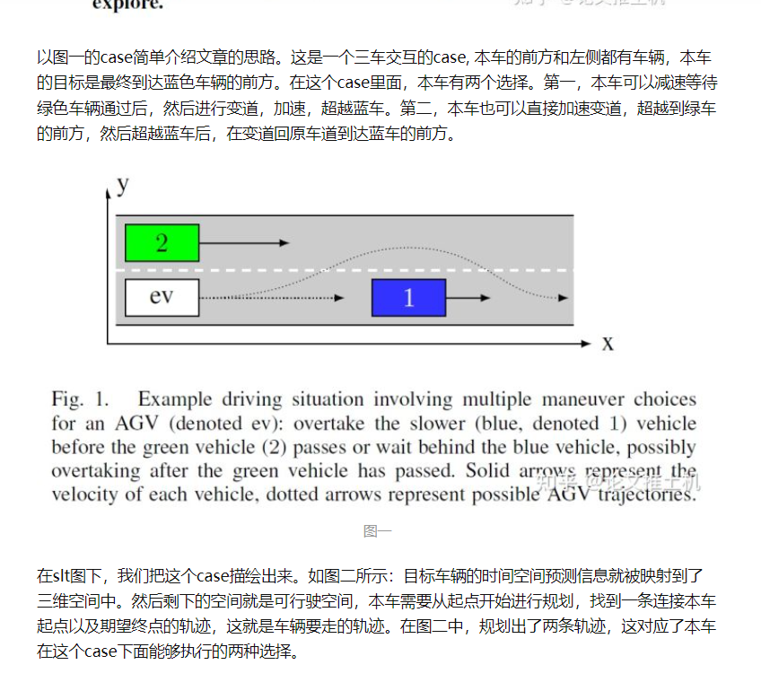
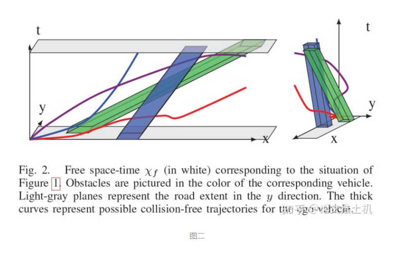
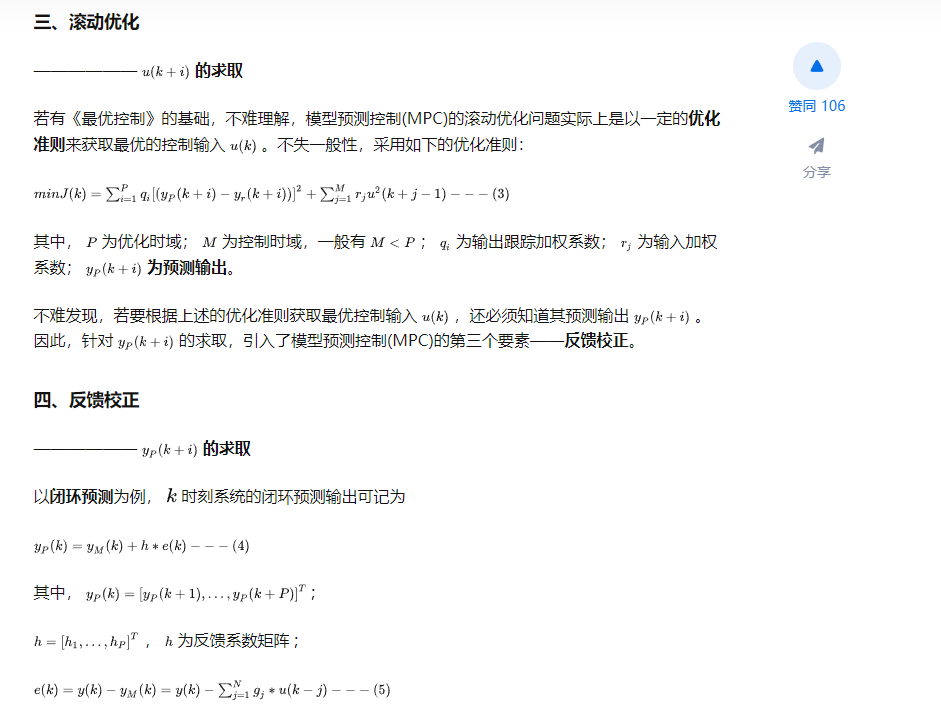
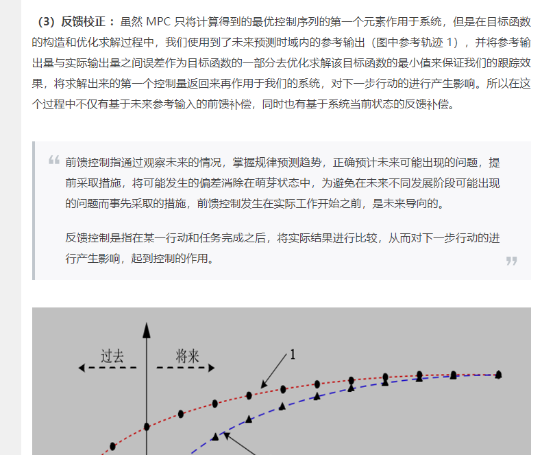

# 8.20

## 时空规划论文阅读
1. 这个例子举得很好，可以将红绿灯的工况也考虑进去

## 8.21
1. MPC的反馈矫正的例子
   
MPC的模型预测过程，在预测输出时如果考虑模型的不确定性，把下一时刻的测量值与当前时刻预测的下一时刻的值的误差反馈进来，这就是反馈矫正，**反馈矫正相当于预测的过程也形成了闭环**。能够准确的的实现预测输出，而不仅仅只基于模型来预测。

https://zhuanlan.zhihu.com/p/66801694

$y(k)$是当前时输出量的测量值，是一个标量。$y_M(k)$是上一时刻预测的当前时刻的输出量，是一个标量。因此$e(k)$也是标量。
如果没有反馈矫正，只用模型来预测输出，那么反馈矩阵就为0。

这个反馈矫正理解的不对！！！

2. 关于动态规划
   1）动态规划既可以正向求解也可以逆向求解，正向求解是求出起点到每个点的最短距离。逆向求解，是求出每个节点到终点的最短距离。\
   动态规划由三层嵌套循环构成：第一层是每一个阶段的循环，第二层当前阶段的每一个状态，第三层是下一个阶段的每一个状态。