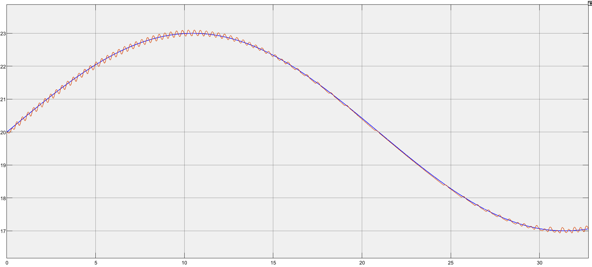
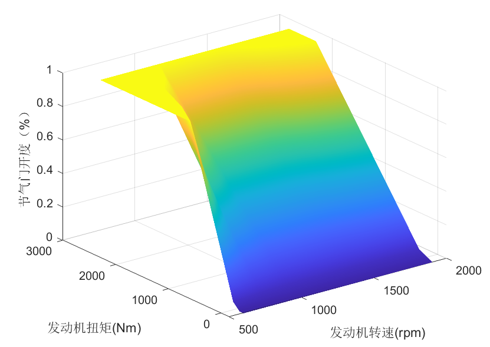
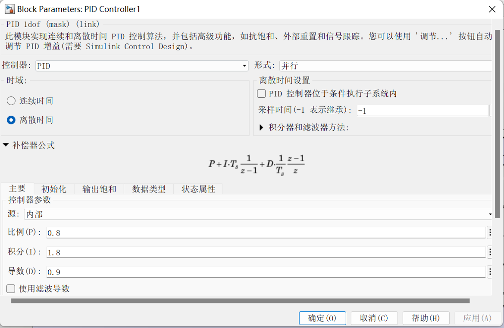
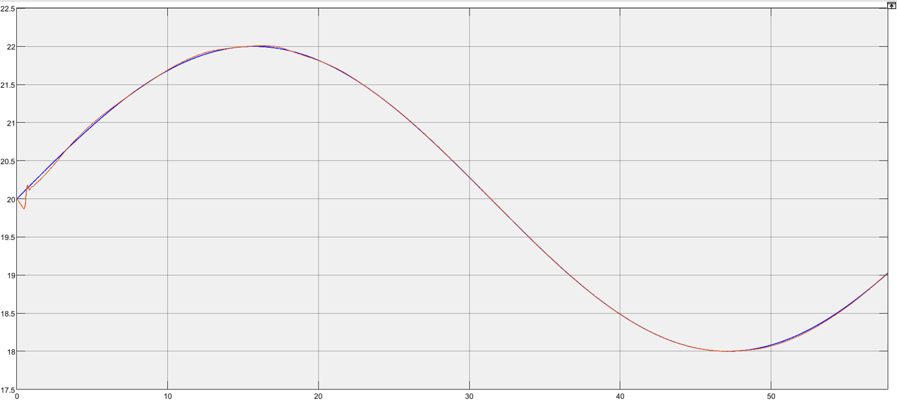
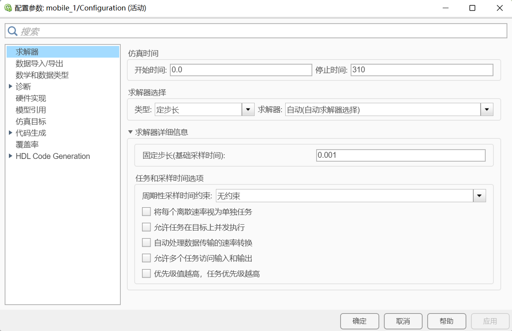

# Carsim仿真中的速度抖震问题的解决方法
---
by 韩硕 
date 2022.8.21

## 问题描述：
我们在进行Trucksim/Carsim和Simulink联合仿真时发现，在进行一般的控制任务中，Trucksim/Carsim车辆输出的速度信息经常会发生抖震现象，如下图所示（蓝线是期望速度，红线为给Trucksim/Carsim输入控制量后的自车的输出速度）。

## 问题原因分析：
经过对比调试，我们最终发现，导致该问题产生的主要原因主要有两点。
1. 在加速度->节气门开度插值的过程中插值分辨率较大：
我们目前在对Trucksim/Carsim进行控制时，目前采用的控制量主要有三种：（1）直接给Trucksim/Carsim输入速度，让Trucksim/Carsim中自带的PID控制器对该速度进行跟踪。（2）给Trucksim/Carsim输入加速度，Trucksim/Carsim中通过自带的发动机模型可以讲加速度转化为节气门开度以及制动压力。**（3）给Trucksim/Carsim输入节气门开度/制动压力**。对于前两种方案，涉及Trucksim/Carsim内部的模型，我们不好做评价。但是第（3）钟方案是存在一定的不足的：我们控制求得的控制量一般为加速度/速度，通过发动机的逆map图（见下图）可以利用查表的方式，通过发动机转矩和发动机转速低，查得对应得节气门开度。但是由于，发动机逆map在制作过程存在分辨率得限制，可能在插值过程中没有办法正好找到使车辆一直保持某一速度得节气门开度。从而会导致车速度抖震现象的发生。

2. PID的调参问题：
该问题是目前发现的导致抖震的主要问题，PID三个参数直接决定着系统的响应特性，抖震的发生往往是由于PID参数不匹配，这里有一个小trick：在车速跟踪这类问题中，如果出现车速抖震的现象，往往**将I与D的比例设置为2**，能够很好的消除此类现象。（需要注意的是，这个经验一般只针对仿真，我们在实车调式时，由于存在大量高频噪声，D的引入会导致控制的不稳定，所以实车中一般采用PI控制器）。

最终，在相对匹配的PID参数下，抖震的现象可以被抑制，如下图所示。

## 总结
总体来看，我们可以确定的是，Trucksim/Carsim输出速度的**抖震现象并不是由于Trucksim/Carsim本身所引起的**，而是由你的上层的控制算法或者下层控制器所决定的，针对不同的控制器，必然会产生不同原因的抖震。**PID只是一个例子**，具体的原因还是需要去分析自己的算法找原因。\
此外，关于simulink仿真需要补充的是，我们一般采用**定步长**的仿真方式，如下图所示。这是由于如果之后需要做实车测试，在生成代码的过程中，变步长可能会出现问题，所以建议一开始就采用定步长的方式进行仿真，防止之后不好改。
