1、on-policy与off-policy的区别

如果要学习的智能体和与环境交互的智能体是相同的，我们称之为同策略，采集一个trajectory后才能更新一次network。如果要学习的智能体和与环境交互的智能体不是相同的，我们称之为异策略，用另一个actor采集多条trajectory，来一次更新多次network。

2、重要性采样的引入
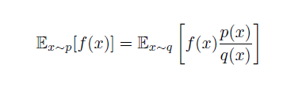
重要性采样是无偏估计，但是如果p和q差距太大，方差会变的很大
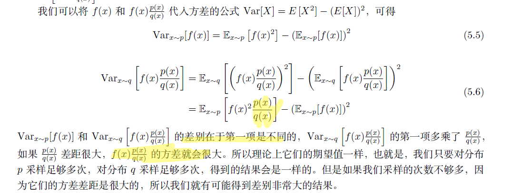

3、PPO/TRPO算法的引入

为了解决重要性采样中方差过大问题，PPO在目标函数J中引入了正则项（KL divergence），TRPO对目标函数引入了约束（KL divergence<\theta）,其实两者的想法是相似的。KL divergence指的是两个策略之间的分布差异，而不是两个策略参数间的距离。

引入重要性采样后原来的策略梯度变为：  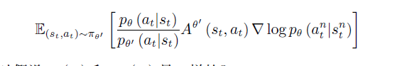

优化的目标函数为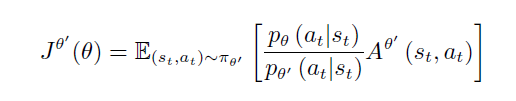

PPO引入正则化项后目标函数变为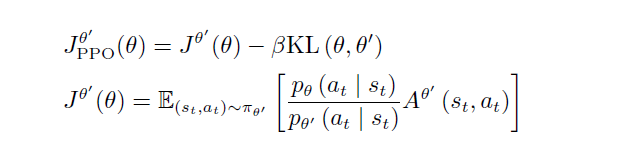

TRPO引入约束后目标函数变为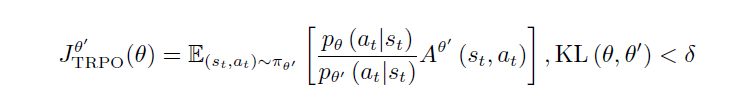

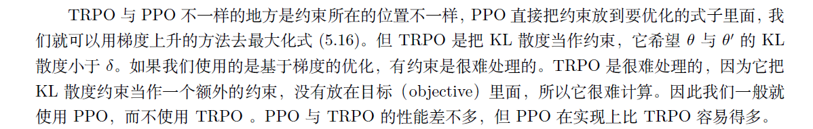

4、PPO算法的trick
①**近端策略优化惩罚自适应KL divergence**
**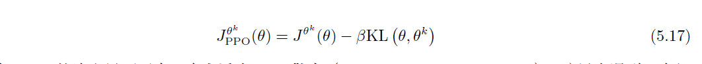**
**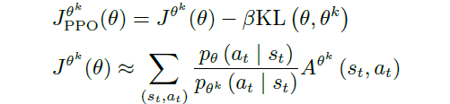**

**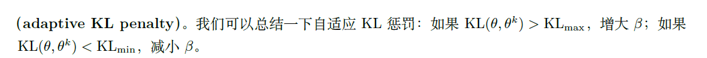**

，KL  散度的值太大，这就代表后面惩罚的项没有发挥作用，我们就把*β*  增大，加大惩罚。如果KL  散度太小，就代表后面这一项的效果太强了，我们怕他只优化后一项，使*θ*  与*θ**k*

一样，这不是我们想要的，所以我们要减小*β。*
*
*
**②近端策略优化裁剪**
*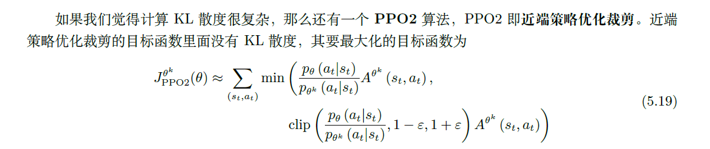*
*
*
*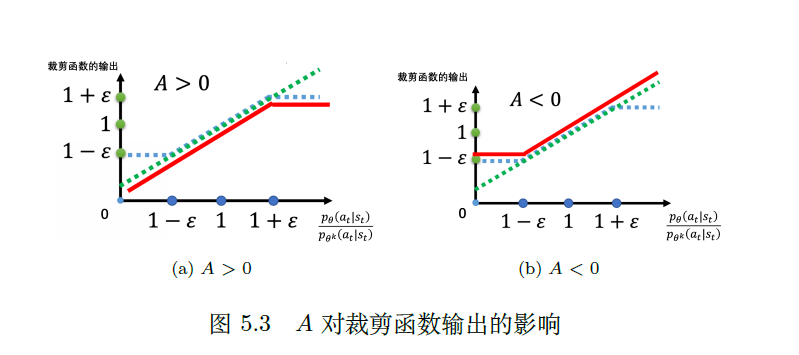*
对裁剪的理解：红线是J的输出，p*θ与*p*θk的比值永远>0*
我们先考虑A ×（pθ/pθk）

如果势函数A大于0，说明当前策略是积极的，可以使价值函数变大。但是我们怕为了使目标函数变大，网络会不断地增大pθ，这样会使pθ与pθk差距过大，这是我们不希望看到的，所以我们需要规定一个上限，即使pθ远远大于pθk，（pθ/pθk）比值也不会变大了，这样也不会使目标函数A ×（pθ/pθk）变得更大了，所以网络就不会以为的追求增大pθ。

如果势函数A大于0，说明当前策略是消极的，会让价值函数变小。这时候为了使目标函数变大，网络可能会不断地减小pθ（这样pθ与pθk的比值接近0，再乘势函数A就会使目标函数变得尽可能大），这样同样会导致pθ与pθk差距过大，这是我们不希望看到的，所以我们需要规定一个下限。即使pθ远远小于pθk，（pθ/pθk）比值也不会变小了，这样也不会使目标函数A ×（pθ/pθk）变得更大了，所以网络就不会以为的追求减小pθ。

*
*
*
*