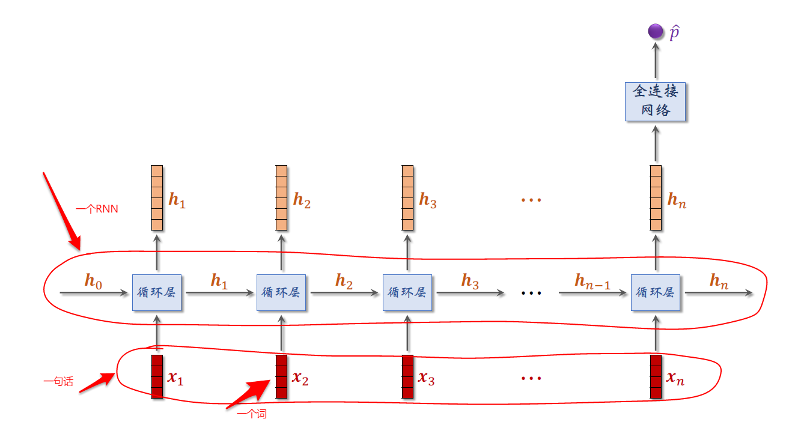

RNN网络的定义：rnn= nn.RNN(input_size, hidden_size, num_layers, batch_first=True)

input_size：输入的维度
hidden_size：隐藏层的维度
num_layers：网络的层数

RNN的正向传播out，state=self.rnn(x），x的维度为   (batch_size, seq_length,input_size)， out的维度为   (batch_size, seq_length, hidden_size)，state为序列最后一个元素对应的隐藏层输出，维度为（num_layer, batch_size，hidden_size）

batch_first=False 时(默认值)
RNN的正向传播out，state=self.rnn(x），x的维度为   (seq_length,batch_size, input_size)， out的维度为   (seq_length,batch_size, hidden_size)，state为序列最后一个元素对应的隐藏层输出，维度为（num_layer, batch_size，hidden_size）

注意输入给网络的X的序列长度并不需要一致，可以不断变化，只要保证input_size是一致的就可以了

seq_length：序列的长度，并不需要固定为某一个值（训练时每个batch的seq_length要一致），验证时不需要一致

关于序列：
1、可以将一张图片当作一个序列，若batchsize=10，那么一次训练10张图片，但是每张图片中像素的行数可以不一致。（每一行像素当作一个x，即第一行像素为x1，第二行像素为x2....，维度大小为（input_size（列数）->这个维度所有数据都要一致）这样一张图片维度可以表示为（seq_length（行数）->可以变化（训练时每个batch的seq_length要一致）, input_size（列数））一个batch的维度可以表示为(batch_size, seq_length,input_size)

2、也可以将一组图片当作一个序列，若batchsize=10，那么一次训练10组图片，但是每组图片中图片的个数可以不一致（每张图片所有像素拉长当作一个x，即第一张图片为x1，第二章图片为x2....，维度大小为（input_size（图片像素总数）->这个维度所有数据都要一致）这样一组图片维度可以表示为（seq_length（每组中的图片个数）->可以变化（训练时每个batch的seq_length要一致）, input_size（每张图片像素总数））一个batch的维度可以表示为(batch_size, seq_length,input_size)

3、也可以将一个句子当作一个序列，若batchsize=10，那么一次训练10句话，但是每句话中词的个数可以不一致（句子中每一个词当作一个x，即第一个词为x1（需要编码），第二章图片为x2....，维度大小为（input_size（取决于编码））， 这样一句话的维度可以表示为（seq_length（每句话中词的个数）->可以变化（训练时每个batch的seq_length要一致）, input_size（每个词编码的维度））一个batch的维度可以表示为(batch_size, seq_length,input_size)

