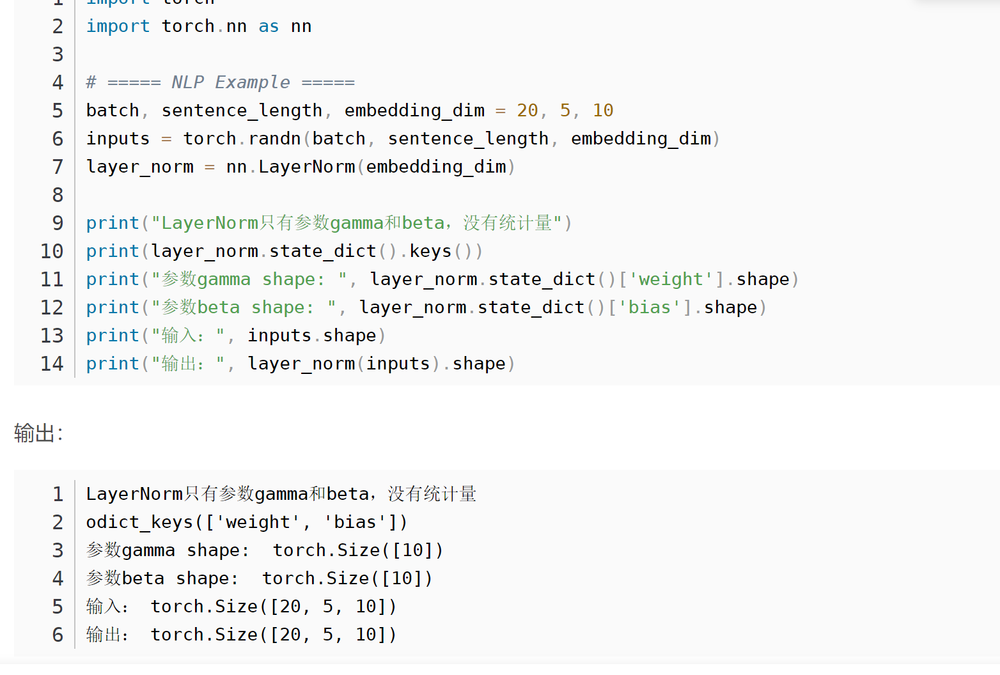
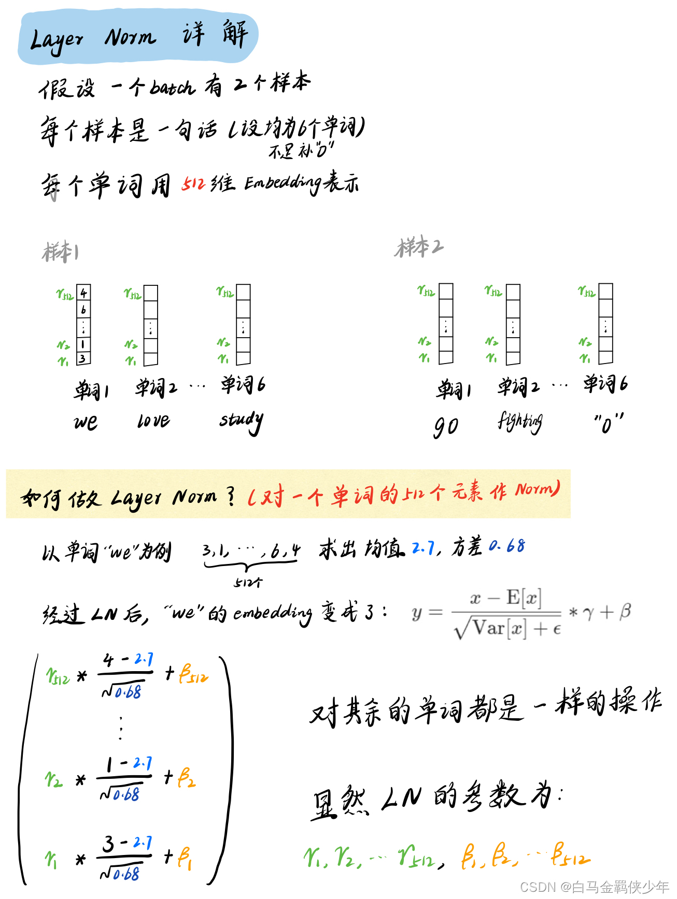
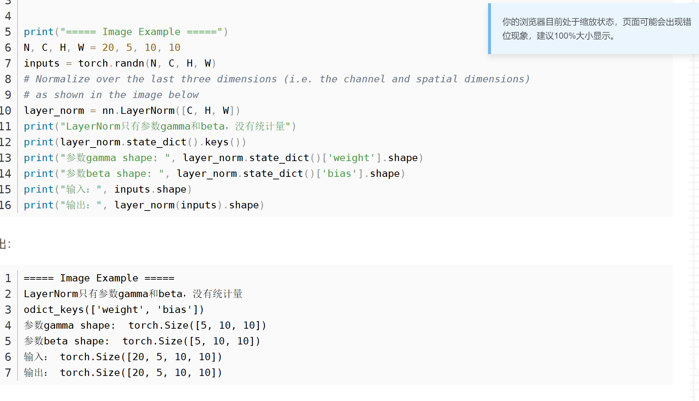

在CNN中常用的是batchnorm2d（channel），输入图片的维度是（B,C,H,W）,batchnorm2d是对channel数进行归一化，其中参数gamma和bisa的个数为  channel数

在RNN中常用的是LayerNorm(embedding_dim)，输入的维度是（B,Sequence_length,embedding_dim）,LayerNorm是对embedding_dim进行归一化，gamma和bias的个数为embedding_dim的个数

NLP中常用那个的LayerNorm，把embedding_dim拉长，然后取平均

NLP中常用那个的LayerNorm，把C,H,W拉长，比如c=2，h =3，w=4，那么拉成24维，然后取24个数的均值和方差，那么gamma和bias的个数分别就是24个

