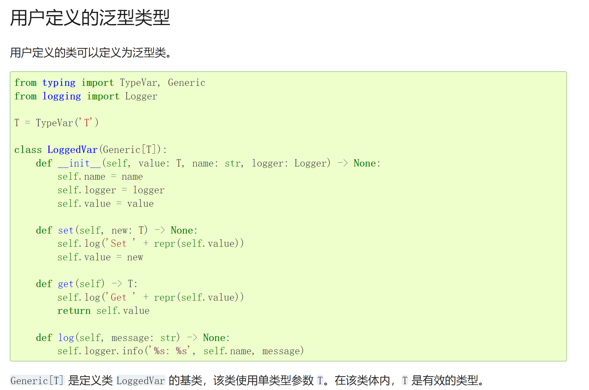
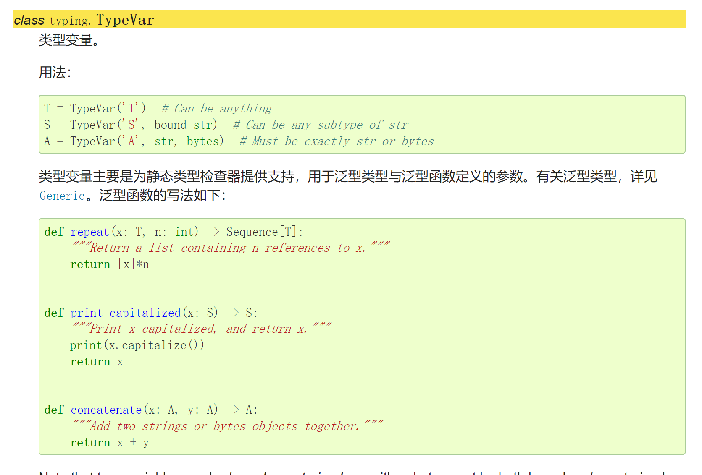
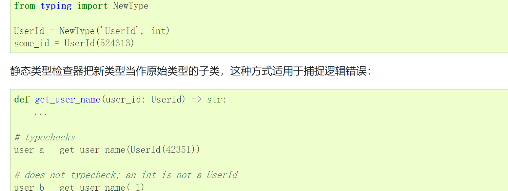
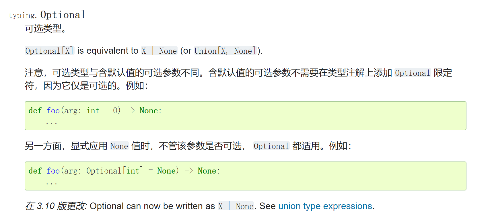
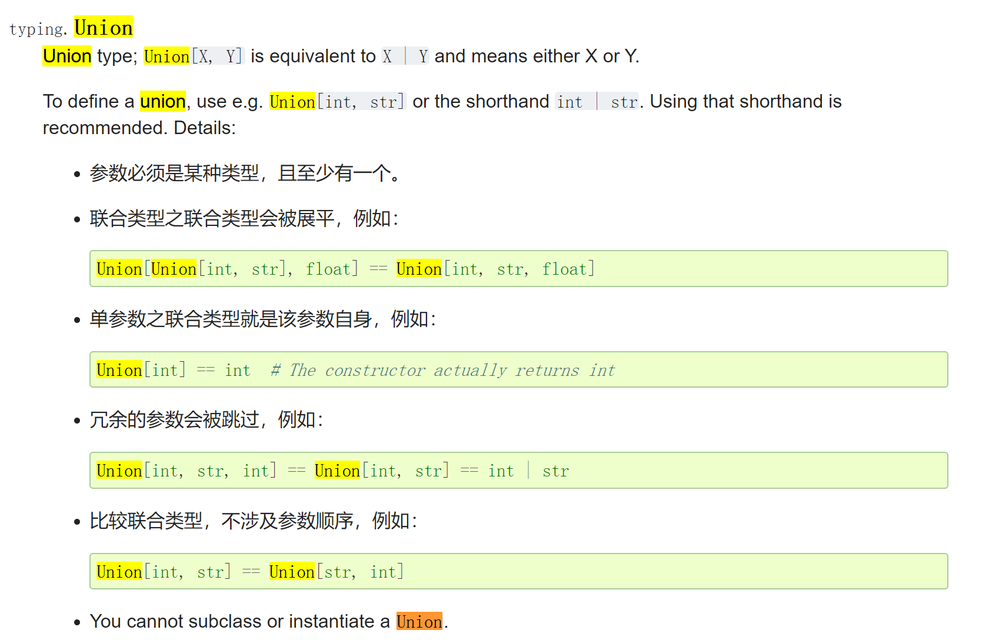

from typing import Generic, Optional, SupportsFloat, TypeVar, Union

Generic：表示泛型，一般在创建class时使用， Generic[T] 返回的T类型，Generic和TypeVar连用
TypeVar：表示泛型

NewType表示类型别名

Optional：表示可选类型Optional[int]，表示可以是int也可以是None
Union：表示或类型

