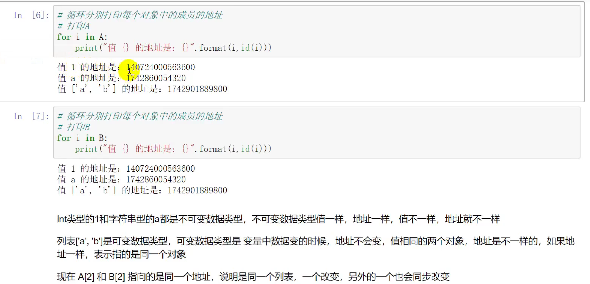

1.定义只有一个元素的元组： a=（1，）

2.类中__call__函数，把类当作函数来调用：  Demo（“名字”）（） --》打印出名字

3.遍历字典的方式for i in dict ->只能遍历出键值

遍历键的方法：

遍历值的方法：

既遍历键又遍历值：

内嵌for in 循环：

用for in 转换字典的键和值

join方法

python生成器：用于储存大数据时减少内存（用把[]改为()）,通过生成器的next方法来访问数据

yield关键字：

python文件的读写

python中with的使用方法，调用with的对象必须要有__enter__和__exit__方法

python中对象赋值，深拷贝，浅拷贝：
1.对象赋值，一个变 两个都会变
2.    浅拷贝，两个对象地址不一样，但是可变数据类型的地址一样

3.深拷贝

python字典排序：
1.根据键排序：