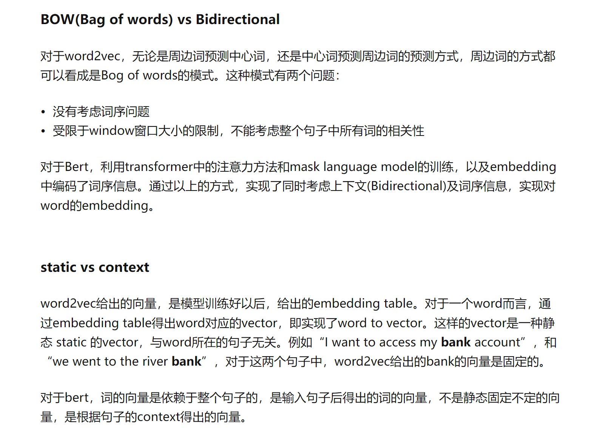

word2vec是相比于one-hot来说的，比如one-hot一共有十万维向量（只有一维是1，其他都是0），但是它是没有考虑到语义信息的，每个单词与每个单词都是独立的。word2vec是在十万个单词排一排，然后根据上下文对每一个单词编码（还是编码成10万维，但是不是稀疏的向量了，每一维都有数字）。word2vec考虑的周边词都是bag of words的模式，是没有考虑到语序的。

但是word2vec的缺点是每个单词只由一个向量，没有办法考虑同一个单词在不同的语句的语义。
bert是动态的，同一个单词在不同的语句中会编码成不同的向量。
