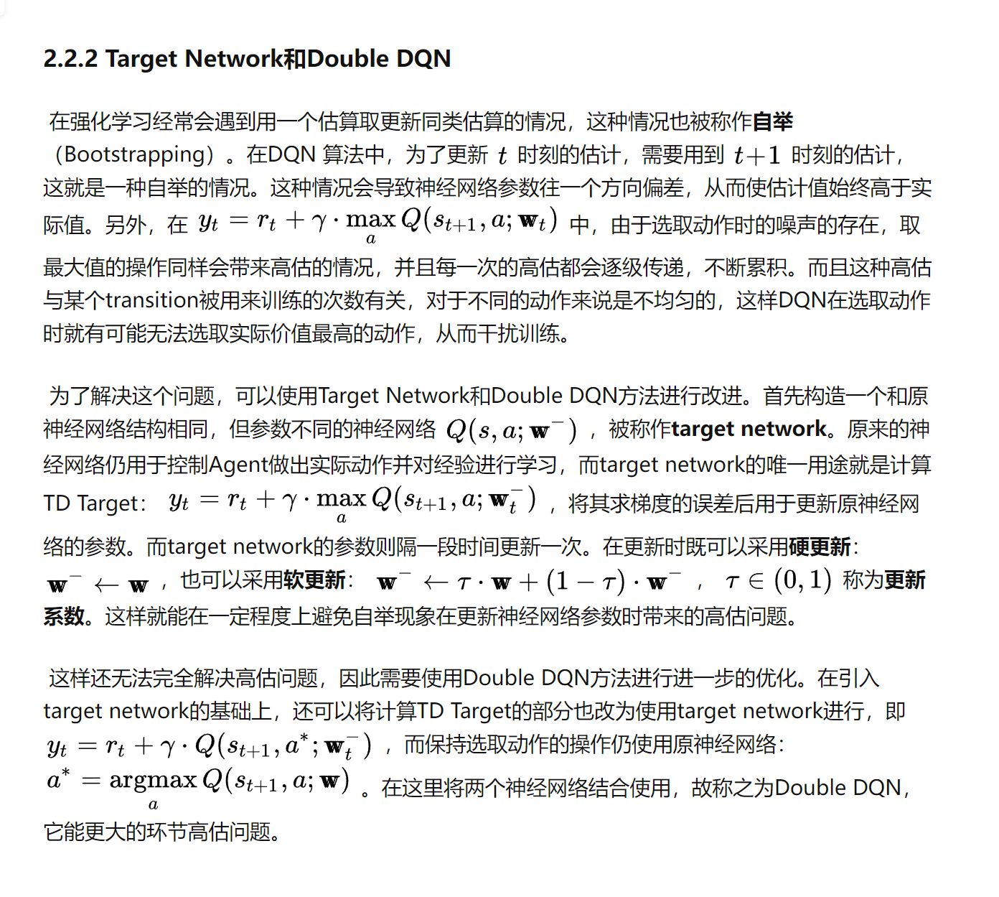

高估的来源有两个：
1、自举：即用T+1时刻的估计去更新T时刻的估计，如果本身Q网络就会高估，那么T+1时刻和T时刻都会高估，就会一直高估下去，从而使Q的估计值始终高于真实值

2、选取动作时存在噪声，可以这么理解，不一定Q值最大的动作就是奖励最大的动作，因为Q的估计存在一定的噪声，可能两个动作的Q真值都是一样大的，但是其中一个的噪声使其Q的估计变大，那么由于贪心策略，这个Q值一定会被选出来，那么就会造成高估

解决高估的方法

1、target network ：采用另外一个神经网络来估计T+1时刻的Q，这样如果自身Q网络高估了，但是target network不一定会高估，也可能会低估，所以当target network低估是，可以把自身Q网络的高估给拉回来。

2、double DQN：在target network选择Q值时，不用target network的最大值来选择a，而是采用自身的Q网络的最大值来选择a，这样也会一定程度上缓解高估。原因如下：假设target network存在动作噪声，两个动作的Q真值都是一样大的，但是其中一个的噪声使其Q的估计变大，那么target network中这个高估的Q一定会被选出来（贪心策略），但是如果用自身的Q网络来选择a，这样就可能会选到另外一个噪声低的动作，而不会只选择噪声高的动作，这样在一定程度上也缓解了高估问题