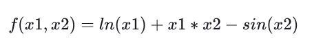
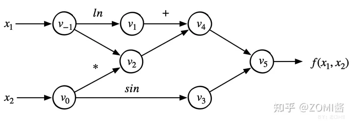
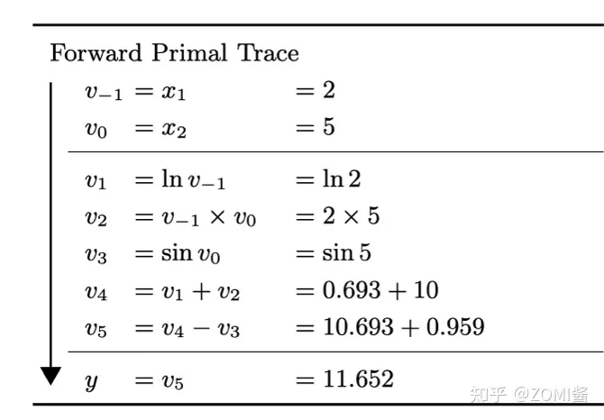
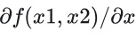
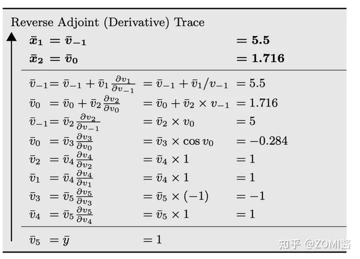
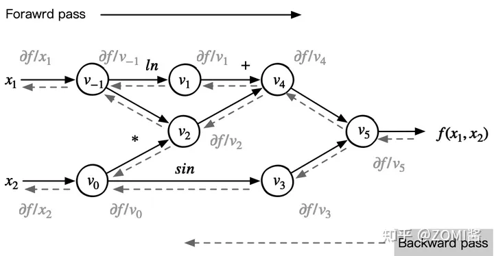

## 前向计算
自动微分是 AI 框架的核心组件之一，在进入 AI 框架如何实现自动微分之前，我们先通过一个简单的例子理解自动微分的基本原理。
假设一个简单的复合函数为例子：

:eqlabel:autodiff_03_eq2

下图是函数对应的计算图：

假设给定复合函数 $f(x1,x2)$ 中，$x1$ 和 $x2$ 均为输入变量。为了对 $f(x1,x2)$ 求值，依照表达式对应的计算图定义的计算顺序，复合函数 $f(x1,x2)$ 可以被分解成一个求值序列，把一个给定输入逐步计算输出的求值序列称之为前向计算过程：

通过上图可得知，前向计算过程是引入一系列的中间变量，将一个复杂的函数，分解成一系列基本函数或者叫做基本的计算操作，最后将这些基本函数构成一个前向的计算图。

## 反向计算

链式求导法则是对称的，在计算导数  时，链式求导法则并不关心哪个变量作为分母，哪个变量作为分子。

于是，反向模式根据从后向前计算，依次得到对每个中间变量节点的偏导数，直到到达自变量节点处，这样就得到了每个输入的偏导数。在每个节点处，根据该节点的后续节点（前向传播中的后续节点）计算其导数值。其对应的反向微分计算公式为：

对于上面表达式求值的过程称之为反向微分。在反向微分中，变量导数的计算顺序与变量的前向计算顺序正好相反；运行的时间复杂度是 $O(m)$，$m$ 是输出变量的个数。因此可以构建相对应的反向计算图：

