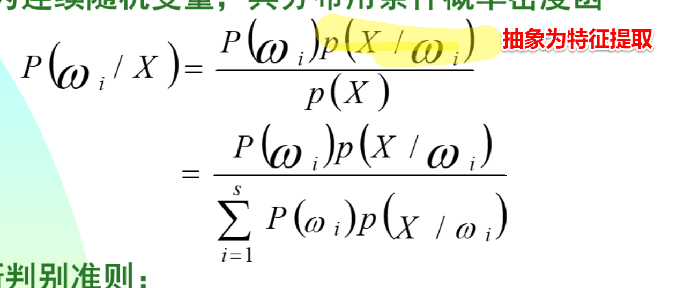
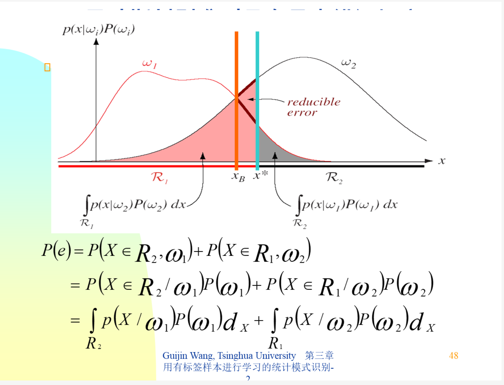
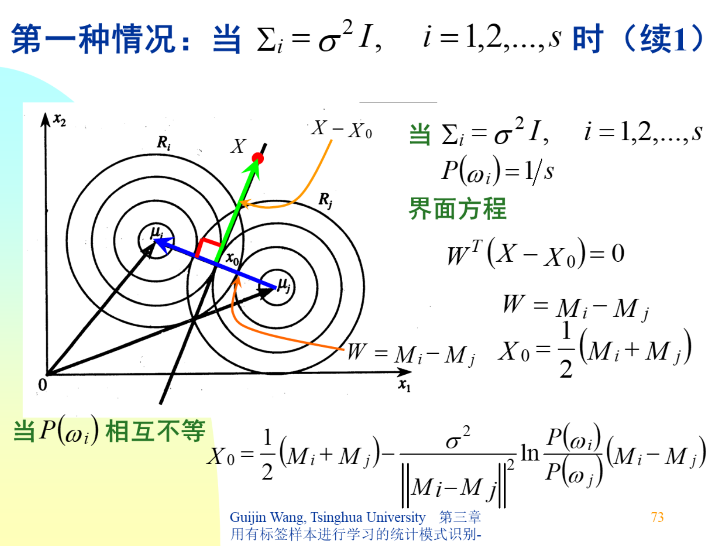
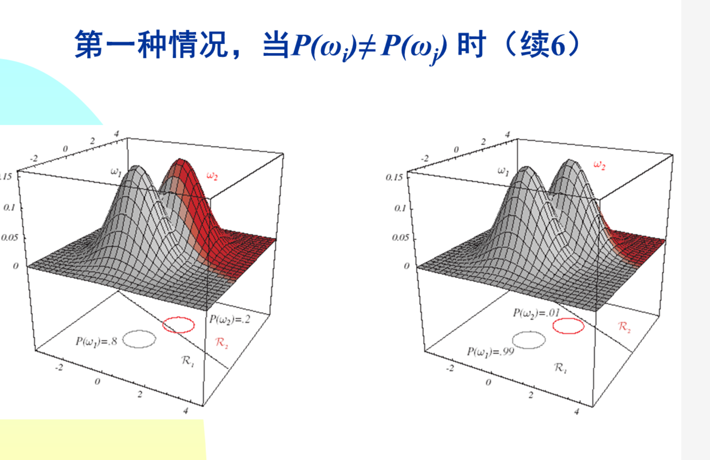

对与Bayes模型来说

后验=先验*似然   ，似然概率可以抽象成是一个特征提取的过程，即每一类的数据的特征是什么样的

红线的错误率最小，取红线时就叫贝叶斯判别，从图中可以看出，如果采用贝叶斯来划分（即红线），那么错误率为小山峰，如果采用其他分类器，可以看到，错误率为小山峰加上一块，那么我们可以得出结论，贝叶斯判别比别的判别器错误率都要低。

样本比较少时，可以假设一种分布（高斯分布）来生成一些数据，增加数据后在采用一些别的判别方法

bayes判别与最小欧式判别在bayes假设高斯同方差的，形式是一样的。当先验概率不同时，判别界面方向不变，但是会向先验大的地方偏移

